---
## Front matter
lang: ru-RU
title: Лабораторная работа № 1. Введение в Mininet
author:
  - Абакумова О. М.
institute:
  - Российский университет дружбы народов, Москва, Россия

## i18n babel
babel-lang: russian
babel-otherlangs: english

## Formatting pdf
toc: false
toc-title: Содержание
slide_level: 2
aspectratio: 169
section-titles: true
theme: metropolis
header-includes:
 - \metroset{progressbar=frametitle,sectionpage=progressbar,numbering=fraction}
mainfont: Open Sans Light
---

# Информация

## Докладчик

:::::::::::::: {.columns align=center}
::: {.column width="70%"}

  * Абакумова Олеся Максимовна
  * Студентка
  * Российский университет дружбы народов
  * 1132220832@pfur.ru
  * <https://github.com/omabakumova>

:::
::: {.column width="30%"}

:::
::::::::::::::

# Цель работы

Основной целью работы является развёртывание в системе виртуализации
(например, в VirtualBox) mininet, знакомство с основными командами для работы с Mininet через командную строку и через графический интерфейс.

# Теоретическое введение

Mininet (http://mininet.org/) -- это виртуальная среда, которая позволяет
разрабатывать и тестировать сетевые инструменты и протоколы. В сетях Mininet
работают реальные сетевые приложения Unix/Linux, а также реальное ядро Linux
и сетевой стек.

# Задания 

- Произвести настройку виртуальной машины Mininet

- Изучить основы работы в Mininet

# Выполнение лабораторной работы

## Настройка стенда виртуальной машины Mininet

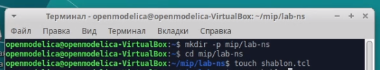{#fig:001 width=40%}

## Настройка стенда виртуальной машины Mininet

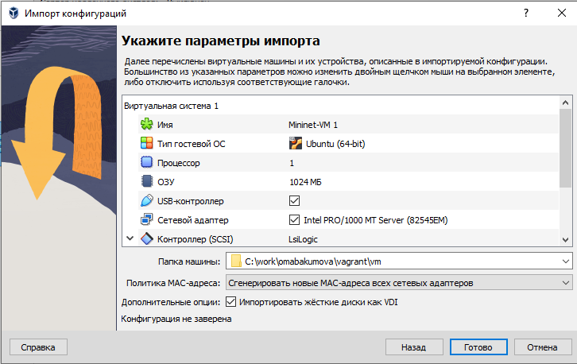{#fig:002 width=40%}

## Настройка стенда виртуальной машины Mininet

{#fig:003 width=40%}

## Настройка стенда виртуальной машины Mininet

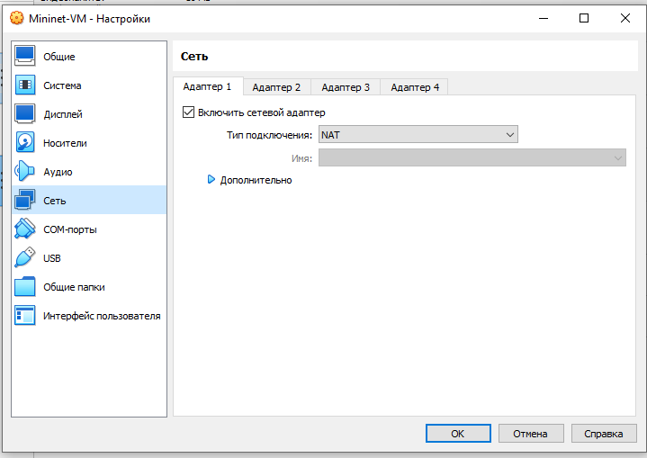{#fig:004 width=40%}

## Настройка стенда виртуальной машины Mininet

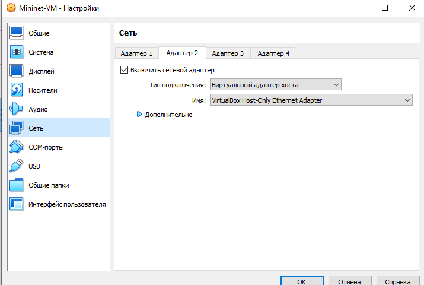{#fig:005 width=40%}

## Настройка стенда виртуальной машины Mininet

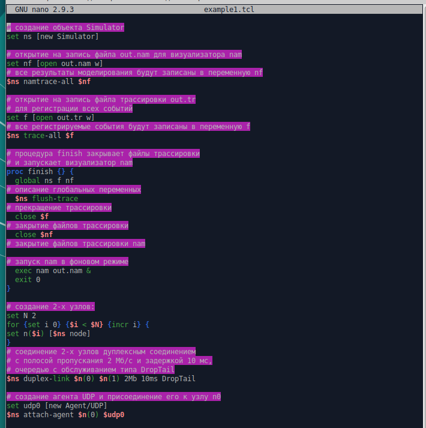{#fig:006 width=40%}

## Настройка стенда виртуальной машины Mininet

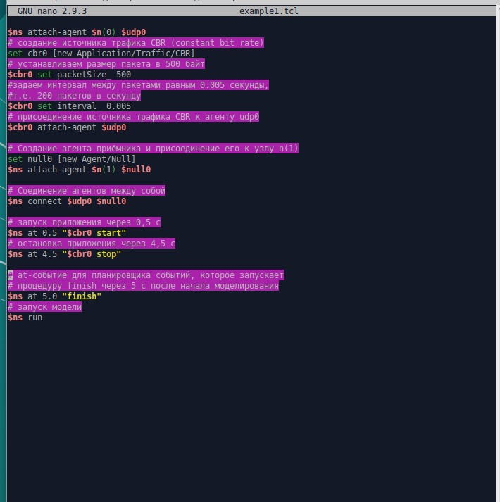{#fig:007 width=40%}

## Настройка стенда виртуальной машины Mininet

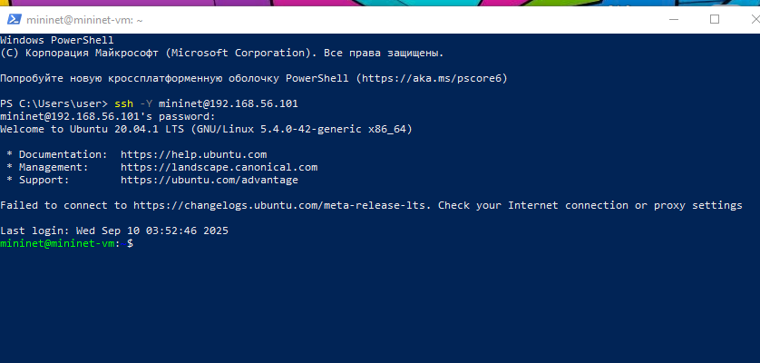{#fig:008 width=40%}

## Настройка стенда виртуальной машины Mininet

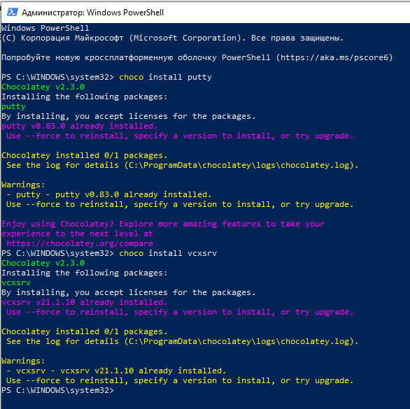{#fig:009 width=40%}

## Настройка стенда виртуальной машины Mininet

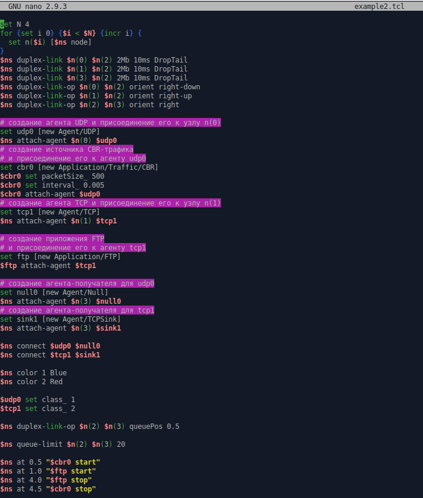{#fig:010 width=40%}

## Настройка стенда виртуальной машины Mininet

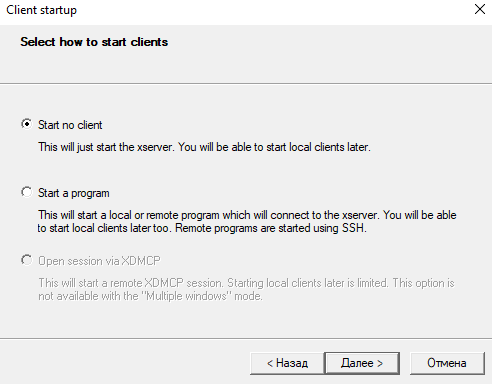{#fig:011 width=40%}

## Настройка стенда виртуальной машины Mininet

{#fig:012 width=40%}

## Настройка стенда виртуальной машины Mininet

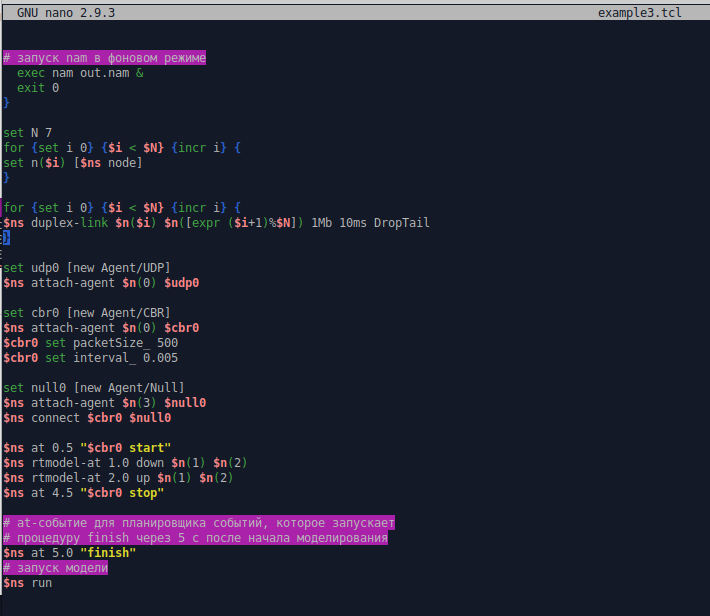{#fig:013 width=40%}

## Настройка стенда виртуальной машины Mininet

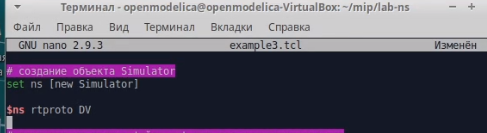{#fig:014 width=40%}

## Настройка параметров XTerm

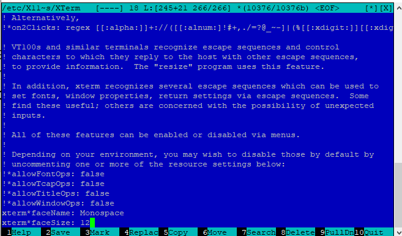{#fig:015 width=40%}

## Настройка соединения X11 для суперпользователя

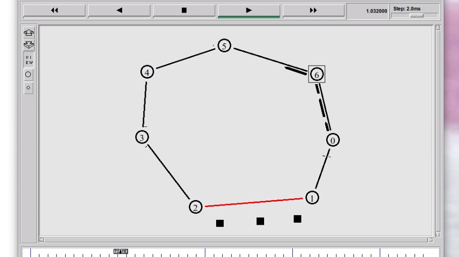{#fig:016 width=40%}

## Настройка соединения X11 для суперпользователя

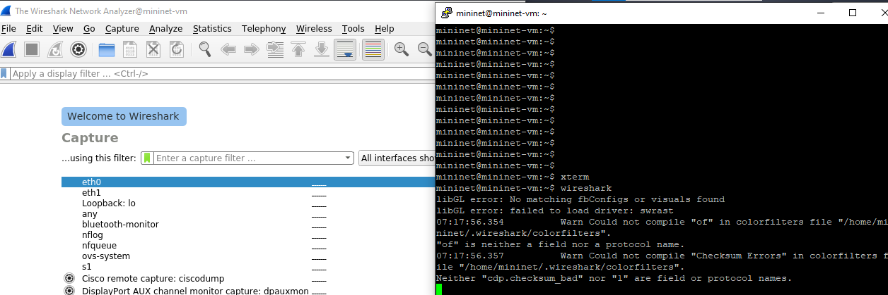{#fig:017 width=50%}

## Настройка доступа к Интернет

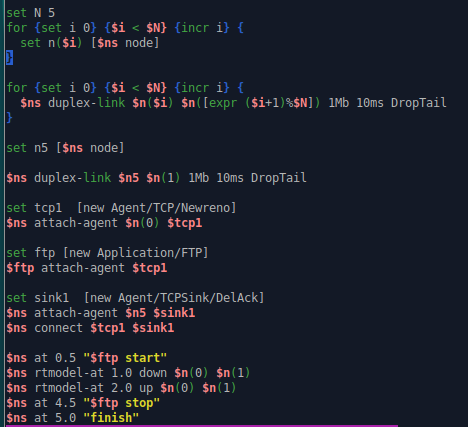{#fig:018 width=40%}

## Настройка доступа к Интернет

{#fig:019 width=40%}

## Настройка доступа к Интернет

{#fig:020 width=40%}

## Обновление версии Mininet

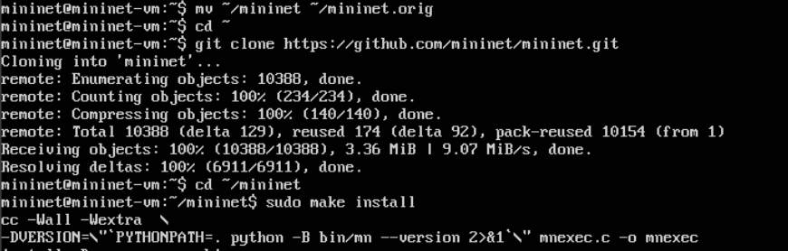{#fig:021 width=40%}

## Обновление версии Mininet

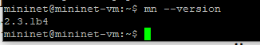{#fig:022 width=40%}

## Основы работы в Mininet

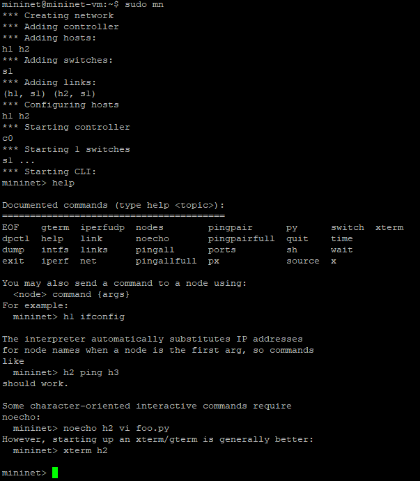{#fig:023 width=40%}

## Основы работы в Mininet

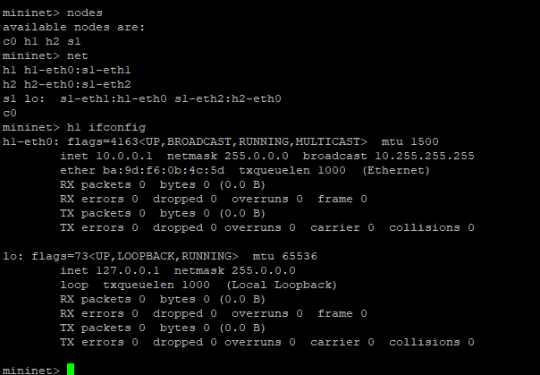{#fig:024 width=40%}

## Основы работы в Mininet

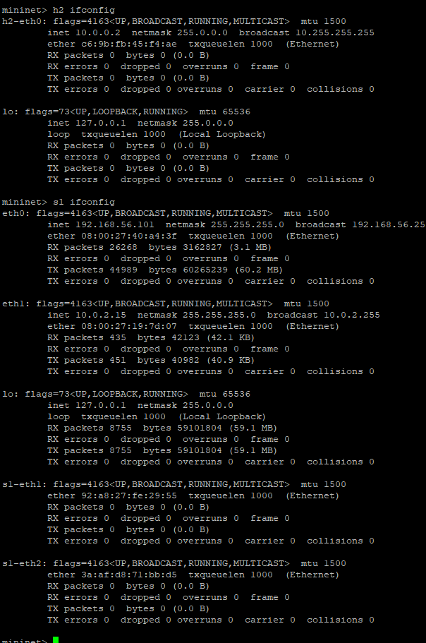{#fig:025 width=25%}

## Основы работы в Mininet

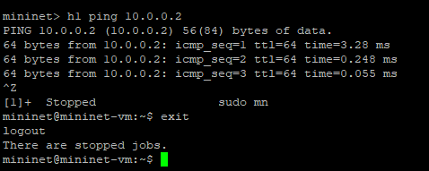{#fig:026 width=40%}

## Основы работы в Mininet

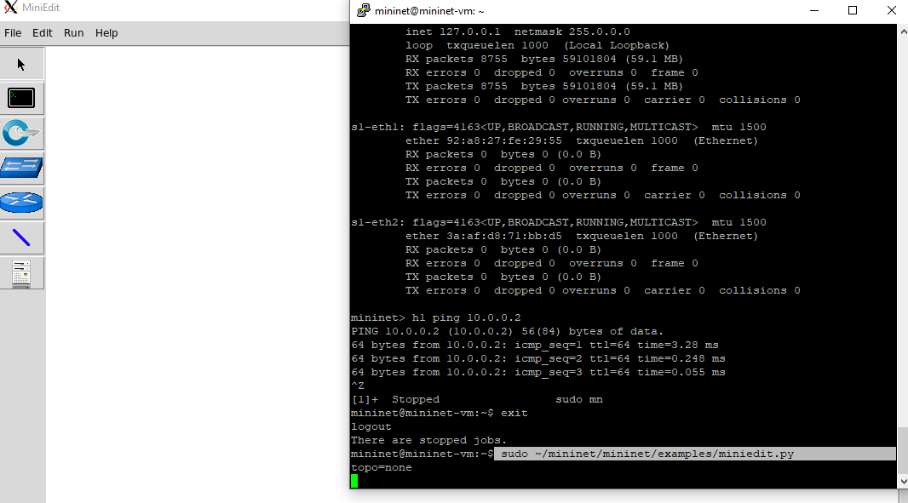{#fig:027 width=40%}

## Основы работы в Mininet

{#fig:028 width=40%}

## Основы работы в Mininet

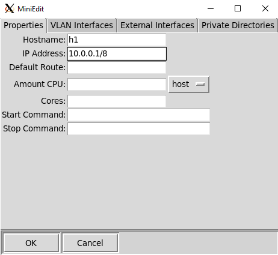{#fig:029 width=40%}

## Основы работы в Mininet

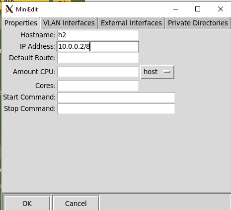{#fig:030 width=40%}

## Основы работы в Mininet

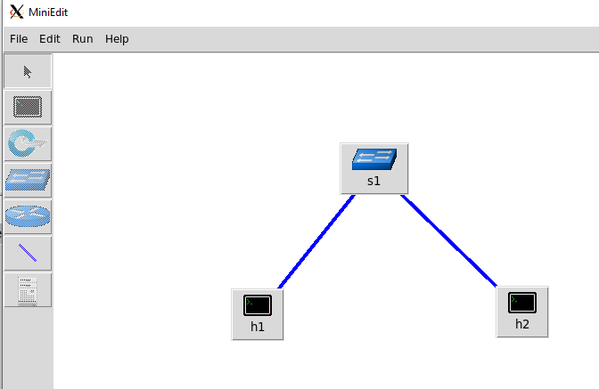{#fig:031 width=40%}

## Основы работы в Mininet

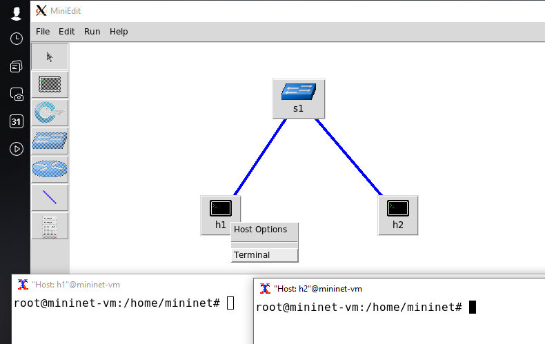{#fig:032 width=40%}

## Основы работы в Mininet

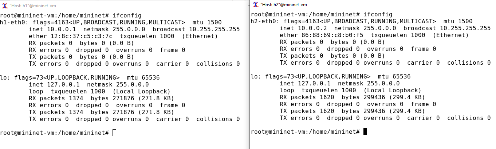{#fig:033 width=40%}

## Основы работы в Mininet

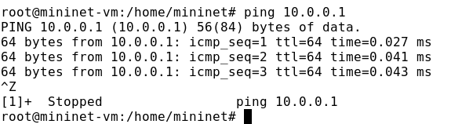{#fig:034 width=40%}

## Основы работы в Mininet

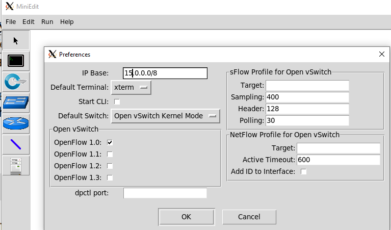{#fig:035 width=50%}

## Основы работы в Mininet

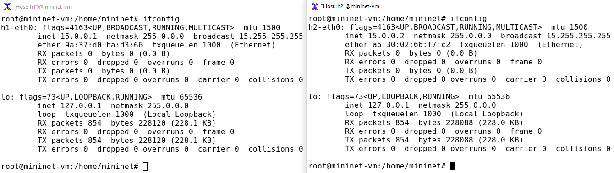{#fig:036 width=40%}

## Основы работы в Mininet

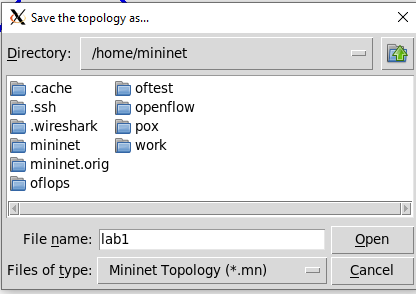{#fig:037 width=40%}

# Выводы

В результате выполнения данной лабораторной работы я развёрнула mininet в
системе виртуализации VirtualBox, а также ознакомилась с основными командами для работы с Mininet через командную строку и через графический интер-
фейс.

