---
## Front matter
title: "Лабораторная работа 1. Простые модели компьютерной сети"
author: "Абакумова Олеся Максимовна, НФИбд-02-22"

## Generic otions
lang: ru-RU
toc-title: "Содержание"

## Bibliography
bibliography: bib/cite.bib
csl: pandoc/csl/gost-r-7-0-5-2008-numeric.csl

## Pdf output format
toc: true # Table of contents
toc-depth: 2
lof: true # List of figures
lot: true # List of tables
fontsize: 12pt
linestretch: 1.5
papersize: a4
documentclass: scrreprt
## I18n polyglossia
polyglossia-lang:
  name: russian
  options:
	- spelling=modern
	- babelshorthands=true
polyglossia-otherlangs:
  name: english
## I18n babel
babel-lang: russian
babel-otherlangs: english
## Fonts
mainfont: IBM Plex Serif
romanfont: IBM Plex Serif
sansfont: IBM Plex Sans
monofont: IBM Plex Mono
mathfont: STIX Two Math
mainfontoptions: Ligatures=Common,Ligatures=TeX,Scale=0.94
romanfontoptions: Ligatures=Common,Ligatures=TeX,Scale=0.94
sansfontoptions: Ligatures=Common,Ligatures=TeX,Scale=MatchLowercase,Scale=0.94
monofontoptions: Scale=MatchLowercase,Scale=0.94,FakeStretch=0.9
mathfontoptions:
## Biblatex
biblatex: true
biblio-style: "gost-numeric"
biblatexoptions:
  - parentracker=true
  - backend=biber
  - hyperref=auto
  - language=auto
  - autolang=other*
  - citestyle=gost-numeric
## Pandoc-crossref LaTeX customization
figureTitle: "Рис."
tableTitle: "Таблица"
listingTitle: "Листинг"
lofTitle: "Список иллюстраций"
lotTitle: "Список таблиц"
lolTitle: "Листинги"
## Misc options
indent: true
header-includes:
  - \usepackage{indentfirst}
  - \usepackage{float} # keep figures where there are in the text
  - \floatplacement{figure}{H} # keep figures where there are in the text
---

# Цель работы

Приобретение навыков моделирования сетей передачи данных с помощью средства имитационного моделирования NS-2, а также анализ полученных результатов
моделирования.

# Теоретическое введение

Network Simulator (NS-2) --- один из программных симуляторов моделирования процессов в компьютерных сетях. NS-2 позволяет описать топологию сети, конфигурацию источников и приёмников трафика, параметры соединений (полосу пропускания, задержку, вероятность потерь пакетов и т.д.) и множество других параметров моделируемой системы. Данные о динамике трафика, состоянии соединений и объектов сети, а также информация о работе протоколов фиксируются в генерируемом trace-файле.

NS-2 является объектно-ориентированным программным обеспечением. Его ядро реализовано на языке С++. В качестве интерпретатора используется язык скриптов (сценариев) OTcl (Object oriented Tool Command Language). NS-2 полностью поддерживает иерархию классов С++ и подобную иерархию классов интерпретатора OTcl. Обе иерархии обладают идентичной структурой, т.е. существует однозначное соответствие между классом одной иерархии и таким же классом другой. Объединение для совместного функционирования С++ и OTcl производится при помощи TclCl (Classes Tcl). В случае, если необходимо реализовать какую-либо специфическую функцию, не реализованную в NS-2 на уровне ядра, для этого используется код на С++.

Более подробно про NS-2 см. в [@mip].

# Выполнение лабораторной работы
## Шаблон сценария для NS-2

В своём рабочем каталоге создадим директорию mip, к которой будут выполнять-
ся лабораторные работы. Внутри mip создадим директорию lab-ns, а в ней файл
shablon.tcl (рис. [-@fig:001]):

{#fig:001 width=70%}

Откроем на редактирование файл shablon.tcl. Можно использовать любой
текстовый редактор типа emacs.Я использую nano.
Создадим объект типа Simulator, переменную nf и укажем, что требуется открыть на запись nam-файл для регистрации выходных результатов моделирования (рис. [-@fig:002]):

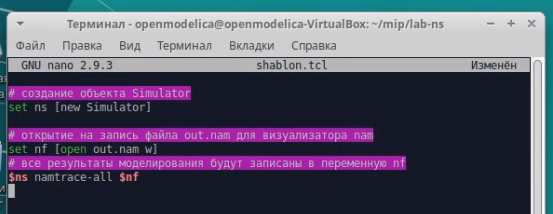{#fig:002 width=70%}

Вторая строка даёт команду симулятору записывать все данные о динамике модели
в файл out.nam.

Далее создадим переменную f и откроем на запись файл трассировки для реги-
страции всех событий модели (рис. [-@fig:003]):

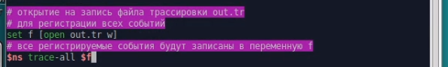{#fig:003 width=70%}

После этого добавим процедуру finish, которая закрывает файлы трассировки
и запускает nam (рис. [-@fig:004]):

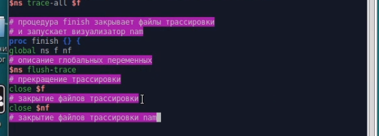{#fig:004 width=70%}

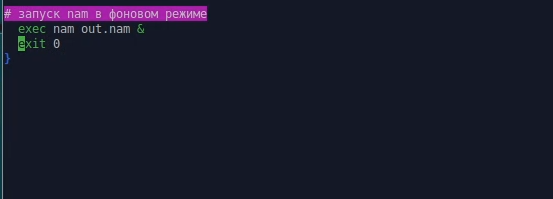{#fig:005 width=70%}

Наконец, с помощью команды at указываем планировщику событий, что проце-
дуру finish следует запустить через 5 с после начала моделирования, после чего
запустить симулятор ns (рис. [-@fig:006]):

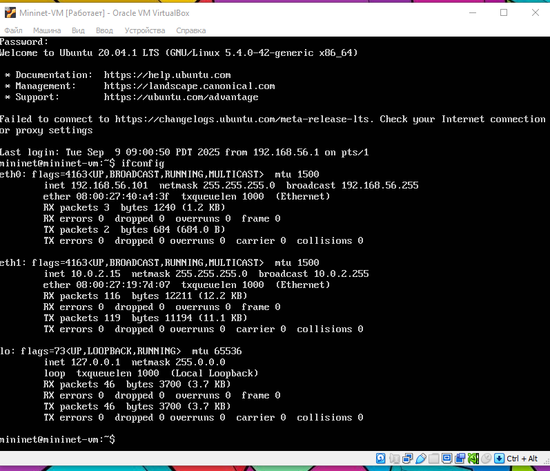{#fig:006 width=70%}

Сохранив изменения в отредактированном файле shablon.tcl и закрыв его,
можно запустить симулятор командой (рис. [-@fig:007]):

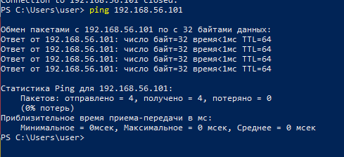{#fig:007 width=70%}

Получившийся шаблон можно использовать в дальнейшем в большинстве раз-
рабатываемых скриптов NS-2, добавляя в него до строки $ns at 5.0 "finish"
описание объектов и действий моделируемой системы.

## Простой пример описания топологии сети, состоящей из двух узлов и одного соединения

Требуется смоделировать сеть передачи данных, состоящую
из двух узлов, соединённых дуплексной линией связи с полосой пропускания 2
Мб/с и задержкой 10 мс, очередью с обслуживанием типа DropTail. От одного узла
к другому по протоколу UDP осуществляется передача пакетов, размером 500 байт,
с постоянной скоростью 200 пакетов в секунду.

Скопируем содержимое созданного шаблона в новый файл (рис. [-@fig:008]):

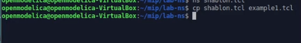{#fig:008 width=70%}

Открыв example1.tcl на редактирование, добавим в него до строки
$ns at 5.0 "finish" описание топологии сети (рис. [-@fig:009]):

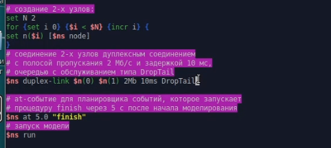{#fig:009 width=70%}

Создадим агенты для генерации и приёма трафика (рис. [-@fig:010]):

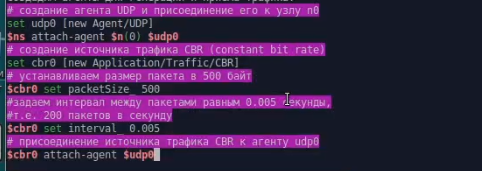{#fig:010 width=70%}

Создаётся агент UDP и присоединяется к узлу n0. В узле агент сам не может
генерировать трафик, он лишь реализует протоколы и алгоритмы транспортного
уровня. Поэтому к агенту присоединяется приложение. В данном случае --- это
источник с постоянной скоростью (Constant Bit Rate, CBR), который каждые 5 мс
посылает пакет R = 500 байт. Таким образом, скорость источника:

$$
R = \frac{500 \times 8}{0.005} = 800000
$$

Далее создадим Null-агент, который работает как приёмник трафика, и прикрепим
его к узлу n1, соединим их между собой (рис. [-@fig:011]):

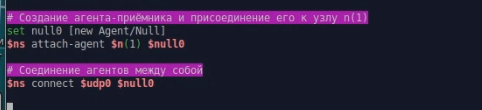{#fig:011 width=70%}

Для запуска и остановки приложения CBR добавляются at-события в планировщик
событий (перед командой $ns at 5.0 "finish") (рис. [-@fig:012]):

{#fig:012 width=70%}

Сохранив изменения в отредактированном файле и запустив симулятор (рис. [-@fig:013]):

{#fig:013 width=70%}

получим в качестве результата запуск аниматора nam в фоновом режиме.

При нажатии на кнопку play в окне nam через 0.5 секунды из узла 0 данные начнут
поступать к узлу 1. Это процесс можно замедлить, выбирая шаг отображения в nam.
Можно осуществлять наблюдение за отдельным пакетом, щёлкнув по нему в окне
nam, а щёлкнув по соединению, можно получить о нем некоторую информацию.

## Пример с усложнённой топологией сети

Описание моделируемой сети:

– сеть состоит из 4 узлов (n0, n1, n2, n3);

– между узлами n0 и n2, n1 и n2 установлено дуплексное соединение с пропускной
способностью 2 Мбит/с и задержкой 10 мс;

– между узлами n2 и n3 установлено дуплексное соединение с пропускной способностью 1,7 Мбит/с и задержкой 20 мс;

– каждый узел использует очередь с дисциплиной DropTail для накопления пакетов,
максимальный размер которой составляет 10;

– TCP-источник на узле n0 подключается к TCP-приёмнику на узле n3
(по-умолчанию, максимальный размер пакета, который TCP-агент может генерировать, равняется 1KByte);

– TCP-приёмник генерирует и отправляет ACK пакеты отправителю и откидывает
полученные пакеты;

– UDP-агент, который подсоединён к узлу n1, подключён к null-агенту на узле n3
(null-агент просто откидывает пакеты);

– генераторы трафика ftp и cbr прикреплены к TCP и UDP агентам соответственно;

– генератор cbr генерирует пакеты размером 1 Кбайт со скоростью 1 Мбит/с;

– работа cbr начинается в 0,1 секунду и прекращается в 4,5 секунды, а ftp начинает
работать в 1,0 секунду и прекращает в 4,0 секунды.

Скопируем содержимое созданного шаблона в новый файл и откроем example2.tcl на редактирование (рис. [-@fig:014]):

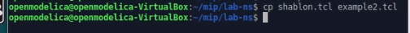{#fig:014 width=70%}

Создадим 4 узла и 3 дуплексных соединения с указанием направления (рис. [-@fig:015]):

{#fig:015 width=70%}

Создадим агент UDP с прикреплённым к нему источником CBR и агент TCP
с прикреплённым к нему приложением FTP (рис. [-@fig:016]):

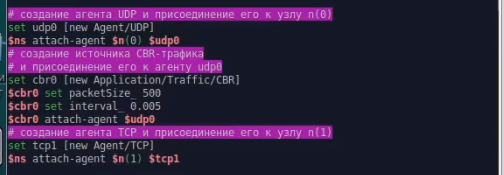{#fig:016 width=70%}

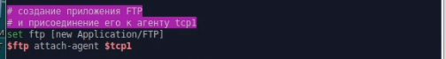{#fig:017 width=70%}

Создадим агенты-получатели (рис. [-@fig:018]):

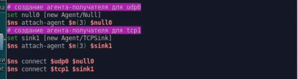{#fig:018 width=70%}

Соединим агенты udp0 и tcp1 и их получателей, описание цвета каждого потока и отслеживание событий в очереди (рис. [-@fig:019]):

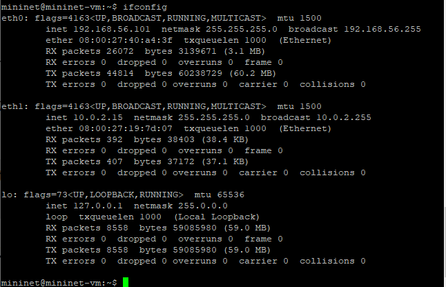{#fig:019 width=70%}

Наложение ограничения на размер очереди и добавление at-событий (рис. [-@fig:020]):

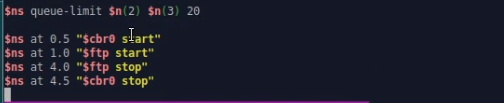{#fig:020 width=70%}

Сохранив изменения в отредактированном файле и запустив симулятор, получим
анимированный результат моделирования (рис. [-@fig:021]):

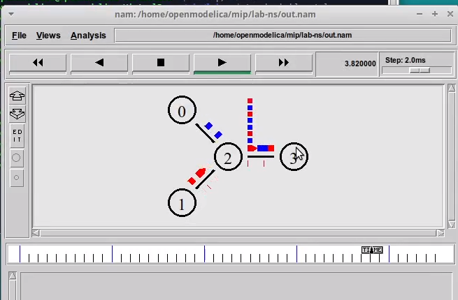{#fig:021 width=70%}

При запуске скрипта можно заметить, что по соединениям между узлами n(0)–n(2)
и n(1)–n(2) к узлу n(2) передаётся данных больше, чем способно передаваться по
соединению от узла n(2) к узлу n(3). Действительно, мы передаём 200 пакетов
в секунду от каждого источника данных в узлах n(0) и n(1), а каждый пакет имеет
размер 500 байт. Таким образом, полоса каждого соединения 0, 8 Mb, а суммарная
--- 1, 6 Mb. Но соединение n(2)–n(3) имеет полосу лишь 1 Mb. Следовательно, часть
пакетов должна теряться. В окне аниматора можно видеть пакеты в очереди, а также
те пакеты, которые отбрасываются при переполнении.

## Пример с кольцевой топологией сети

Требуется построить модель передачи данных по сети с кольцевой топологией и динамической маршрутизацией пакетов:

– сеть состоит из 7 узлов, соединённых в кольцо;

– данные передаются от узла n(0) к узлу n(3) по кратчайшему пути;

– с 1 по 2 секунду модельного времени происходит разрыв соединения между
узлами n(1) и n(2);

– при разрыве соединения маршрут передачи данных должен измениться на резерв-
ный.

Скопируем содержимое созданного шаблона в новый файл и откроем example3.tcl на редактирование (рис. [-@fig:022]):

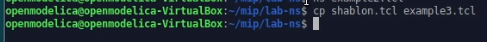{#fig:022 width=70%}

Опишем топологию моделируемой сети и соединим узлы так, чтобы создать круговую топологию (рис. [-@fig:023]):

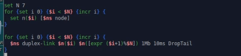{#fig:023 width=70%}

Каждый узел, за исключением последнего, соединяется со следующим, последний
соединяется с первым. Для этого в цикле использован оператор %, означающий
остаток от деления нацело.

Зададим передачу данных от узла n(0) к узлу n(3) (рис. [-@fig:024]):

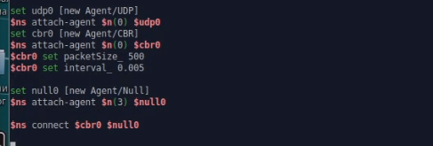{#fig:024 width=70%}

Данные передаются по кратчайшему маршруту от узла n(0) к узлу n(3), через узлы
n(1) и n(2) (рис. [-@fig:027]).

Добавим команду разрыва соединения между узлами n(1) и n(2) на время в одну
секунду, а также время начала и окончания передачи данных (рис. [-@fig:025]):

{#fig:025 width=70%}

Передача данных при кольцевой топологии сети в случае разрыва соединения (рис. [-@fig:028]).

Добавив в начало скрипта после команды создания объекта Simulator (рис. [-@fig:026]):

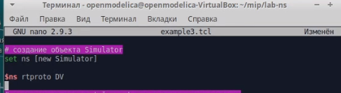{#fig:026 width=70%}

увидим, что сразу после запуска в сети отправляется небольшое количество
маленьких пакетов, используемых для обмена информацией, необходимой для марш-
рутизации между узлами (рис. [-@fig:029]). Когда соединение будет разорвано, информация
о топологии будет обновлена, и пакеты будут отсылаться по новому маршруту через
узлы n(6), n(5) и n(4).

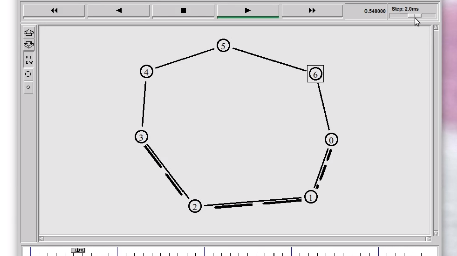{#fig:027 width=70%}

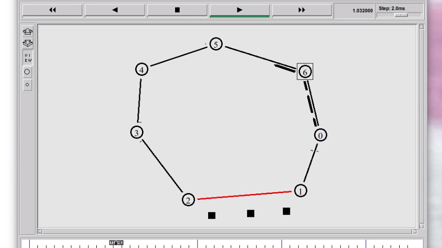{#fig:028 width=70%}

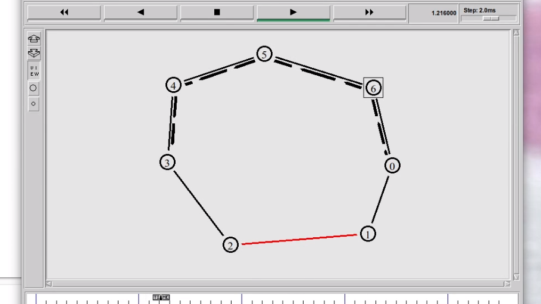{#fig:029 width=70%}

## Упражнение

Внесем следующие изменения в реализацию примера с кольцевой
топологией сети:
– топология сети должна соответствовать представленной на рисунке (рис. [-@fig:031]);

– передача данных должна осуществляться от узла n(0) до узла n(5) по кратчайшему пути в течение 5 секунд модельного времени (рис. [-@fig:032]);

– передача данных должна идти по протоколу TCP (тип Newreno), на принимаю-
щей стороне используется TCPSink-объект типа DelAck; поверх TCP работает
протокол FTP с 0,5 до 4,5 секунд модельного времени;

– с 1 по 2 секунду модельного времени происходит разрыв соединения между
узлами n(0) и n(1) (рис. [-@fig:033]);

– при разрыве соединения маршрут передачи данных должен измениться на ре-
зервный (рис. [-@fig:034]), после восстановления соединения пакеты снова должны пойти по
кратчайшему пути (рис. [-@fig:035]).

Реализация:

Скопировав шаблон в новый файл example4.tcl и открыв его на редактировани,пропишем следующее (рис. [-@fig:030]):

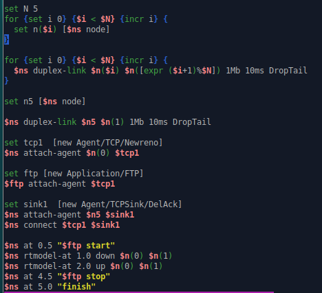{#fig:030 width=70%}

При запуске симуляции,мы получаем кольцевую топологию вида (рис. [-@fig:031]):

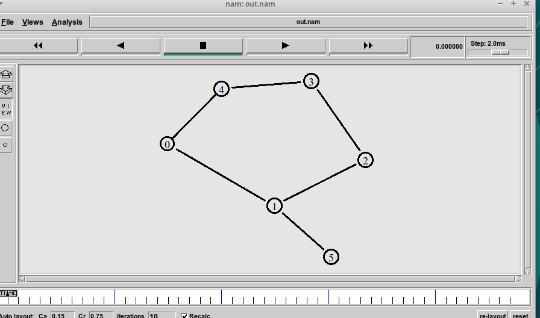{#fig:031 width=70%}

Передача данных от узла n(0) до узла n(5) осуществялется по кратчайшему пути (рис. [-@fig:032]):

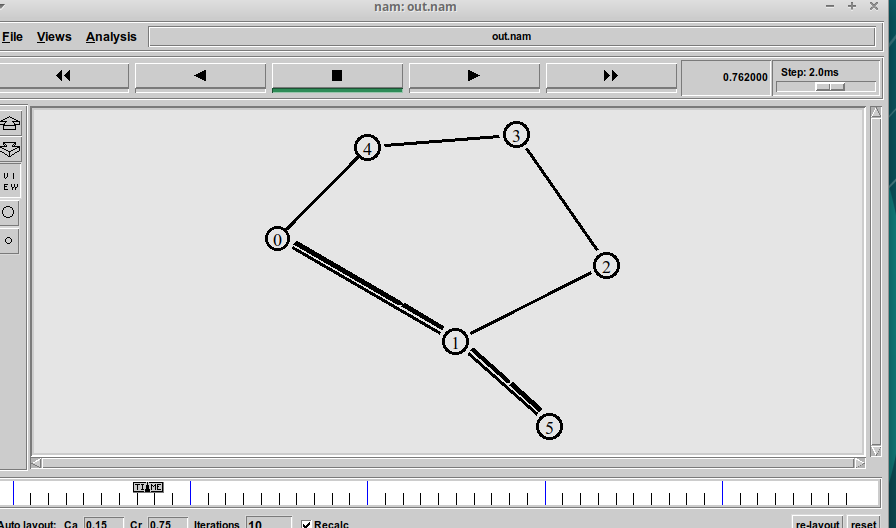{#fig:032 width=70%}

Далее происходит разрыв соединения между узлами n(0) и n(1) с 1 по 2 секунду моделного времени (рис. [-@fig:033]):

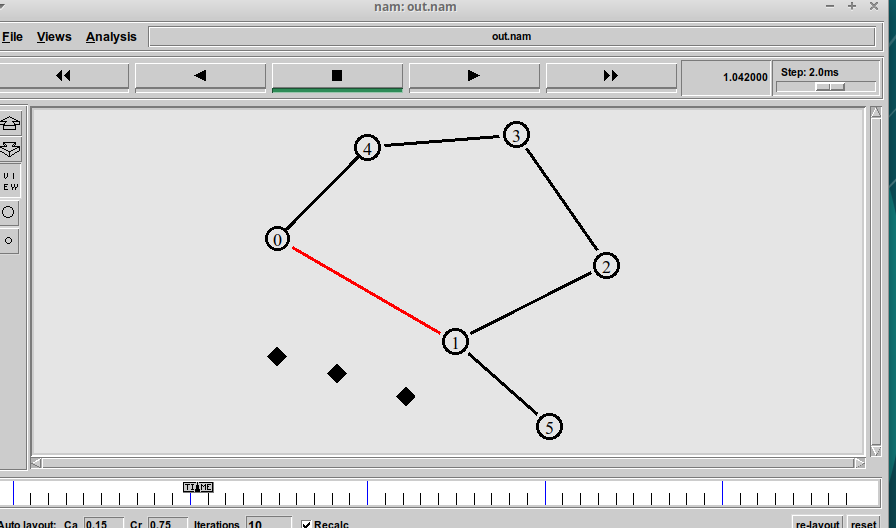{#fig:033 width=70%}

После разрыва соединения, маршрут перестроен на резервный (рис. [-@fig:034]):

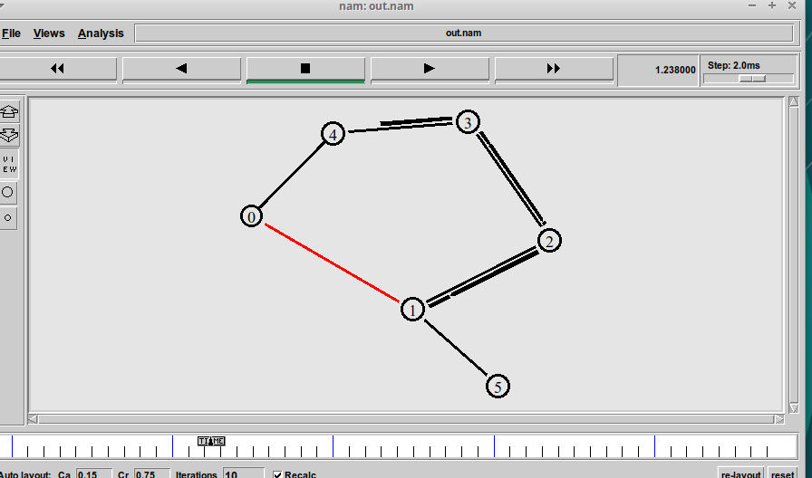{#fig:034 width=70%}

После восстановления соединения, пакеты снова пошла по кратчайшему пути (рис. [-@fig:035]):

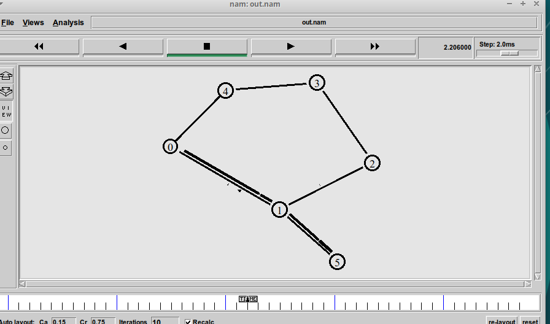{#fig:035 width=70%}

# Выводы

Во время выполнения данной лабораторной работы я приобрела навыки моделирования сетей передачи данных с помощью средства имитационного моделирования NS-2, а также провела анализ полученных результатов моделирования.

# Список литературы{.unnumbered}

::: {#refs}
:::
