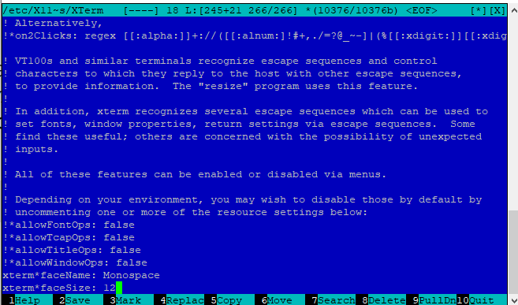
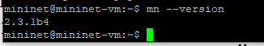
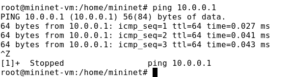

---
## Front matter
title: "Лабораторная работа № 1. Введение в Mininet"
author: "Абакумова Олеся Максимовна, НФИбд-02-22"

## Generic otions
lang: ru-RU
toc-title: "Содержание"

## Bibliography
bibliography: bib/cite.bib
csl: pandoc/csl/gost-r-7-0-5-2008-numeric.csl

## Pdf output format
toc: true # Table of contents
toc-depth: 2
lof: true # List of figures
lot: true # List of tables
fontsize: 12pt
linestretch: 1.5
papersize: a4
documentclass: scrreprt
## I18n polyglossia
polyglossia-lang:
  name: russian
  options:
	- spelling=modern
	- babelshorthands=true
polyglossia-otherlangs:
  name: english
## I18n babel
babel-lang: russian
babel-otherlangs: english
## Fonts
mainfont: IBM Plex Serif
romanfont: IBM Plex Serif
sansfont: IBM Plex Sans
monofont: IBM Plex Mono
mathfont: STIX Two Math
mainfontoptions: Ligatures=Common,Ligatures=TeX,Scale=0.94
romanfontoptions: Ligatures=Common,Ligatures=TeX,Scale=0.94
sansfontoptions: Ligatures=Common,Ligatures=TeX,Scale=MatchLowercase,Scale=0.94
monofontoptions: Scale=MatchLowercase,Scale=0.94,FakeStretch=0.9
mathfontoptions:
## Biblatex
biblatex: true
biblio-style: "gost-numeric"
biblatexoptions:
  - parentracker=true
  - backend=biber
  - hyperref=auto
  - language=auto
  - autolang=other*
  - citestyle=gost-numeric
## Pandoc-crossref LaTeX customization
figureTitle: "Рис."
tableTitle: "Таблица"
listingTitle: "Листинг"
lofTitle: "Список иллюстраций"
lotTitle: "Список таблиц"
lolTitle: "Листинги"
## Misc options
indent: true
header-includes:
  - \usepackage{indentfirst}
  - \usepackage{float} # keep figures where there are in the text
  - \floatplacement{figure}{H} # keep figures where there are in the text
---

# Цель работы

Основной целью работы является развёртывание в системе виртуализации
(например, в VirtualBox) mininet, знакомство с основными командами для работы с Mininet через командную строку и через графический интерфейс.

# Теоретическое введение

Mininet (http://mininet.org/) -- это виртуальная среда, которая позволяет
разрабатывать и тестировать сетевые инструменты и протоколы. В сетях Mininet
работают реальные сетевые приложения Unix/Linux, а также реальное ядро Linux
и сетевой стек.

# Выполнение лабораторной работы
## Настройка стенда виртуальной машины Mininet

Для начала сделаем импорт конфигураций предварительно установив необходимый файл (рис. [-@fig:001]):

{#fig:001 width=70%}

{#fig:002 width=70%}

Теперь необходимо внести некоторые настройки в виртуальную машину (рис. [-@fig:003]):

{#fig:003 width=70%}

{#fig:004 width=70%}

{#fig:005 width=70%}

Запустим виртуальную машину и выведем информацию о ней с помощью 'ifconfig' (рис. [-@fig:006]):

{#fig:006 width=70%}

Зная статический IP-адрес, проверим его доступность с хостовой машины(из под Windows)(рис. [-@fig:007]):

{#fig:007 width=70%}

Теперь подключимся по SSH (рис. [-@fig:008]):

{#fig:008 width=70%}

Далее нам необходимо установить следующие утилит для работы из под Windows (рис. [-@fig:009]):

{#fig:009 width=70%}

Перейдем к запуску Xserver (рис. [-@fig:010]):

{#fig:010 width=70%}

{#fig:011 width=70%}

{#fig:012 width=70%}

Перейдем к putty (рис. [-@fig:013]):

{#fig:013 width=70%}

{#fig:014 width=70%}

## Настройка параметров XTerm

По умолчанию XTerm использует растровые шрифты малого кегля. Для увели-
чения размера шрифта и применения векторных шрифтов вместо растровых
необходимо внести изменения в файл /etc/X11/app-defaults/XTerm (рис. [-@fig:015]):

{#fig:015 width=70%}

## Настройка соединения X11 для суперпользователя

При попытке запуска приложения из-под суперпользователя возникает ошибка: 'X11 connection rejected because of wrong authentication'.
Ошибка возникает из-за того, что X-соединение выполняется от имени пользователя mininet, а приложение запускается от имени пользователя root
с использованием sudo. Для исправления этой ситуации необходимо заполнить файл полномочий /root/.Xauthority, используя утилиту xauth. Скопируем значение куки (MIT magic cookie) пользователя mininet в файл
для пользователя root (рис. [-@fig:016]):

{#fig:016 width=70%}

**У меня на скриншотах возможна настройка выглядит не совсем как ожидается так, как я проделывала это не в первый раз**
Как можно заметить после внесения этого изменения в качестве теста мы можем открыть различные утилиты, как из под рута, так ии из под пользователя (рис. [-@fig:017]):

{#fig:017 width=70%}

## Настройка доступа к Интернет

Теперь перейдем к настройке доступа к Интернету. До настройки доступа мы имеем следующее (рис. [-@fig:018]):

{#fig:018 width=70%}

Для доступа к сети Интернет должен быть активен адрес NAT: 10.0.0.x.Если активен только внутренний адрес машины вида 192.168.x.y, то акти-
вируем второй интерфейс, набрав в командной строке: 'sudo dhclient eth1' и 'ifconfig' (рис. [-@fig:019]):

{#fig:019 width=70%}

Для удобства дальнейшей работы установим mc с помощью команды 'sudo apt install mc' и добавим  для mininet указание на использование двух адаптеров при запуске. Для этого требуется перейти
в режим суперпользователя и внести изменения в файл /etc/netplan/01-netcfg.yaml виртуальной машины minine (рис. [-@fig:020]):

{#fig:020 width=70%}

## Обновление версии Mininet

Необходимо обновить версию Mininet и произвести установку (рис. [-@fig:021]):

{#fig:021 width=70%}

Проверить версию можно следующим образом (рис. [-@fig:022]):

{#fig:022 width=70%}

## Основы работы в Mininet
### Работа с Mininet с помощью командной строки

Вызов Mininet с использованием топологии по умолчанию.

- Для запуска минимальной топологии введите в командной строке: 'sudo mn'

Эта команда запускает Mininet с минимальной топологией, состоящей из
коммутатора, подключённого к двум хостам.

- Для отображения списка команд интерфейса командной строки Mininet
и примеров их использования введите команду в интерфейсе командной
строки Mininet: 'help' (рис. [-@fig:023]):

{#fig:023 width=70%}

Для отображения доступных узлов введем: 'nodes'
Вывод этой команды показывает, что есть два хоста (хост h1 и хост h2)
и коммутатор (s1).

- Иногда бывает полезно отобразить связи между устройствами в Mininet,
чтобы понять топологию. Введите команду net в интерфейсе командной
строки Mininet, чтобы просмотреть доступные линки: 'net'
Вывод этой команды показывает:

- Хост h1 подключён через свой сетевой интерфейс h1-eth0 к коммутатору на интерфейсе s1-eth1.

- Хост h2 подключён через свой сетевой интерфейс h2-eth0 к коммутатору на интерфейсе s1-eth2.

- Коммутатор s1:

- имеет петлевой интерфейс lo.

- подключается к h1-eth0 через интерфейс s1-eth1.

- подключается к h2-eth0 через интерфейс s1-eth2 (рис. [-@fig:024]):

{#fig:024 width=70%}

Mininet позволяет выполнять команды на конкретном устройстве. Чтобы
выполнить команду для определенного узла, необходимо сначала указать
устройство, а затем команду, например: 'h1 ifconfig'
Эта запись выполняет команду ifconfig на хосте h1 и показывает интерфейсы хоста h1 -- хост h1 имеет интерфейс h1-eth0, настроенный
с IP-адресом 10.0.0.1, и другой интерфейс lo, настроенный с IP-адресом
127.0.0.1 (рис. [-@fig:024]).

Посмотрим конфигурацию всех узлов (рис. [-@fig:025]):

{#fig:025 width=70%}

Эти записи выполняют команду ifconfig на хосте h2 и показывает интерфейсы хоста h2 -- хост h2 имеет интерфейс h2-eth0, настроенный
с IP-адресом 10.0.0.2, и другой интерфейс lo, настроенный с IP-адресом
127.0.0.1. Также выведена информация о s1 c IP-адресом 192.168.56.101.

Проверим связность.По умолчанию узлам h1 и h2 назначаются IP-адреса 10.0.0.1/8 и
10.0.0.2/8 соответственно. Чтобы проверить связь между ними, мы можем
использовать команду ping. Команда ping работает, отправляя сообщения
эхо-запроса протокола управляющих сообщений Интернета (ICMP) на удалённый компьютер и ожидая ответа (рис. [-@fig:026]):

{#fig:026 width=70%}

Мы проверили соединение между хостами h1 и h2.
Для остановки эмуляции достаточно ввести: 'exit'.

### Построение и эмуляция сети в Mininet с использованием графического интерфейса

В терминале виртуальной машины mininet запустим MiniEdit (рис. [-@fig:027]):

{#fig:027 width=70%}

Основные кнопки:

- Select: позволяет выбирать/перемещать устройства. Нажатие Del на
клавиатуре после выбора устройства удаляет его из топологии.

- Host: позволяет добавить новый хост в топологию. После нажатия этой
кнопки щелкнем в любом месте пустого холста, чтобы вставить новый
хост.

- Switch: позволяет добавить в топологию новый коммутатор. После нажатия этой кнопки щёлкнем в любом месте пустого холста, чтобы вставить
переключатель.

- Link: соединяет устройства в топологии. После нажатия этой кнопки
щелкните устройство и перетащим его на второе устройство, с которым
необходимо установить связь.

- Run: запускает эмуляцию. После проектирования и настройки топологии
нажмем кнопку запуска.

- Stop: останавливает эмуляцию.

В качестве демонстрации добавим два хоста и один коммутатор, соединим хосты с коммутатором (рис. [-@fig:028]):

{#fig:028 width=70%}

Настроим IP-адреса на хостах h1 и h2. Для этого удерживая правую кнопку
мыши на устройстве выберем свойства. Для хоста h1 укажем IP-адрес
10.0.0.1/8, а для хоста h2 — 10.0.0.2/8 (рис. [-@fig:029]):

{#fig:029 width=70%}

{#fig:030 width=70%}

Проверим связность. Перед проверкой соединения между хостом h1 и хостом h2 необходимо
запустить эмуляцию. Для запуска эмуляции нажмем кнопку Run. После
начала эмуляции кнопки панели MiniEdit станут серыми, указывая на то,
что в настоящее время они отключены (рис. [-@fig:031]):

{#fig:031 width=70%}

Откроем терминал на обоих хостах (рис. [-@fig:032]):

{#fig:032 width=70%}

На терминале хоста h1 введем команду ifconfig, чтобы отобразить назначенные ему IP-адреса. Интерфейс h1-eth0 на хосте h1 должен быть
настроен с IP-адресом 10.0.0.1 и маской подсети 255.0.0.0.Повторим эти действия на хосте h2. Его интерфейс h2-eth0 должен быть
настроен с IP-адресом 10.0.0.2 и маской подсети 255.0.0.0 (рис. [-@fig:033]);

{#fig:033 width=70%}

Проверим соединение между хостами (рис. [-@fig:034]):

{#fig:034 width=70%}

Остановить эмуляцию можно просто нажав 'stop'.

Ранее IP-адреса узлам h1 и h2 были назначены вручную. В качестве альтернативы можно полагаться на Mininet для автоматического назначения
IP-адресов. Предварительно удалив назначенные вручную IP-адреса хостов h1 и h2 перейдем к автоматическому назначению (рис. [-@fig:035]):

{#fig:035 width=70%}

Удостовериться в назначении можно просто выполнив 'ifconfig' (рис. [-@fig:036]):

{#fig:036 width=70%}

Сохранить и загрузить топологию в Mininet достаточно просто. В домашнем каталоге виртуальной машины mininet создадим каталог 'work' для
работы с проектами mininet. Также выполним команду 'sudo chown -R mininet:mininet ~/work', чтобы поменять права доступа к файлам в каталоге
проекта (рис. [-@fig:037]):

{#fig:037 width=70%}

# Выводы

В результате выполнения данной лабораторной работы я развёрнула mininet в
системе виртуализации VirtualBox, а также ознакомилась с основными командами для работы с Mininet через командную строку и через графический интерфейс.

