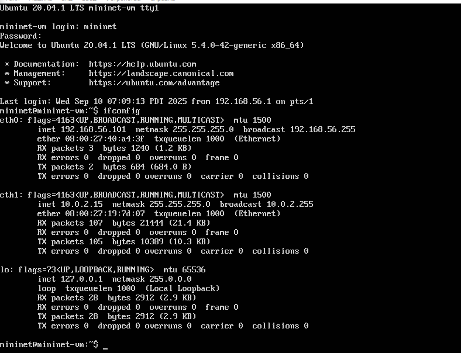
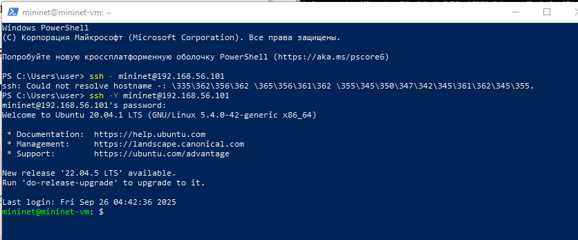
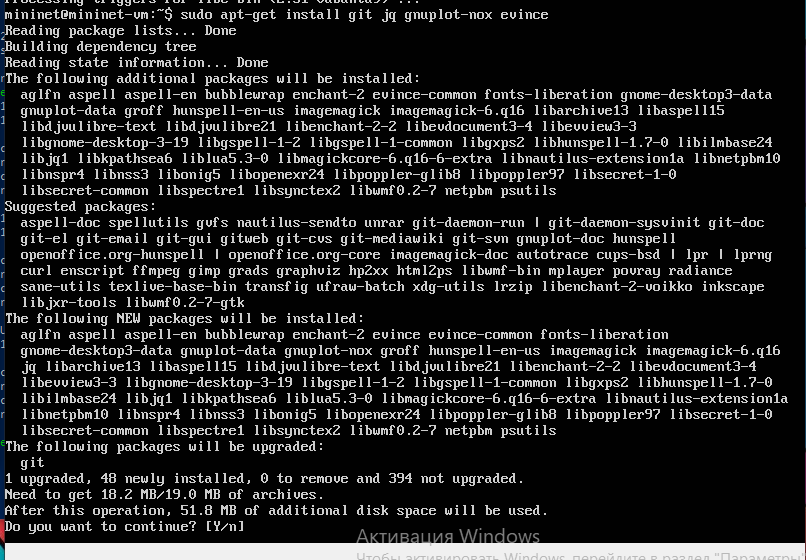
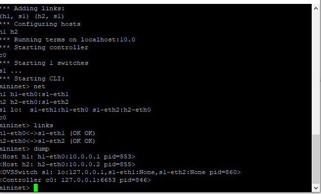
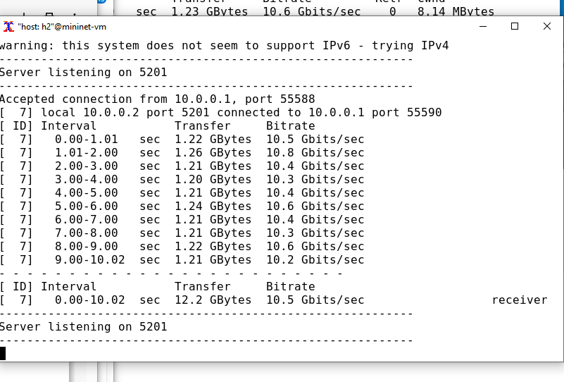
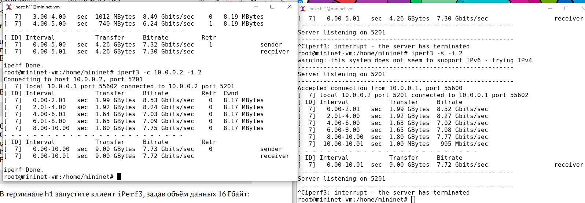
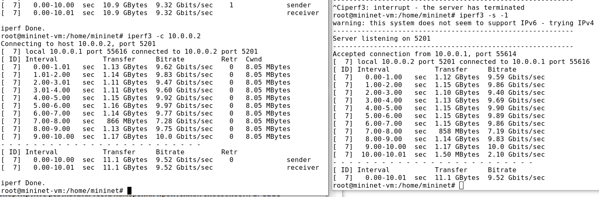
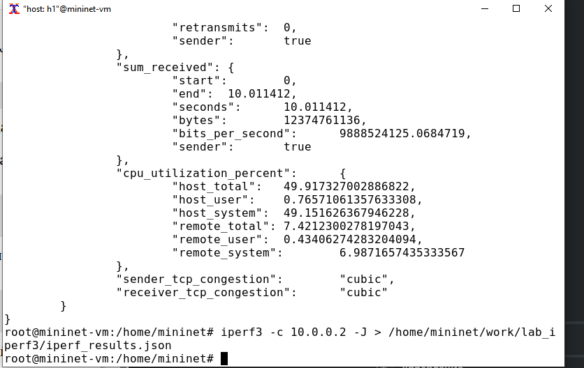
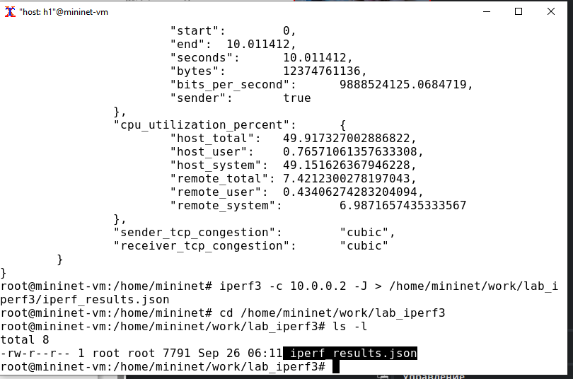

---
## Front matter
title: "Лабораторная работа № 2. Измерение и тестирование пропускной способности сети.Интерактивный эксперимент"
author: "Абакумова Олеся Максимовна, НФИбд-02-22"

## Generic otions
lang: ru-RU
toc-title: "Содержание"

## Bibliography
bibliography: bib/cite.bib
csl: pandoc/csl/gost-r-7-0-5-2008-numeric.csl

## Pdf output format
toc: true # Table of contents
toc-depth: 2
lof: true # List of figures
lot: true # List of tables
fontsize: 12pt
linestretch: 1.5
papersize: a4
documentclass: scrreprt
## I18n polyglossia
polyglossia-lang:
  name: russian
  options:
	- spelling=modern
	- babelshorthands=true
polyglossia-otherlangs:
  name: english
## I18n babel
babel-lang: russian
babel-otherlangs: english
## Fonts
mainfont: IBM Plex Serif
romanfont: IBM Plex Serif
sansfont: IBM Plex Sans
monofont: IBM Plex Mono
mathfont: STIX Two Math
mainfontoptions: Ligatures=Common,Ligatures=TeX,Scale=0.94
romanfontoptions: Ligatures=Common,Ligatures=TeX,Scale=0.94
sansfontoptions: Ligatures=Common,Ligatures=TeX,Scale=MatchLowercase,Scale=0.94
monofontoptions: Scale=MatchLowercase,Scale=0.94,FakeStretch=0.9
mathfontoptions:
## Biblatex
biblatex: true
biblio-style: "gost-numeric"
biblatexoptions:
  - parentracker=true
  - backend=biber
  - hyperref=auto
  - language=auto
  - autolang=other*
  - citestyle=gost-numeric
## Pandoc-crossref LaTeX customization
figureTitle: "Рис."
tableTitle: "Таблица"
listingTitle: "Листинг"
lofTitle: "Список иллюстраций"
lotTitle: "Список таблиц"
lolTitle: "Листинги"
## Misc options
indent: true
header-includes:
  - \usepackage{indentfirst}
  - \usepackage{float} # keep figures where there are in the text
  - \floatplacement{figure}{H} # keep figures where there are in the text
---

# Цель работы

Основной целью работы является знакомство с инструментом для измерения
пропускной способности сети в режиме реального времени — iPerf3, а также
получение навыков проведения интерактивного эксперимента по измерению
пропускной способности моделируемой сети в среде Mininet.

# Задание 

1. Установить на виртуальную машину mininet iPerf3 и дополнительное программное обеспечения для визуализации и обработки данных.

2. Провести ряд интерактивных экспериментов по измерению пропускной
способности с помощью iPerf3 с построением графиков.

# Выполнение лабораторной работы
## Установка необходимого программного обеспечения
Для начала запустимм вирутальную машину (рис. [-@fig:001]):

{#fig:001 width=70%}

Подключимся в основной ОС к виртуальной машине (рис. [-@fig:002]):

{#fig:002 width=70%}

После подключения к виртуальной машине mininet посмотрим IP-адреса
машины (рис. [-@fig:003]):

{#fig:003 width=70%}

Для доступа к сети Интернет должен быть активен адрес NAT: 10.0.0.x.В данном случае никакие дополнительные действия с моей стороны не требуются.

Установим iperf3 (рис. [-@fig:004]):

{#fig:004 width=70%}

{#fig:005 width=70%}

Установим необходимое дополнительное ПО (рис. [-@fig:006]):

{#fig:006 width=70%}

Развернем iperf3_plotter (рис. [-@fig:007]):

{#fig:007 width=70%}

{#fig:008 width=70%}

## Интерактивные эксперименты

Зададим простейшую топологию, состоящую из двух хостов и коммутатора
с назначенной по умолчанию mininet сетью 10.0.0.0/8: (рис. [-@fig:009]):

{#fig:009 width=70%}

После введения этой команды запустятся терминалы двух хостов, коммута-
тора и контроллера. Терминалы коммутатора и контроллера можно закрыть. **Что у меня с первого раза не произошло.У меня отвалился X сервер и чтобы все работало корректно необходимо было его перезапустить, и исправить права запуска X-соединения.**

Посмотрим параметры запущенной в интерактивном режиме топологии (рис. [-@fig:010]):

{#fig:010 width=70%}

{#fig:011 width=70%}

{#fig:012 width=70%}

В терминале 2 запустим сервер iPerf3 (рис. [-@fig:013]):

{#fig:013 width=70%}

После запуска этой команды хост h2 перейдёт в состояние прослушивания
5201-го порта в ожидании входящих подключений.

В терминале хоста h1 запустим клиент iPerf3 (рис. [-@fig:014]):

{#fig:014 width=70%}

Здесь параметр `-c` указывает, что хост h1 настроен как клиент, а параметр
10.0.0.2 является IP-адресом сервера iPerf3 (хост h2).

Дождемся окончания теста. По умолчанию время тестирования установ-
лено в 10 секунд. Для прерывания работы клиента iPerf3 достаточно на
хосте h1 нажать `Ctrl + c` , при этом сервер iPerf3 на хосте h1 продолжит
прослушивать порт 5201. Для остановки как сервера, так и клиента iPerf3
необходимо в терминале хоста h2 нажать `Ctrl + c`.

Проанализируем полученный в результате выполнения теста сводный отчёт (рис. [-@fig:015] и рис. [-@fig:014]), отобразившийся как на клиенте, так и на сервере iPerf3, содержащий
следующие данные:

- ID: идентификационный номер соединения.

- интервал (Interval): временной интервал для периодических отчетов
о пропускной способности (по умолчанию временной интервал равен 1
секунде);

- передача (Transfer): сколько данных было передано за каждый интервал
времени;

- пропускная способность (Bitrate): измеренная пропускная способность
в каждом временном интервале;

- Retr: количество повторно переданных TCP-сегментов за каждый вре-
менной интервал (это поле увеличивается, когда TCP-сегменты теряются
в сети из-за перегрузки или повреждения);

- Cwnd: указывает размер окна перегрузки в каждом временном интер-
вале (TCP использует эту переменную для ограничения объёма данных,
которые TCP-клиент может отправить до получения подтверждения отправленных данных).

Суммарные данные на сервере аналогичны данным на стороне клиента
iPerf3 и должны интерпретироваться таким же образом.

{#fig:015 width=70%}

Было установлено TCP-соединение с идентификатором 7 продолжительностью 10 секунд. Отчеты сформированы с периодичностью в 1 секунду как на стороне отправителя клиента так и на стороне получателя сервера что позволяет провести детальное сравнение. Пропускная способность демонстрирует исключительно высокую и стабильную производительность. Скорость колебалась в очень узком диапазоне от 10.2 Гбит/с до 10.8 Гбит/с при этом большинство измерений показывали значения около 10.5 Гбит/с. Итоговая средняя скорость за весь период теста составила ровно 10.5 Гбит/с согласно отчетам как отправителя так и получателя что указывает на точность измерений и отсутствие расхождений. 

Проведем аналогичный эксперимент в интерфейсе mininet (рис. [-@fig:016]):

1. Запустим сервер iPerf3 на хосте h2.

2. Запустим клиент iPerf3 на хосте h1.

3. Остановим серверный процесс.

{#fig:016 width=70%}

Сравним результат с отчётом предыдущего эксперимента.
Сравнительный анализ двух экспериментов показывает заметное снижение производительности сети при запуске команд непосредственно через интерфейс Mininet по сравнению с выполнением теста из командной оболочки хоста.

В первом эксперименте, проведенном из командной оболочки, результаты показали высокую и стабильную пропускную способность на уровне 10,5 Гбит/с с минимальными колебаниями от 10,2 до 10,8 Гбит/с. Объем переданных данных составил 12,2 ГБ за 10 секунд.

Во втором эксперименте, запущенном через интерфейс Mininet, наблюдается ухудшение показателей. Пропускная способность снизилась до среднего значения 9,47 Гбит/с с более широким разбросом от 8,81 до 10,0 Гбит/с. Общий объем переданных данных уменьшился до 11,0 ГБ за тот же временной интервал.

Размер окна перегрузки Cwnd в обоих случаях оставался стабильным около 8,19 МБ, что подтверждает отсутствие серьезных перегрузок в сети.

Для указания iPerf3 периода времени для передачи можно использовать
ключ `-t` (или `--time`) — время в секундах для передачи (по умолчанию 10
секунд) (рис. [-@fig:017]):

{#fig:017 width=70%}

Настроим клиент iPerf3 для выполнения теста пропускной способности
с 2-секундным интервалом времени отсчёта как на клиенте, так и на сервере.
Используем опцию `-i` для установки интервала между отсчётами, измеряе-
мого в секундах (рис. [-@fig:018] и рис. [-@fig:019]):

{#fig:018 width=70%}

{#fig:019 width=70%}

{#fig:020 width=70%}

Сравнивая этот результат с предыдущими экспериментами видно что увеличение интервала отчетов до 2 секунд заметно снизило измеренную пропускную способность. В первых тестах с интервалом в 1 секунду скорость была около 10.5 Гбит/с а сейчас упала до примерно 8.4 Гбит/с. Это снижение объясняется тем что более длинный интервал усреднения хуже отражает кратковременные пики скорости которые успешно фиксировались при секундных интервалах. При двухсекундном измерении быстрые колебания скорости сглаживаются и в итоге показывают более низкое среднее значение. 

Зададим на клиенте iPerf3 отправку определённого объёма данных. Используем опцию `-n` для установки количества байт для передачи (рис. [-@fig:021]):

{#fig:021 width=70%}

Обратим внимание, что по умолчанию iPerf3 выполняет измерение пропускной способности в течение 10 секунд, но при задании количества
данных для передачи клиент iPerf3 будет продолжать отправлять пакеты до тех пор, пока не будет отправлен весь объем данных, указанный
пользователем.

Изменим в тесте измерения пропускной способности iPerf3 протокол передачи данных с TCP (установлен по умолчанию) на UDP. iPerf3 автоматически
определяет протокол транспортного уровня на стороне сервера. Для изменения протокола используем опцию `-u` на стороне клиента iPerf3 (рис. [-@fig:022]):

{#fig:022 width=70%}

После завершения теста отобразятся следующие сводные данные:

- ID, интервал, передача, битрейт: то же, что и у TCP.

- Jitter: разница в задержке пакетов.

- Lost/Total: указывает количество потерянных дейтаграмм по сравнению
с общим количеством отправленных на сервер (и процентное соотношение).

В тесте измерения пропускной способности iPerf3 изменим номер порта для отправки/получения пакетов или датаграмм через указанный порт.
Используем для этого опцию `-p`(рис. [-@fig:023]):

{#fig:023 width=70%}

По умолчанию после запуска сервер iPerf3 постоянно прослушивает входящие соединения. В тесте измерения пропускной способности iPerf3 зададим
для сервера параметр обработки данных только от одного клиента с остановкой сервера по завершении теста. Для этого используем опцию `-1` на
сервере iPerf3 (рис. [-@fig:024]):

{#fig:024 width=70%}

Обратим внимание, что после завершения этого теста сервер iPerf3
немедленно останавливается.

Экспортируем результаты теста измерения пропускной способности iPerf3
в файл JSON:

1. В виртуальной машине mininet создадим каталог для работы над проектом (рис. [-@fig:025]):

{#fig:025 width=70%}

2. запустим сервер iPerf3 на h2 и терминале h1 запустим клиент iPerf3, указав параметр `-J` для отображения вывода результатов в формате JSON (рис. [-@fig:026]):

{#fig:026 width=70%}

В данном случае параметр -J выведет текст JSON на экран через стандартный вывод (stdout) после завершения теста.

3. Экспортируем вывод результатов теста в файл, перенаправив стандартный вывод в файл (рис. [-@fig:027]):

{#fig:027 width=70%}

4. Убедимся, что файл iperf_results.json создан в указанном каталоге (рис. [-@fig:028]):

{#fig:028 width=70%}

Визуализируем результаты эксперимента:

1. В моем случа исправлять права запуска X-сервера не потребовалось, потому что я сделала это ранее (рис. [-@fig:029]):

{#fig:029 width=70%}

2.  Перейдем в каталог для работы над проектом, проверим и при необходимости скорректируем права доступа к файлу JSON

{#fig:030 width=70%}

3. Сгененрируем выходные данные для файла JSON iPerf3, выполнив следующую команду (рис. [-@fig:031]):

{#fig:031 width=70%}

Сценарий построения должен создать файл CSV (1.dat), который может
использоваться другими приложениями. В подкаталоге results каталога,
в котором был выполнен скрипт, сценарий должен создать графики для
следующих полей файла JSON:

- окно перегрузки (cwnd.pdf);

- повторная передача (retransmits.pdf);

- время приема-передачи (RTT.pdf);

- отклонение времени приема-передачи (RTT_Var.pdf);

- пропускная способность (throughput.pdf);

- максимальная единица передачи (MTU.pdf);

- количество переданных байтов (bytes.pdf).

4. Убедимся, что файлы с данными и графиками сформировались (рис. [-@fig:032]):

{#fig:032 width=70%}

# Выводы

В результате выполнения данной лабораторной работы я познакомилась с инструментом для измерения
пропускной способности сети в режиме реального времени — iPerf3, а также
получила навыки проведения интерактивного эксперимента по измерению
пропускной способности моделируемой сети в среде Mininet.

