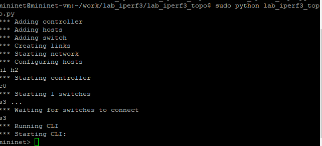
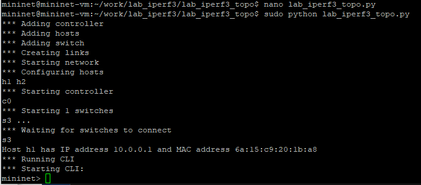
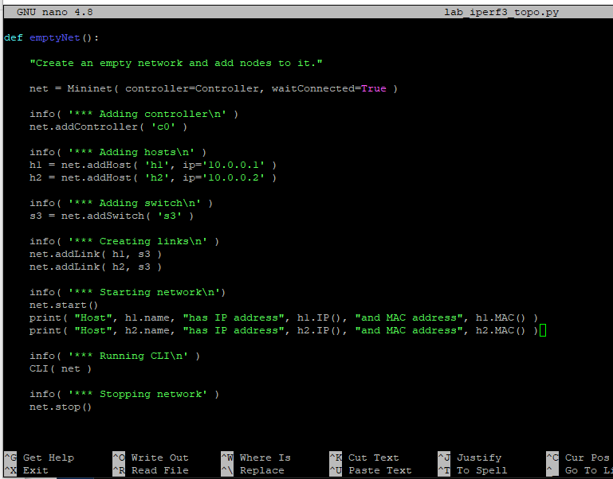
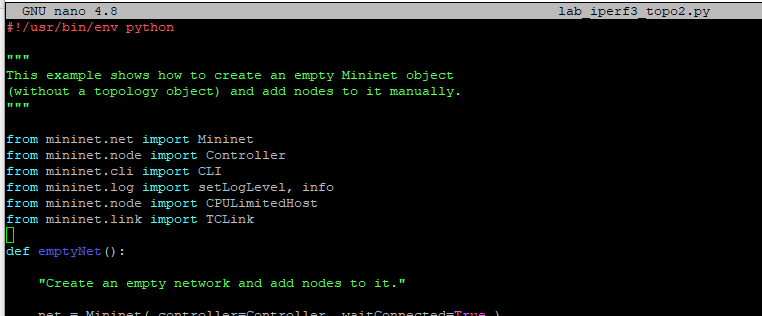
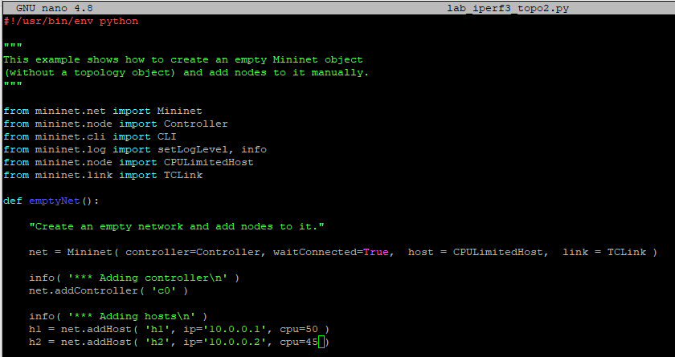
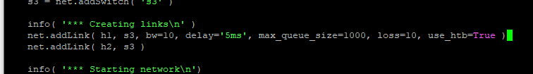
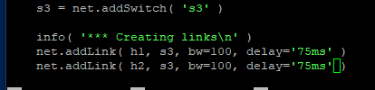
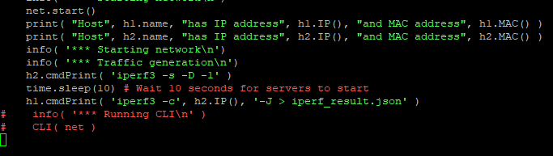
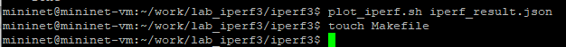
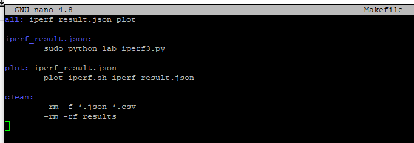

---
## Front matter
lang: ru-RU
title: Лабораторная работа № 3. Измерение и тестирование пропускной способности сети. Воспроизводимый эксперимент
author:
  - Абакумова О. М.
institute:
  - Российский университет дружбы народов, Москва, Россия

## i18n babel
babel-lang: russian
babel-otherlangs: english

## Formatting pdf
toc: false
toc-title: Содержание
slide_level: 2
aspectratio: 169
section-titles: true
theme: metropolis
header-includes:
 - \metroset{progressbar=frametitle,sectionpage=progressbar,numbering=fraction}
mainfont: Open Sans Light
---

# Информация

## Докладчик

:::::::::::::: {.columns align=center}
::: {.column width="70%"}

  * Абакумова Олеся Максимовна
  * Студентка
  * Российский университет дружбы народов
  * 1132220832@pfur.ru
  * <https://github.com/omabakumova>

:::
::: {.column width="30%"}

:::
::::::::::::::

# Цель работы

Основной целью работы является знакомство с инструментом для измерения
пропускной способности сети в режиме реального времени — iPerf3, а также
получение навыков проведения воспроизводимого эксперимента по измерению
пропускной способности моделируемой сети в среде Mininet.

# Задание 

1. Воспроизвести посредством API Mininet эксперименты по измерению пропускной способности с помощью iPerf3.

2. Построить графики по проведённому эксперименту.

# Выполнение лабораторной работы

## Воспроизведение экспериментов посредством API Mininet

{#fig:001 width=40%}

## Воспроизведение экспериментов посредством API Mininet

{#fig:002 width=40%}

## Воспроизведение экспериментов посредством API Mininet

{#fig:003 width=40%}

## Воспроизведение экспериментов посредством API Mininet

{#fig:004 width=40%}

## Воспроизведение экспериментов посредством API Mininet

{#fig:005 width=40%}

## Воспроизведение экспериментов посредством API Mininet

{#fig:006 width=40%}

## Воспроизведение экспериментов посредством API Mininet

{#fig:007 width=40%}

## Воспроизведение экспериментов посредством API Mininet

{#fig:008 width=40%}

## Воспроизведение экспериментов посредством API Mininet

{#fig:009 width=40%}

## Воспроизведение экспериментов посредством API Mininet

{#fig:010 width=40%}

## Воспроизведение экспериментов посредством API Mininet

{#fig:011 width=40%}

## Воспроизведение экспериментов посредством API Mininet

{#fig:012 width=40%}

## Построение графика по проведенному эксперименту

{#fig:013 width=40%}

## Построение графика по проведенному эксперименту

{#fig:014 width=40%}

## Построение графика по проведенному эксперименту

{#fig:015 width=40%}

## Построение графика по проведенному эксперименту

{#fig:016 width=40%}

## Построение графика по проведенному эксперименту

{#fig:017 width=40%}

## Построение графика по проведенному эксперименту

{#fig:018 width=40%}

## Построение графика по проведенному эксперименту

{#fig:019 width=40%}

## Построение графика по проведенному эксперименту

{#fig:020 width=40%}

# Выводы

В результате выполнения данной лабораторной работы я познакомилась с инструментом для измерения
пропускной способности сети в режиме реального времени — iPerf3, а также
получила навыки проведения воспроизводимого эксперимента по измерению
пропускной способности моделируемой сети в среде Mininet.

