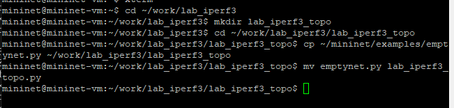
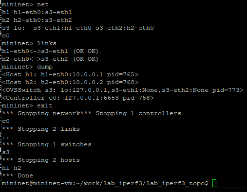
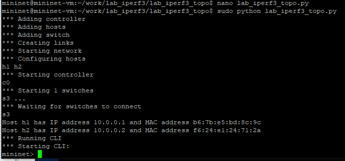
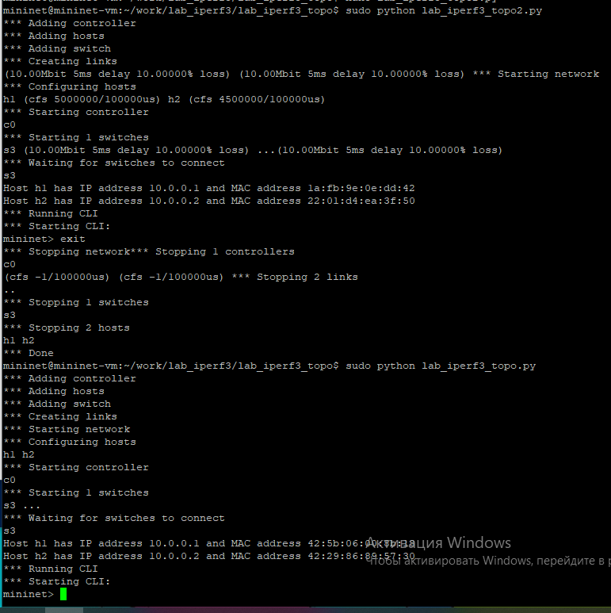
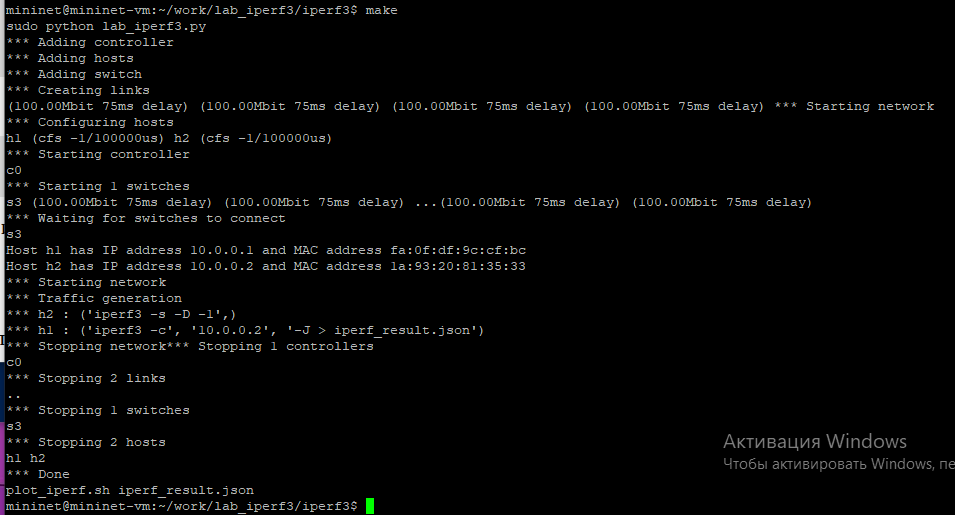

---
## Front matter
title: "Лабораторная работа № 3. Измерение
и тестирование пропускной способности сети.
Воспроизводимый эксперимент"
author: "Абакумова Олеся Максимовна, НФИбд-02-22"

## Generic otions
lang: ru-RU
toc-title: "Содержание"

## Bibliography
bibliography: bib/cite.bib
csl: pandoc/csl/gost-r-7-0-5-2008-numeric.csl

## Pdf output format
toc: true # Table of contents
toc-depth: 2
lof: true # List of figures
lot: true # List of tables
fontsize: 12pt
linestretch: 1.5
papersize: a4
documentclass: scrreprt
## I18n polyglossia
polyglossia-lang:
  name: russian
  options:
	- spelling=modern
	- babelshorthands=true
polyglossia-otherlangs:
  name: english
## I18n babel
babel-lang: russian
babel-otherlangs: english
## Fonts
mainfont: IBM Plex Serif
romanfont: IBM Plex Serif
sansfont: IBM Plex Sans
monofont: IBM Plex Mono
mathfont: STIX Two Math
mainfontoptions: Ligatures=Common,Ligatures=TeX,Scale=0.94
romanfontoptions: Ligatures=Common,Ligatures=TeX,Scale=0.94
sansfontoptions: Ligatures=Common,Ligatures=TeX,Scale=MatchLowercase,Scale=0.94
monofontoptions: Scale=MatchLowercase,Scale=0.94,FakeStretch=0.9
mathfontoptions:
## Biblatex
biblatex: true
biblio-style: "gost-numeric"
biblatexoptions:
  - parentracker=true
  - backend=biber
  - hyperref=auto
  - language=auto
  - autolang=other*
  - citestyle=gost-numeric
## Pandoc-crossref LaTeX customization
figureTitle: "Рис."
tableTitle: "Таблица"
listingTitle: "Листинг"
lofTitle: "Список иллюстраций"
lotTitle: "Список таблиц"
lolTitle: "Листинги"
## Misc options
indent: true
header-includes:
  - \usepackage{indentfirst}
  - \usepackage{float} # keep figures where there are in the text
  - \floatplacement{figure}{H} # keep figures where there are in the text
---

# Цель работы

Основной целью работы является знакомство с инструментом для измерения
пропускной способности сети в режиме реального времени — iPerf3, а также
получение навыков проведения воспроизводимого эксперимента по измерению
пропускной способности моделируемой сети в среде Mininet.

# Задание 

1. Воспроизвести посредством API Mininet эксперименты по измерению пропускной способности с помощью iPerf3.

2. Построить графики по проведённому эксперименту.

# Выполнение лабораторной работы
## Воспроизведение экспериментов посредством API Mininet

1.  С помощью API Mininet создайте простейшую топологию сети, состоящую
из двух хостов и коммутатора с назначенной по умолчанию mininet сетью
10.0.0.0/8:

- В каталоге /work/lab_iperf3 для работы над проектом создадим подкаталог lab_iperf3_topo и скопируйте в него файл с примером скрипта
mininet/examples/emptynet.py, описывающего стандартную простую
топологию сети mininet (рис. [-@fig:001]):

{#fig:001 width=70%}

- Изучим содержание скрипта `lab_iperf3_topo.py` (рис. [-@fig:002]):

{#fig:002 width=70%}

Основные элементы:

   - addSwitch(): добавляет коммутатор в топологию и возвращает имя
коммутатора;

   - ddHost(): добавляет хост в топологию и возвращает имя хоста;

   - addLink(): добавляет двунаправленную ссылку в топологию (и возвращает ключ ссылки; ссылки в Mininet являются двунаправленными, если
не указано иное);

   - Mininet: основной класс для создания и управления сетью;

   - start(): запускает сеть;

   - pingAll(): проверяет подключение, пытаясь заставить все узлы пинговать друг друга;

   - stop(): останавливает сеть;

   - net.hosts: все хосты в сети;

   - dumpNodeConnections(): сбрасывает подключения к/от набора узлов;

   - setLogLevel( 'info' | 'debug' | 'output' ): устанавливает
уровень вывода Mininet по умолчанию; рекомендуется info.

- Запустим скрипт создания топологии lab_iperf3_topo.py (рис. [-@fig:003]):

{#fig:003 width=70%}

- После отработки скрипта посмотрим элементы топологии и завершим
работу mininet (рис. [-@fig:004]):

{#fig:004 width=70%}

2. Внесем в скрипт lab_iperf3_topo.py изменение, позволяющее вывести
на экран информацию о хосте h1, а именно имя хоста, его IP-адрес, MAC-
адрес. Для этого после строки, задающей старт работы сети, добавим строку (рис. [-@fig:005]):

{#fig:005 width=70%}

Здесь:

   - IP() возвращает IP-адрес хоста или определенного интерфейса;

   - MAC() возвращает MAC-адрес хоста или определенного интерфейса.

3. Проверим корректность отработки изменённого скрипта (рис. [-@fig:006]):

{#fig:006 width=70%}

4. Изменим скрипт lab_iperf3_topo.py так, чтобы на экран выводилась информация об имени, IP-адресе и MAC-адресе обоих хостов сети (рис. [-@fig:007]). Проверим корректность отработки изменённого скрипта (рис. [-@fig:008]):

{#fig:007 width=70%}

{#fig:008 width=70%}

5. Mininet предоставляет функции ограничения производительности и изо-
ляции с помощью классов `CPULimitedHost` и `TCLink`. Добавим в скрипт
настройки параметров производительности.

- Сделаем копию скрипта `lab_iperf3_topo.py` с помощью команды: `cp lab_iperf3_topo.py lab_iperf3_topo2.py`.

- В начале скрипта `lab_iperf3_topo2.py` добавим записи об импорте
классов `CPULimitedHost` и `TCLink` (рис. [-@fig:009]):

{#fig:009 width=70%}

- В скрипте `lab_iperf3_topo2.py` изменим строку описания сети, указав
на использование ограничения производительности и изоляции.

- В скрипте `lab_iperf3_topo2.py` изменим функцию задания параметров виртуального хоста `h1`, указав, что ему будет выделено 50% от общих
ресурсов процессора системы.

- Аналогичным образом для хоста h2 зададим долю выделения ресурсов
процессора в 45% (рис. [-@fig:010]):

{#fig:010 width=70%}

- В скрипте `lab_iperf3_topo2.py` изменим функцию параметров соединения между хостом `h1` и коммутатором `s3` (рис. [-@fig:011]):

{#fig:011 width=70%}

Здесь добавляется двунаправленный канал с характеристиками пропускной способности, задержки и потерь:

   - параметр пропускной способности (`bw`) выражается числом в Мбит;

   - задержка (`delay`) выражается в виде строки с заданными единицами
измерения (например, `5ms`, `100us`, `1s`);

   - потери (`loss`) выражаются в процентах (от 0 до 100);

   - параметр максимального значения очереди (`max_queue_size`) выражается в пакетах;

   - параметр `use_htb` указывает на использование ограничителя интенсивности входящего потока `Hierarchical Token Bucket (HTB)`.

- Запустим на отработку сначала скрипт `lab_iperf3_topo2.py`, затем
`lab_iperf3_topo.py` и сравним результат

{#fig:012 width=70%}

При сравнении двух запусков видно, что скрипт `lab_iperf3_topo2.py` создает сеть с ограничениями пропускной способности (`10.00Mbit`), задержкой (`5ms`) и потерей пакетов (`10.00000%`), а также настраивает планировщик `CFS` для хостов `h1 и h2` с конкретными квотами. Второй скрипт `lab_iperf3_topo.py` запускает сеть без этих ограничений и специальных настроек `CFS`, создавая базовую топологию. 

## Построение графика по проведенному эксперименту

6. Построим графики по проводимому эксперименту:

- Сделаем копию скрипта `lab_iperf3_topo2.py` и поместите его в подкаталог `iperf` (рис. [-@fig:013]):

{#fig:013 width=70%}

- В начале скрипта `lab_iperf3.py` добавим запись (рис. [-@fig:014]):

{#fig:014 width=70%}

- Изменим код в скрипте `lab_iperf3.py` так, чтобы:

   - на хостах не было ограничения по использованию ресурсов процессора;
   
   - каналы между хостами и коммутатором были по 100 Мбит/с с задержкой 75 мс, без потерь, без использования ограничителей пропускной (рис. [-@fig:015]): 

{#fig:015 width=70%}

- После функции старта сети опишем запуск на хосте `h2` сервера `iPerf3`,
а на хосте `h1` запуск с задержкой в 10 секунд клиента `iPerf3` с экспортом
результатов в JSON-файл, закомментируем строки, отвечающие за запуск
CLI-интерфейса (рис. [-@fig:016]):

{#fig:016 width=70%}

Здесь после старта сети на хосте `h2` в фоновом режиме запускается сервер `iPerf3` с ключами `-s` (серверный режим), `-D` (демонизация) и `-1` (завершение после принятия одного соединения). Затем вводится задержка в 10 секунд для запуска сервера. На хосте `h1` запускается клиент `iPerf3`, который подключается к IP-адресу `h2`, указанному через `h2.IP()`. Ключ `-c` задает клиентский режим, а `-J` делает вывод результатов в формате `JSON`, который перенаправляется в файл `iperf_result.json`. Строки, отвечающие за запуск интерактивного CLI-интерфейса Mininet, закомментированы, что позволяет выполнить тест автоматически без ручного вмешательства.

- Запустим  на отработку скрипт `lab_iperf3.py` (рис. [-@fig:017]):

{#fig:017 width=70%}

- Построим графики из получившегося JSON-файла и создадим Makefile для проведения всего эксперимента (рис. [-@fig:018]):

{#fig:018 width=70%}

- В Makefile пропишем запуск скрипта эксперимента, построение графиков и очистку каталога от результатов (рис. [-@fig:019]):

{#fig:019 width=70%}

- Проверим корректность отработки Makefile (рис. [-@fig:020]):

{#fig:020 width=70%}

# Выводы

В результате выполнения данной лабораторной работы я познакомилась с инструментом для измерения
пропускной способности сети в режиме реального времени — iPerf3, а также
получила навыки проведения воспроизводимого эксперимента по измерению
пропускной способности моделируемой сети в среде Mininet.

