---
## Front matter
lang: ru-RU
title: Лабораторная работа № 4. Эмуляция и измерение задержек в глобальных сетях
author:
  - Абакумова О. М.
institute:
  - Российский университет дружбы народов, Москва, Россия


## i18n babel
babel-lang: russian
babel-otherlangs: english

## Formatting pdf
toc: false
toc-title: Содержание
slide_level: 2
aspectratio: 169
section-titles: true
theme: metropolis
header-includes:
 - \metroset{progressbar=frametitle,sectionpage=progressbar,numbering=fraction}
mainfont: Open Sans Light
---

# Информация

## Докладчик

:::::::::::::: {.columns align=center}
::: {.column width="70%"}

  * Абакумова Олеся Максимовна
  * Студентка
  * Российский университет дружбы народов
  * 1132220832@pfur.ru
  * <https://github.com/omabakumova>

:::
::: {.column width="30%"}


:::
::::::::::::::

# Цель работы

Основной целью работы является знакомство с NETEM — инструментом для
тестирования производительности приложений в виртуальной сети, а также
получение навыков проведения интерактивного и воспроизводимого экспериментов по измерению задержки и её дрожания (jitter) в моделируемой сети
в среде Mininet.

# Теоретическое введение

Модуль NETEM входит в ядро ОС Linux и управляется при помощи команды
tc из пакета iproute2. Команда tc выполняет все необходимые действия при
работе с системой управления трафиком.
Основной синтаксис tc, используемый с NETEM

# Теоретическое введение

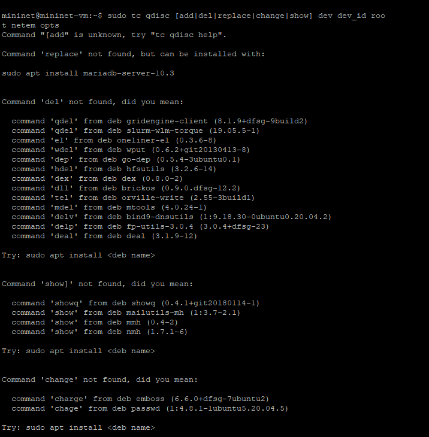{#fig:001 width=40%}

# Задание 

1. Задайте простейшую топологию, состоящую из двух хостов и коммутатора
с назначенной по умолчанию mininet сетью 10.0.0.0/8.

2. Проведите интерактивные эксперименты по добавлению/изменению задерж-
ки, джиттера, значения корреляции для джиттера и задержки, распределения
времени задержки в эмулируемой глобальной сети.

3. Реализуйте воспроизводимый эксперимент по заданию значения задержки
в эмулируемой глобальной сети. Постройте график.

4. Самостоятельно реализуйте воспроизводимые эксперименты по изменению
задержки, джиттера, значения корреляции для джиттера и задержки, рас-
пределения времени задержки в эмулируемой глобальной сети. Постройте
графики

# Выполнение лабораторной работы
## Запуск лабораторной топологии

{#fig:002 width=40%}

## Запуск лабораторной топологии

{#fig:003 width=40%}

## Запуск лабораторной топологии

{#fig:004 width=40%}

## Запуск лабораторной топологии

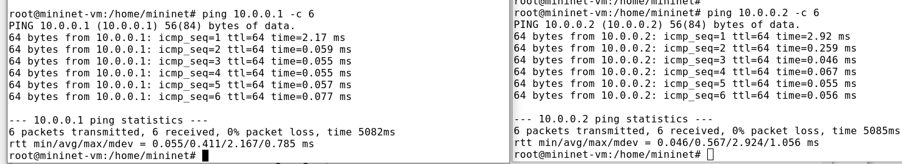{#fig:005 width=40%}

## Запуск лабораторной топологии

Для IP-адреса 10.0.0.1:

- Минимальное RTT: 0.055 мс

- Среднее RTT: 0.411 мс

- Максимальное RTT: 2.167 мс

- Стандартное отклонение: 0.785 мс

## Запуск лабораторной топологии

Для IP-адреса 10.0.0.2:

- Минимальное RTT: 0.046 мс

- Среднее RTT: 0.567 мс

- Максимальное RTT: 2.924 мс

- Стандартное отклонение: 1.056 мс

# Интерактивные эксперименты

## Добавление/изменение задержки в эмулируемой глобальной сети

{#fig:006 width=40%}

## Добавление/изменение задержки в эмулируемой глобальной сети

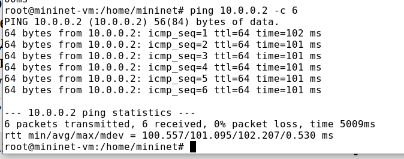{#fig:007 width=40%}

## Добавление/изменение задержки в эмулируемой глобальной сети

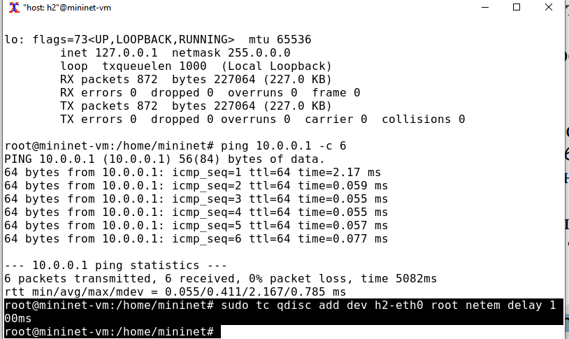{#fig:008 width=40%}

## Добавление/изменение задержки в эмулируемой глобальной сети

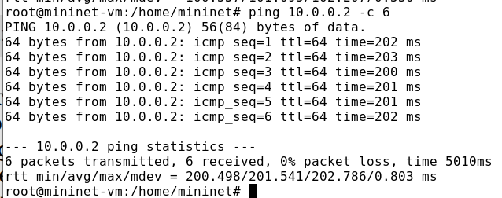{#fig:009 width=40%}


## Изменение задержки в эмулируемой глобальной сети

{#fig:010 width=40%}

## Изменение задержки в эмулируемой глобальной сети

{#fig:011 width=40%}


## Восстановление исходных значений (удаление правил) задержки в эмулируемой глобальной сети

{#fig:012 width=40%}

## Восстановление исходных значений (удаление правил) задержки в эмулируемой глобальной сети

{#fig:013 width=40%}


## Добавление значения дрожания задержки в интерфейс подключения к эмулируемой глобальной сети

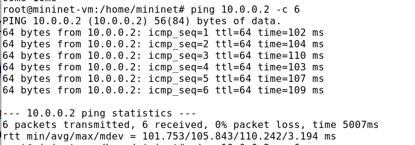{#fig:014 width=40%}

## Добавление значения дрожания задержки в интерфейс подключения к эмулируемой глобальной сети

{#fig:015 width=40%}

## Добавление значения корреляции для джиттера и задержки в интерфейс подключения к эмулируемой глобальной сети

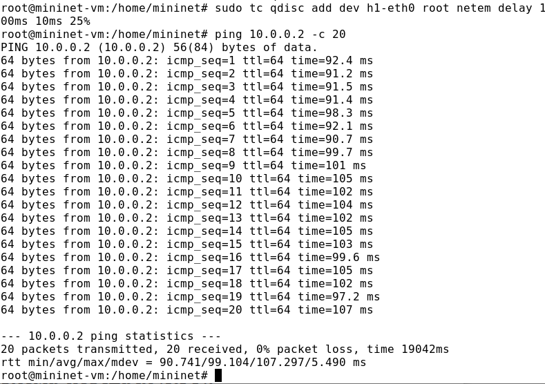{#fig:016 width=40%}

## Распределение задержки в интерфейсе подключения к эмулируемой глобальной сети

NETEM позволяет пользователю указать распределение, которое описывает,
как задержки изменяются в сети. В реальных сетях передачи данных задержки
неравномерны, поэтому при моделировании может быть удобно использовать
некоторое случайное распределение, например, нормальное, парето или парето-
нормальное.

## Распределение задержки в интерфейсе подключения к эмулируемой глобальной сети

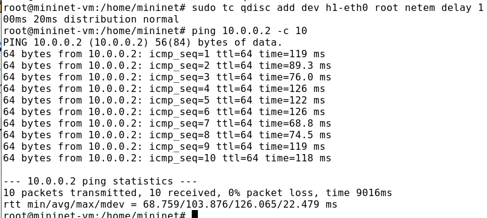{#fig:017 width=40%}

## Распределение задержки в интерфейсе подключения к эмулируемой глобальной сети

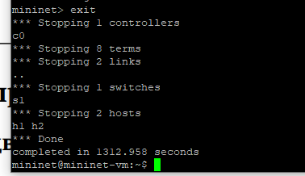{#fig:018 width=40%}

# Воспроизведение экспериментов
## Предварительная подготовка

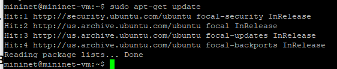{#fig:019 width=40%}

## Предварительная подготовка

{#fig:020 width=40%}

## Предварительная подготовка

{#fig:021 width=40%}


## Добавление задержки для интерфейса, подключающегося к эмулируемой глобальной сети


{#fig:022 width=40%}

## Добавление задержки для интерфейса, подключающегося к эмулируемой глобальной сети


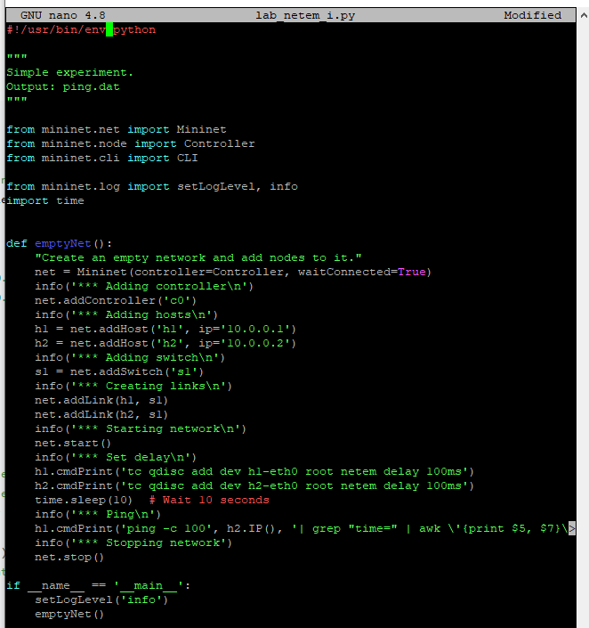{#fig:023 width=40%}

## Добавление задержки для интерфейса, подключающегося к эмулируемой глобальной сети


Скрипт создает простую сетевую топологию в Mininet с двумя хостами и одним коммутатором, настраивает задержку и выполняет ping-тест для сбора данных.
Задержка задается в следующих строках:

```python
h1.cmdPrint('tc qdisc add dev h1-eth0 root netem delay 100ms')
h2.cmdPrint('tc qdisc add dev h2-eth0 root netem delay 100ms')
```
## Добавление задержки для интерфейса, подключающегося к эмулируемой глобальной сети


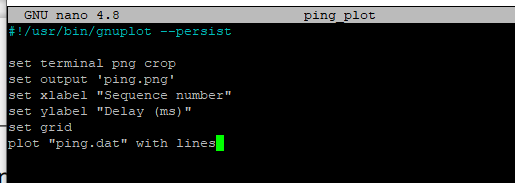{#fig:024 width=40%}

## Добавление задержки для интерфейса, подключающегося к эмулируемой глобальной сети

{#fig:025 width=40%}

## Добавление задержки для интерфейса, подключающегося к эмулируемой глобальной сети

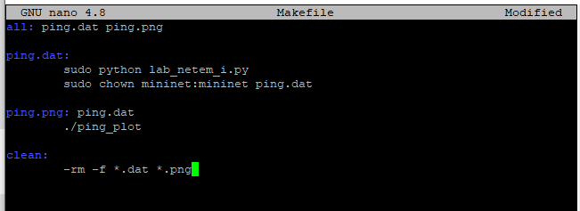{#fig:026 width=40%}

## Добавление задержки для интерфейса, подключающегося к эмулируемой глобальной сети

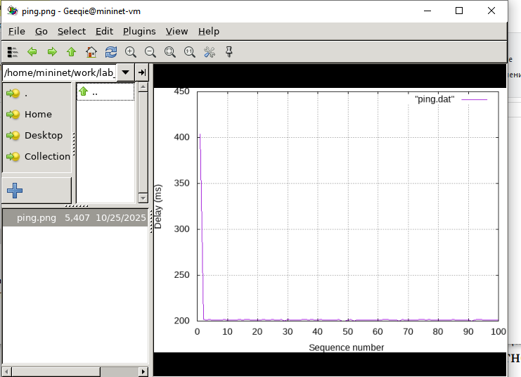{#fig:027 width=40%}

## Добавление задержки для интерфейса, подключающегося к эмулируемой глобальной сети

{#fig:028 width=40%}

## Добавление задержки для интерфейса, подключающегося к эмулируемой глобальной сети

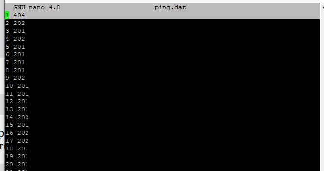{#fig:029 width=40%}

## Добавление задержки для интерфейса, подключающегося к эмулируемой глобальной сети

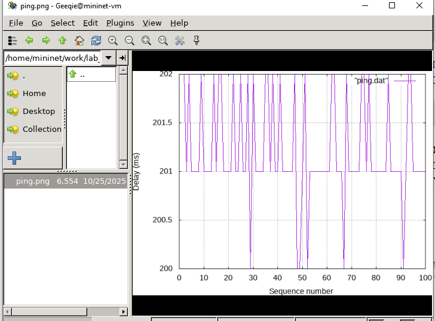{#fig:030 width=40%}

## Добавление задержки для интерфейса, подключающегося к эмулируемой глобальной сети

{#fig:031 width=40%}

## Добавление задержки для интерфейса, подключающегося к эмулируемой глобальной сети

{#fig:032 width=40%}

## Задание для самостоятельной работы

Самостоятельно реализуем воспроизводимые эксперименты по изменению
задержки, джиттера, значения корреляции для джиттера и задержки, распределения времени задержки в эмулируемой глобальной сети. Построим графики.
Вычислим минимальное, среднее, максимальное и стандартное отклонение
времени приёма-передачи для каждого случая

## Задание для самостоятельной работы

{#fig:033 width=40%}

## Задание для самостоятельной работы

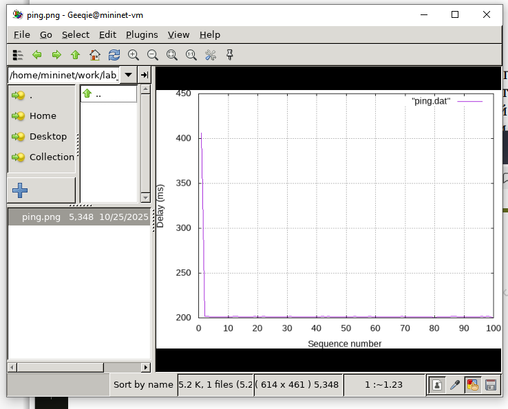{#fig:034 width=40%}

## Задание для самостоятельной работы

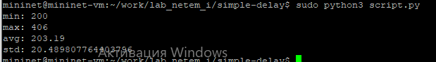{#fig:035 width=40%}


# Выводы

В результате выполнения данной лабораторной работы я познакомилась с NETEM — инструментом для
тестирования производительности приложений в виртуальной сети, а также
получила навыков проведения интерактивного и воспроизводимого экспериментов по измерению задержки и её дрожания (jitter) в моделируемой сети
в среде Mininet.

