---
## Front matter
title: "Лабораторная работа № 4. Эмуляция и измерение
задержек в глобальных сетях"
author: "Абакумова Олеся Максимовна, НФИбд-02-22"

## Generic otions
lang: ru-RU
toc-title: "Содержание"

## Bibliography
bibliography: bib/cite.bib
csl: pandoc/csl/gost-r-7-0-5-2008-numeric.csl

## Pdf output format
toc: true # Table of contents
toc-depth: 2
lof: true # List of figures
lot: true # List of tables
fontsize: 12pt
linestretch: 1.5
papersize: a4
documentclass: scrreprt
## I18n polyglossia
polyglossia-lang:
  name: russian
  options:
	- spelling=modern
	- babelshorthands=true
polyglossia-otherlangs:
  name: english
## I18n babel
babel-lang: russian
babel-otherlangs: english
## Fonts
mainfont: IBM Plex Serif
romanfont: IBM Plex Serif
sansfont: IBM Plex Sans
monofont: IBM Plex Mono
mathfont: STIX Two Math
mainfontoptions: Ligatures=Common,Ligatures=TeX,Scale=0.94
romanfontoptions: Ligatures=Common,Ligatures=TeX,Scale=0.94
sansfontoptions: Ligatures=Common,Ligatures=TeX,Scale=MatchLowercase,Scale=0.94
monofontoptions: Scale=MatchLowercase,Scale=0.94,FakeStretch=0.9
mathfontoptions:
## Biblatex
biblatex: true
biblio-style: "gost-numeric"
biblatexoptions:
  - parentracker=true
  - backend=biber
  - hyperref=auto
  - language=auto
  - autolang=other*
  - citestyle=gost-numeric
## Pandoc-crossref LaTeX customization
figureTitle: "Рис."
tableTitle: "Таблица"
listingTitle: "Листинг"
lofTitle: "Список иллюстраций"
lotTitle: "Список таблиц"
lolTitle: "Листинги"
## Misc options
indent: true
header-includes:
  - \usepackage{indentfirst}
  - \usepackage{float} # keep figures where there are in the text
  - \floatplacement{figure}{H} # keep figures where there are in the text
---

# Цель работы

Основной целью работы является знакомство с NETEM — инструментом для
тестирования производительности приложений в виртуальной сети, а также
получение навыков проведения интерактивного и воспроизводимого экспериментов по измерению задержки и её дрожания (jitter) в моделируемой сети
в среде Mininet.

Модуль NETEM входит в ядро ОС Linux и управляется при помощи команды
tc из пакета iproute2. Команда tc выполняет все необходимые действия при
работе с системой управления трафиком.
Основной синтаксис tc, используемый с NETEM (рис. [-@fig:001]):

{#fig:001 width=70%}

Здесь:

- sudo — включить выполнение команды с более высокими привилегиями
безопасности;

- tc — команда, используемая для взаимодействия с NETEM;

- qdisc — дисциплина очереди (qdisc), представляющая собой набор правил,
определяющих порядок, в котором обслуживаются пакеты, поступающие
с выхода протокола IP.

- [add | del | replace | change | show] ([добавить | удалить | заме-
нить | изменить | показать]): указание на использование одной из операций
над qdisc (например, для добавления задержки на определенном интерфейсе
используется опция add, а для изменения или удаления задержки на опреде-
ленном интерфейсе используется опция change или del соответственно);

- dev_id — параметр указывает интерфейс, подлежащий эмуляции (в данном
случае указан корневой интерфейс — root);

- opts — параметр указывает величину задержки, потери пакетов, дублирова-
ния, повреждения и др.

# Задание 

1. Задайте простейшую топологию, состоящую из двух хостов и коммутатора
с назначенной по умолчанию mininet сетью 10.0.0.0/8.

2. Проведите интерактивные эксперименты по добавлению/изменению задерж-
ки, джиттера, значения корреляции для джиттера и задержки, распределения
времени задержки в эмулируемой глобальной сети.

3. Реализуйте воспроизводимый эксперимент по заданию значения задержки
в эмулируемой глобальной сети. Постройте график.

4. Самостоятельно реализуйте воспроизводимые эксперименты по изменению
задержки, джиттера, значения корреляции для джиттера и задержки, рас-
пределения времени задержки в эмулируемой глобальной сети. Постройте
графики

# Выполнение лабораторной работы
## Запуск лабораторной топологии

1.  Запустим виртуальную машину и подключимся с основной ОС (рис. [-@fig:002]):

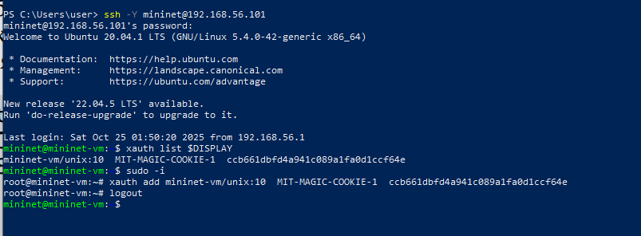{#fig:002 width=70%}

2. Зададим простейшую топологию, состоящую из двух хостов и коммутатора
с назначенной по умолчанию mininet сетью 10.0.0.0/8 (рис. [-@fig:003]):

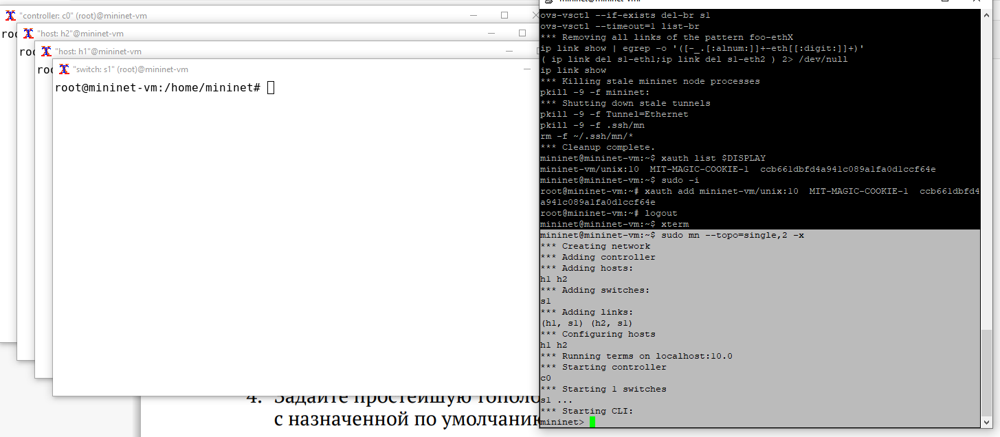{#fig:003 width=70%}

После введения этой команды запустятся терминалы двух хостов, коммутатора и контроллера. Терминалы коммутатора и контроллера можно закрыть.

3. На хостах h1 и h2 введем команду ifconfig, чтобы отобразить информацию, относящуюся к их сетевым интерфейсам и назначенным им IP-адресам.
В дальнейшем при работе с NETEM и командой tc будут использоваться
интерфейсы h1-eth0 и h2-eth0 (рис. [-@fig:004]):

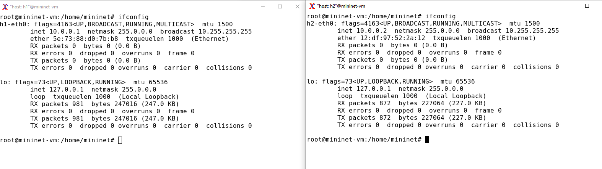{#fig:004 width=70%}

4. Проверим подключение между хостами h1 и h2 с помощью команды ping
с параметром -c 6 (рис. [-@fig:005]):

{#fig:005 width=70%}

Для IP-адреса 10.0.0.1:

- Минимальное RTT: 0.055 мс

- Среднее RTT: 0.411 мс

- Максимальное RTT: 2.167 мс

- Стандартное отклонение: 0.785 мс

Для IP-адреса 10.0.0.2:

- Минимальное RTT: 0.046 мс

- Среднее RTT: 0.567 мс

- Максимальное RTT: 2.924 мс

- Стандартное отклонение: 1.056 мс

## Интерактивные эксперименты
### Добавление/изменение задержки в эмулируемой глобальной сети

Сетевые эмуляторы задают задержки на интерфейсе. Например, задерж-
ка, вносимая в интерфейс коммутатора A, который подключён к интерфейсу
коммутатора B, может представлять собой задержку распространения WAN,
соединяющей оба коммутатора.

1. На хосте h1 добавим задержку в 100 мс к выходному интерфейсу (рис. [-@fig:006]):

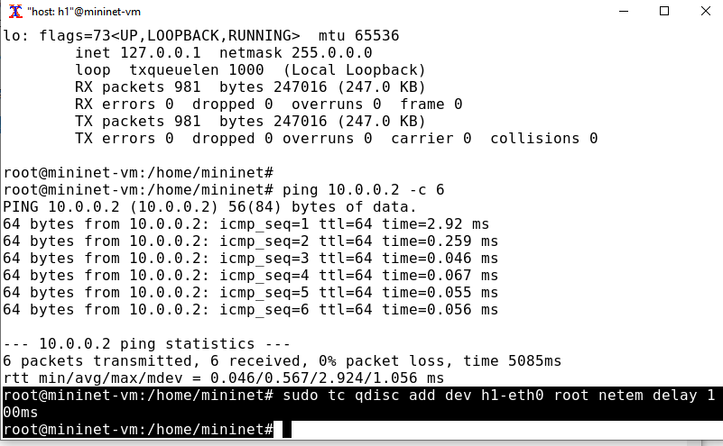{#fig:006 width=70%}

Здесь:

- sudo: выполнить команду с более высокими привилегиями;

- tc: вызвать управление трафиком Linux;

- qdisc: изменить дисциплину очередей сетевого планировщика;

- add: создать новое правило;

- dev h1-eth0: указать интерфейс, на котором будет применяться правило;

- netem: использовать эмулятор сети;

- delay 100ms: задержка ввода 100 мс.

2.Проверим, что соединение от хоста h1 к хосту h2 имеет задержку 100 мс,
используя команду ping с параметром -c 6 с хоста h1 (рис. [-@fig:007]):

{#fig:007 width=70%}

- Минимальное RTT: 100.557 мс

- Среднее RTT: 101.095 мс

- Максимальное RTT: 102.207 мс

- Стандартное отклонение: 0.530 мс

3. Для эмуляции глобальной сети с двунаправленной задержкой необходимо
к соответствующему интерфейсу на хосте h2 также добавить задержку в 100
миллисекунд (рис. [-@fig:008]):

{#fig:008 width=70%}

3. Проверим, что соединение между хостом h1 и хостом h2 имеет RTT в 200 мс
(100 мс от хоста h1 к хосту h2 и 100 мс от хоста h2 к хосту h1), повторив
команду ping с параметром -c 6 на терминале хоста h1 (рис. [-@fig:009]):

{#fig:009 width=70%}

- Минимальное RTT: 100.557 мс

- Среднее RTT: 101.095 мс

- Максимальное RTT: 102.207 мс

- Стандартное отклонение: 0.530 мс

### Изменение задержки в эмулируемой глобальной сети

1. Изменим задержку со 100 мс до 50 мс для отправителя h1 и для получателя h2 (рис. [-@fig:010]):

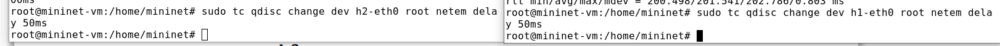{#fig:010 width=70%}

2. Проверим, что соединение от хоста h1 к хосту h2 имеет задержку 100 мс,
используя команду ping с параметром -c 6 с терминала хоста h1 (рис. [-@fig:011]):

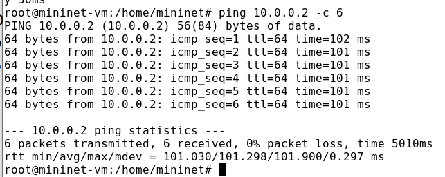{#fig:011 width=70%}

- Минимальное RTT: 101.030 мс

- Среднее RTT: 101.298 мс

- Максимальное RTT: 101.900 мс

- Стандартное отклонение: 0.297 мс

### Восстановление исходных значений (удаление правил) задержки в эмулируемой глобальной сети

1. Восстановим конфигурацию по умолчанию, удалив все правила, применённые к сетевому планировщику соответствующего интерфейса (рис. [-@fig:012]):

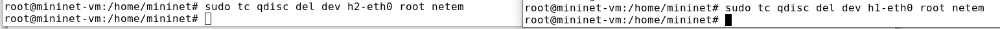{#fig:012 width=70%}

2.  Проверим, что соединение между хостом h1 и хостом h2 не имеет явно
установленной задержки, используя команду ping с параметром -c 6 с терминала хоста h1 (рис. [-@fig:013]):

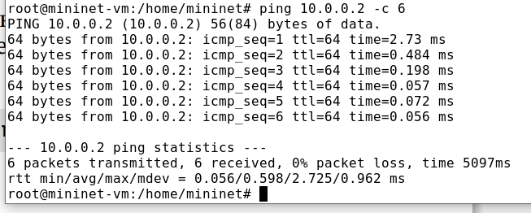{#fig:013 width=70%}

- Минимальное RTT: 0.056 мс

- Среднее RTT: 0.598 мс

- Максимальное RTT: 2.725 мс

- Стандартное отклонение: 0.962 мс

### Добавление значения дрожания задержки в интерфейс подключения к эмулируемой глобальной сети

В сетях нет постоянной задержки. Она может варьироваться в зависимости
от других потоков трафика, конкурирующих за тот же путь. Джиттер (jitter) —
это изменение времени задержки.

1. При необходимости восстановим конфигурацию интерфейсов по умолчанию
на узлах h1 и h2:

2. Добавим на узле h1 задержку в 100 мс со случайным отклонением 10 мс : `sudo tc qdisc add dev h1-eth0 root netem delay 100ms 10ms`.

3. Проверим, что соединение от хоста h1 к хосту h2 имеет задержку 100 мс со
случайным отклонением ±10 мс, используя в терминале хоста h1 команду
ping с параметром -c 6 (рис. [-@fig:014]):

{#fig:014 width=70%}

- Минимальное RTT: 101.753 мс

- Среднее RTT: 105.843 мс

- Максимальное RTT: 110.242 мс

- Стандартное отклонение: 3.194 мс

4. Восстановим конфигурацию интерфейса по умолчанию на узле h1 (рис. [-@fig:015]): 

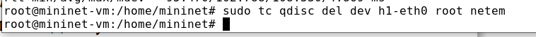{#fig:015 width=70%}

### Добавление значения корреляции для джиттера и задержки в интерфейс подключения к эмулируемой глобальной сети

1. При необходимости восстановим конфигурацию интерфейсов по умолчанию
на узлах h1 и h2.

2. Добавим на интерфейсе хоста h1 задержку в 100 мс с вариацией ±10 мс
и значением корреляции в 25%. Убедимся, что все пакеты, покидающие устройство h1 на интерфейсе h1-eth0, будут иметь время задержки 100 мс со случайным отклонением ±10 мс, при этом время передачи следующего пакета зависит от предыдущего значения на 25% (рис. [-@fig:016]):

{#fig:016 width=70%}

- Минимальное RTT: 90.741 мс

- Среднее RTT: 99.104 мс

- Максимальное RTT: 107.297 мс

- Стандартное отклонение: 5.490 мс

3. Восстановим конфигурацию интерфейса по умолчанию на узле h1.

### Распределение задержки в интерфейсе подключения к эмулируемой глобальной сети

NETEM позволяет пользователю указать распределение, которое описывает,
как задержки изменяются в сети. В реальных сетях передачи данных задержки
неравномерны, поэтому при моделировании может быть удобно использовать
некоторое случайное распределение, например, нормальное, парето или парето-
нормальное.

1. При необходимости восстановим конфигурацию интерфейсов по умолчанию
на узлах h1 и h2. Убедимся, что все пакеты, покидающие хост h1 на интерфейсе h1-eth0, будут иметь время задержки, которое распределено в диапазоне 100 мс ±20 мс. Используем для этого команду ping на терминале хоста h1 с параметром
-c 10 (рис. [-@fig:017]):

{#fig:017 width=70%}

2. Восстановим конфигурацию интерфейса по умолчанию на узле h1.

3. Завершим работу mininet в интерактивном режиме, введя в интерфейсе
mininet (рис. [-@fig:018]):

{#fig:018 width=70%}

## Воспроизведение экспериментов
### Предварительная подготовка

1. Обновим репозитории программного обеспечения на виртуальной машинеВ (рис. [-@fig:019]):

{#fig:019 width=70%}

2.Установим пакет geeqie — понадобится для просмотра файлов png (рис. [-@fig:020]):

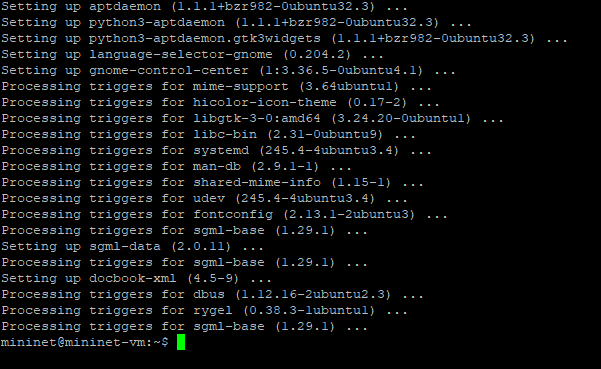{#fig:020 width=70%}

3. Для каждого воспроизводимого эксперимента expname создайте свой каталог, в котором будут размещаться файлы эксперимента (рис. [-@fig:021]):

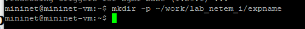{#fig:021 width=70%}

Здесь expname может принимать значения simple-delay, change-delay,
jitter-delay, correlation-delay и т.п.

Для каждого случая создадим скрипт для проведения эксперимента
lab_netem_i.py и скрипт для визуализации результатов ping_plot.

### Добавление задержки для интерфейса, подключающегося к эмулируемой глобальной сети

С помощью API Mininet воспроизведите эксперимент по добавлению задержки для интерфейса хоста, подключающегося к эмулируемой глобальной сети.

1. В виртуальной среде mininet в своём рабочем каталоге с проектами создадим
каталог simple-delay и перейдем в него (рис. [-@fig:022]):

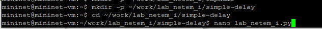{#fig:022 width=70%}

2. Создаем скрипт для эксперимента lab_netem_i.py (рис. [-@fig:023]):

{#fig:023 width=70%}

Скрипт создает простую сетевую топологию в Mininet с двумя хостами и одним коммутатором, настраивает задержку и выполняет ping-тест для сбора данных.
Задержка задается в следующих строках:

```python
h1.cmdPrint('tc qdisc add dev h1-eth0 root netem delay 100ms')
h2.cmdPrint('tc qdisc add dev h2-eth0 root netem delay 100ms')
```

3. Создаём скрипт для визуализации ping_plot результатов эксперимента (рис. [-@fig:024]):

{#fig:024 width=70%}

4. Зададим права доступа к файлу скрипта (рис. [-@fig:025]):

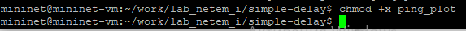{#fig:025 width=70%}

5. Создадим Makefile для управления процессом проведения эксперимента (рис. [-@fig:026]):

{#fig:026 width=70%}

6. Запустим с помощью `make` и получим следующий график (рис. [-@fig:027]):

{#fig:027 width=70%}

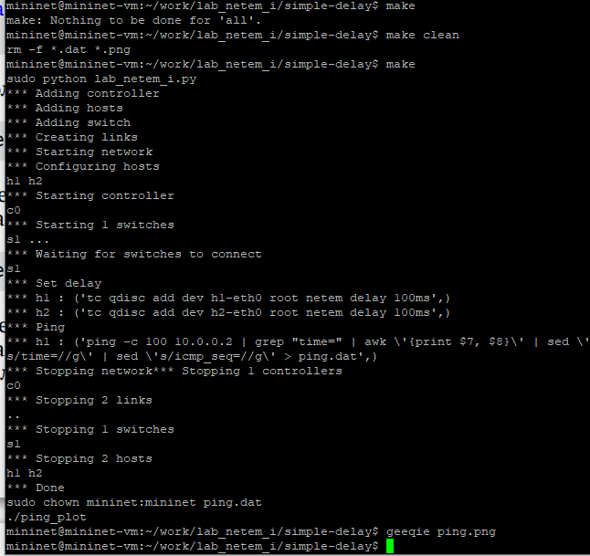{#fig:028 width=70%}

7. Из файла ping.dat удалим первую строку и заново построим график (рис. [-@fig:029]):

{#fig:029 width=70%}

8. Выведем снова график с учетом изменений (рис. [-@fig:030]):

{#fig:030 width=70%}

9. Разработаем скрипт для вычисления на основе данных файла ping.dat минимального, среднего, максимального и стандартного отклонения времени приёма-передачи (рис. [-@fig:031]):

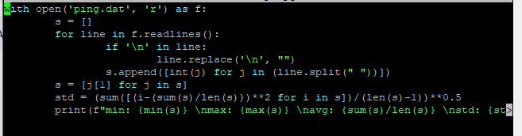{#fig:031 width=70%}

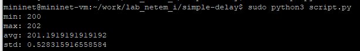{#fig:032 width=70%}

### Задание для самостоятельной работы

Самостоятельно реализуем воспроизводимые эксперименты по изменению
задержки, джиттера, значения корреляции для джиттера и задержки, распределения времени задержки в эмулируемой глобальной сети. Построим графики.
Вычислим минимальное, среднее, максимальное и стандартное отклонение
времени приёма-передачи для каждого случая (рис. [-@fig:033]):

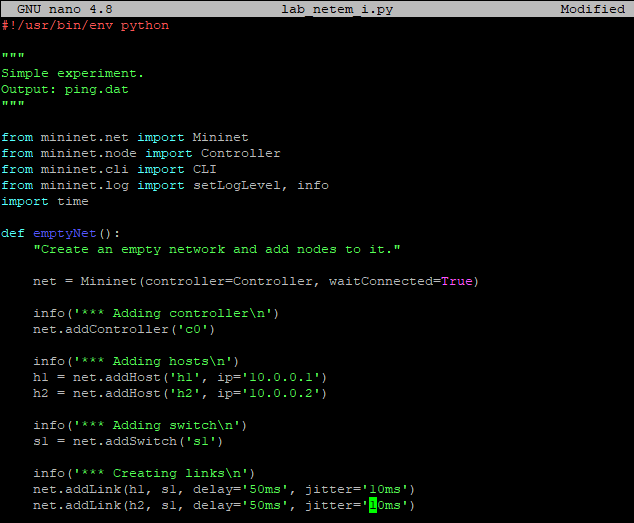{#fig:033 width=70%}

{#fig:034 width=70%}

{#fig:035 width=70%}


# Выводы

В результате выполнения данной лабораторной работы я познакомилась с NETEM — инструментом для
тестирования производительности приложений в виртуальной сети, а также
получила навыков проведения интерактивного и воспроизводимого экспериментов по измерению задержки и её дрожания (jitter) в моделируемой сети
в среде Mininet.

