---
## Front matter
lang: ru-RU
title: Лабораторная работа № 5. Эмуляция и измерение потерь пакетов в глобальных сетях
author:
  - Абакумова О. М.
institute:
  - Российский университет дружбы народов, Москва, Россия


## i18n babel
babel-lang: russian
babel-otherlangs: english

## Formatting pdf
toc: false
toc-title: Содержание
slide_level: 2
aspectratio: 169
section-titles: true
theme: metropolis
header-includes:
 - \metroset{progressbar=frametitle,sectionpage=progressbar,numbering=fraction}
mainfont: Open Sans Light
---

# Информация

## Докладчик

:::::::::::::: {.columns align=center}
::: {.column width="70%"}

  * Абакумова Олеся Максимовна
  * Студентка
  * Российский университет дружбы народов
  * 1132220832@pfur.ru
  * <https://github.com/omabakumova>

:::
::: {.column width="30%"}


:::
::::::::::::::

# Цель работы

Основной целью работы является получение навыков проведения интерактивных экспериментов в среде Mininet по исследованию параметров сети,
связанных с потерей, дублированием, изменением порядка и повреждением
пакетов при передаче данных. Эти параметры влияют на производительность
протоколов и сетей 

# Задание

1. Задайте простейшую топологию, состоящую из двух хостов и коммутатора
с назначенной по умолчанию mininet сетью 10.0.0.0/8.

2. Проведите интерактивные эксперименты по по исследованию параметров
сети, связанных с потерей, дублированием, изменением порядка и повреждением пакетов при передаче данных.

3. Реализуйте воспроизводимый эксперимент по добавлению правила отбрасывания пакетов в эмулируемой глобальной сети. На экран выведите сводную
информацию о потерянных пакетах.

4. Самостоятельно реализуйте воспроизводимые эксперименты по исследованию параметров сети, связанных с потерей, изменением порядка и повреждением пакетов при передаче данных. На экран выведите сводную
информацию о потерянных пакетах.

# Выполнение лабораторной работы
## Запуск лабораторной топологии

{#fig:001 width=40%}

## Запуск лабораторной топологии

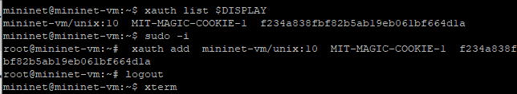{#fig:002 width=40%}

## Запуск лабораторной топологии

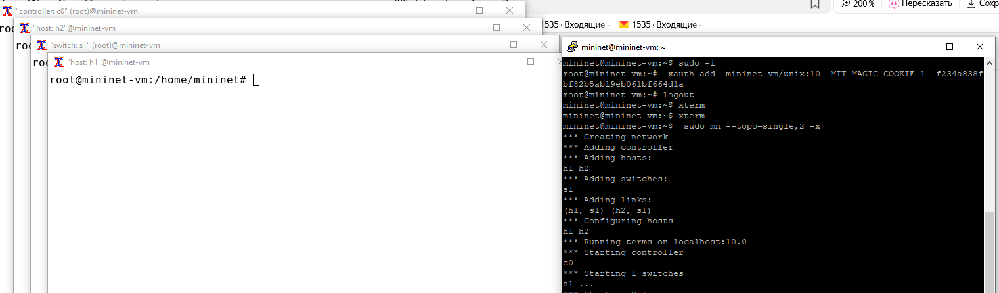{#fig:003 width=40%}

## Запуск лабораторной топологии

{#fig:004 width=40%}

## Запуск лабораторной топологии

{#fig:005 width=40%}

## Запуск лабораторной топологии

{#fig:006 width=40%}

## Запуск лабораторной топологии


Минимальное RTT: 0.052 мс, среднее RTT: 0.095 мс, максимальное RTT: 3.840 мс, стандартное отклонение RTT: 1.419 мс для 10.0.0.1. Для 10.0.0.2: минимальное RTT: 0.059 мс, среднее RTT: 0.992 мс, максимальное RTT: 5.435 мс, стандартное отклонение RTT: 1.997 мс. Потерь данных в обоих случаях нет (0% потерь пакетов).

## Интерактивные эксперименты

Пакеты могут быть потеряны в процессе передачи из-за таких факторов, как
битовые ошибки и перегрузка сети. Скорость потери данных часто измеряется
как процентная доля потерянных пакетов по отношению к количеству отправленных пакетов.

## Интерактивные эксперименты

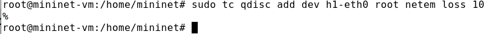{#fig:007 width=40%}

## Интерактивные эксперименты

{#fig:008 width=40%}

## Интерактивные эксперименты

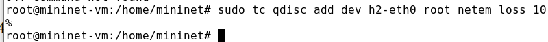{#fig:009 width=40%}

## Интерактивные эксперименты

{#fig:010 width=40%}

**22% потерь пакетов**

## Интерактивные эксперименты

{#fig:011 width=40%}

## Интерактивные эксперименты

{#fig:012 width=40%}

## Интерактивные эксперименты


{#fig:013 width=40%}

## Интерактивные эксперименты

{#fig:014 width=40%}

**60% потеря пакетов**

## Интерактивные эксперименты

{#fig:015 width=40%}

## Интерактивные эксперименты

{#fig:016 width=40%}

## Интерактивные эксперименты

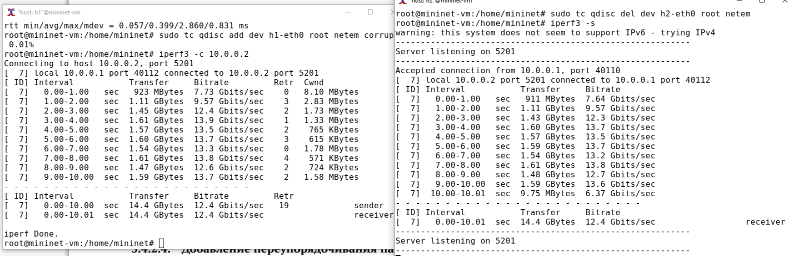{#fig:017 width=40%}


## Интерактивные эксперименты

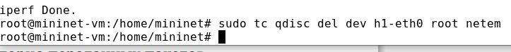{#fig:018 width=40%}

## Интерактивные эксперименты

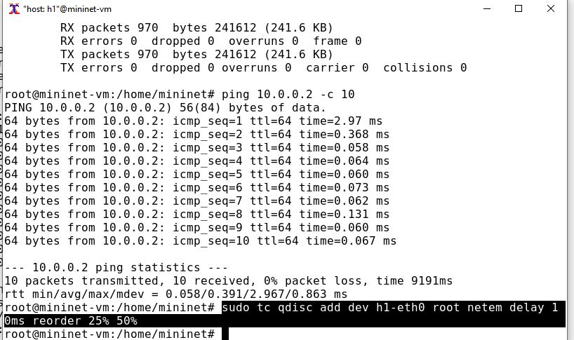{#fig:019 width=40%}

## Интерактивные эксперименты

{#fig:020 width=40%}

**0% потерь пакетов**

## Интерактивные эксперименты

{#fig:021 width=40%}

## Интерактивные эксперименты

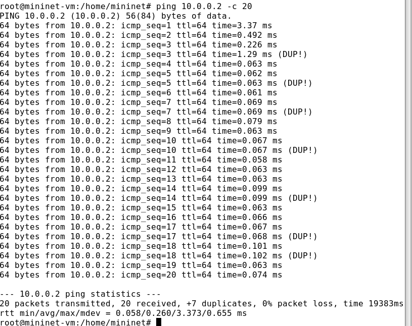{#fig:022 width=40%}

## Воспроизведение экспериментов

{#fig:023 width=40%}

## Воспроизведение экспериментов

{#fig:024 width=40%}

## Воспроизведение экспериментов

{#fig:025 width=40%}

## Воспроизведение экспериментов

В этих строках задается значение потери пакетов для интерфейса хоста:

```python
h1.cmdPrint( 'tc qdisc add dev h1-eth0 root netem loss
    ~ 10%'
h2.cmdPrint( 'tc qdisc add dev h2-eth0 root netem loss
    ~ 10%'
```

## Воспроизведение экспериментов

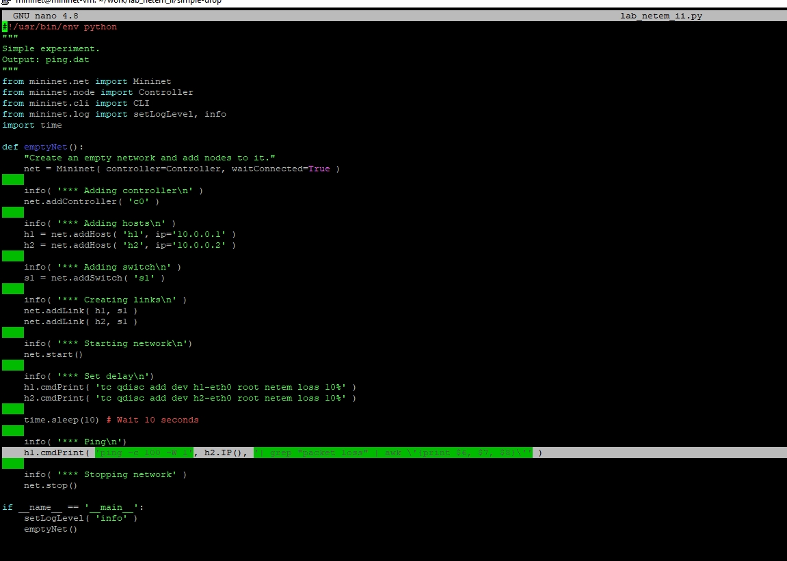{#fig:026 width=40%}

## Воспроизведение экспериментов

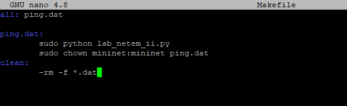{#fig:027 width=40%}

## Воспроизведение экспериментов

{#fig:028 width=40%}

## Воспроизведение экспериментов

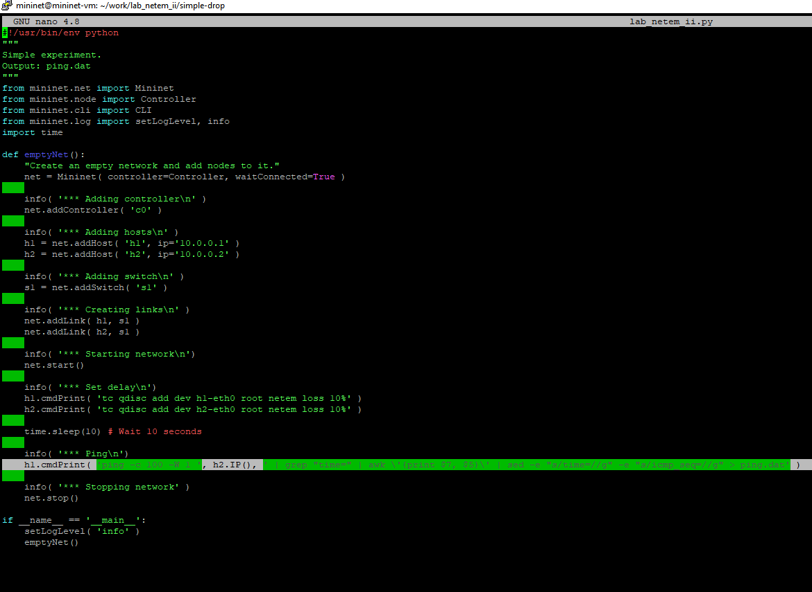{#fig:029 width=40%}

## Воспроизведение экспериментов


{#fig:030 width=40%}

## Воспроизведение экспериментов

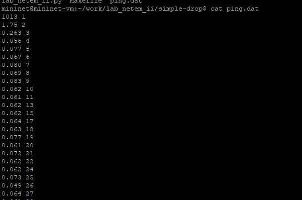{#fig:031 width=40%}

## Задание для самостоятельной работы

Самостоятельно реализуйте воспроизводимые эксперименты по исследованию параметров сети, связанных с потерей, изменением порядка и повреждением пакетов при передаче данных 

## Задание для самостоятельной работы

{#fig:032 width=40%}

## Задание для самостоятельной работы


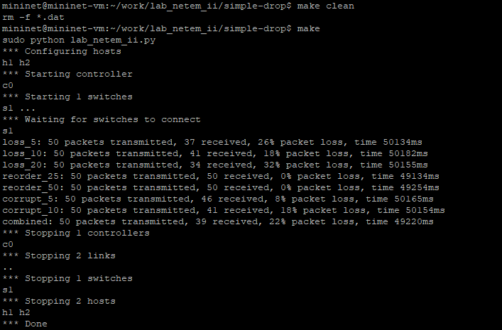{#fig:033 width=40%}

## Задание для самостоятельной работы

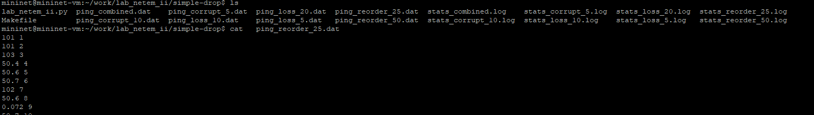{#fig:034 width=40%}


# Выводы

В результате выполнения данной лабораторной работы я получила навыки работы проведения интерактивных экспериментов в среде Mininet по исследованию параметров сети,
связанных с потерей, дублированием, изменением порядка и повреждением
пакетов при передаче данных.

