---
## Front matter
title: "Лабораторная работа № 5. Эмуляция и измерение потерь пакетов в глобальных сетях
задержек в глобальных сетях"
author: "Абакумова Олеся Максимовна, НФИбд-02-22"

## Generic otions
lang: ru-RU
toc-title: "Содержание"

## Bibliography
bibliography: bib/cite.bib
csl: pandoc/csl/gost-r-7-0-5-2008-numeric.csl

## Pdf output format
toc: true # Table of contents
toc-depth: 2
lof: true # List of figures
lot: true # List of tables
fontsize: 12pt
linestretch: 1.5
papersize: a4
documentclass: scrreprt
## I18n polyglossia
polyglossia-lang:
  name: russian
  options:
	- spelling=modern
	- babelshorthands=true
polyglossia-otherlangs:
  name: english
## I18n babel
babel-lang: russian
babel-otherlangs: english
## Fonts
mainfont: IBM Plex Serif
romanfont: IBM Plex Serif
sansfont: IBM Plex Sans
monofont: IBM Plex Mono
mathfont: STIX Two Math
mainfontoptions: Ligatures=Common,Ligatures=TeX,Scale=0.94
romanfontoptions: Ligatures=Common,Ligatures=TeX,Scale=0.94
sansfontoptions: Ligatures=Common,Ligatures=TeX,Scale=MatchLowercase,Scale=0.94
monofontoptions: Scale=MatchLowercase,Scale=0.94,FakeStretch=0.9
mathfontoptions:
## Biblatex
biblatex: true
biblio-style: "gost-numeric"
biblatexoptions:
  - parentracker=true
  - backend=biber
  - hyperref=auto
  - language=auto
  - autolang=other*
  - citestyle=gost-numeric
## Pandoc-crossref LaTeX customization
figureTitle: "Рис."
tableTitle: "Таблица"
listingTitle: "Листинг"
lofTitle: "Список иллюстраций"
lotTitle: "Список таблиц"
lolTitle: "Листинги"
## Misc options
indent: true
header-includes:
  - \usepackage{indentfirst}
  - \usepackage{float} # keep figures where there are in the text
  - \floatplacement{figure}{H} # keep figures where there are in the text
---

# Цель работы

Основной целью работы является получение навыков проведения интерактивных экспериментов в среде Mininet по исследованию параметров сети,
связанных с потерей, дублированием, изменением порядка и повреждением
пакетов при передаче данных. Эти параметры влияют на производительность
протоколов и сетей 

# Задание

1. Задайте простейшую топологию, состоящую из двух хостов и коммутатора
с назначенной по умолчанию mininet сетью 10.0.0.0/8.

2. Проведите интерактивные эксперименты по по исследованию параметров
сети, связанных с потерей, дублированием, изменением порядка и повреждением пакетов при передаче данных.

3. Реализуйте воспроизводимый эксперимент по добавлению правила отбрасывания пакетов в эмулируемой глобальной сети. На экран выведите сводную
информацию о потерянных пакетах.

4. Самостоятельно реализуйте воспроизводимые эксперименты по исследованию параметров сети, связанных с потерей, изменением порядка и повреждением пакетов при передаче данных. На экран выведите сводную
информацию о потерянных пакетах.

# Выполнение лабораторной работы
## Запуск лабораторной топологии

Запускаем виртуальную машину. Здесь ждет легкая неожиданность, но это не помешало выполнить лабораторную работу (рис. [-@fig:001]):

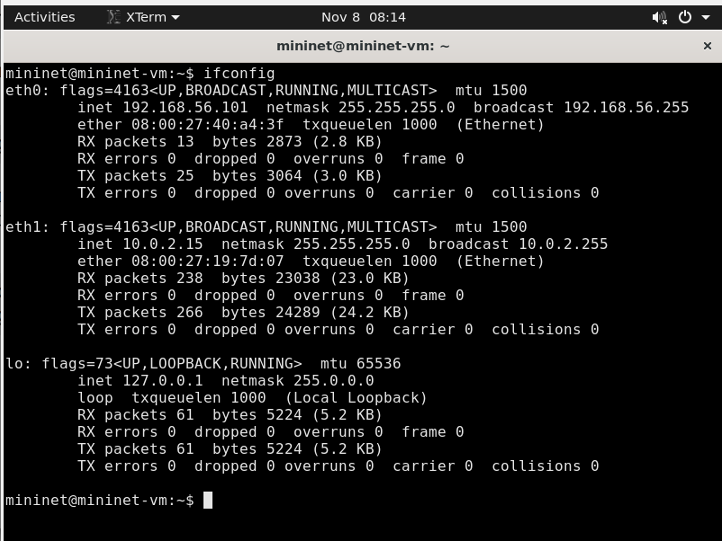{#fig:001 width=70%}

В виртуальной машине mininet при необходимости исправим права запуска
X-соединения. Скопируем значение куки (MIT magic cookie) своего пользователя mininet в файл для пользователя root(рис. [-@fig:002]):

{#fig:002 width=70%}

После выполнения этих действий графические приложения должны запускаться под пользователем mininet.

Зададим простейшую топологию, состоящую из двух хостов и коммутатора
с назначенной по умолчанию mininet сетью 10.0.0.0/8 (рис. [-@fig:003]):

{#fig:003 width=70%}

После введения этой команды запустятся терминалы двух хостов, коммутатора и контроллера. Терминалы коммутатора и контроллера можно закрыть.

На хостах h1 и h2 введем команду ifconfig, чтобы отобразить информацию, относящуюся к их сетевым интерфейсам и назначенным им IP-адресам.
В дальнейшем при работе с NETEM и командой tc будут использоваться
интерфейсы h1-eth0 и h2-eth0 (рис. [-@fig:004]):

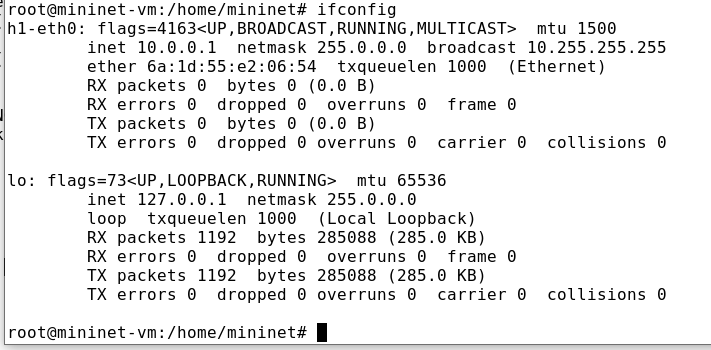{#fig:004 width=70%}

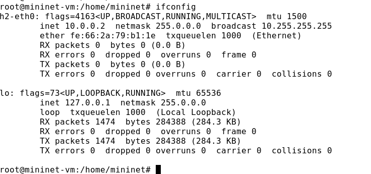{#fig:005 width=70%}

Проверим подключение между хостами h1 и h2 с помощью команды ping
с параметром -c 6 (рис. [-@fig:006]):

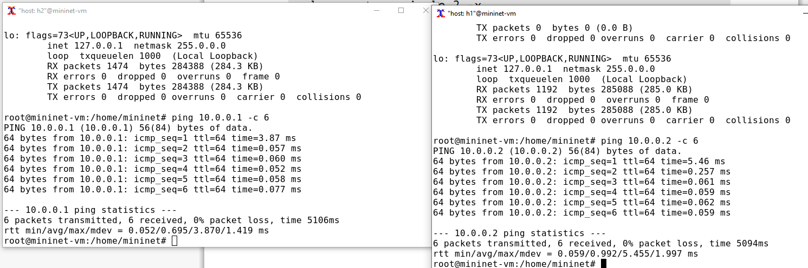{#fig:006 width=70%}


Минимальное RTT: 0.052 мс, среднее RTT: 0.095 мс, максимальное RTT: 3.870 мс, стандартное отклонение RTT: 1.419 мс для 10.0.0.1. Для 10.0.0.2: минимальное RTT: 0.059 мс, среднее RTT: 0.992 мс, максимальное RTT: 5.435 мс, стандартное отклонение RTT: 1.997 мс. Потерь данных в обоих случаях нет (0% потерь пакетов).


## Интерактивные эксперименты
### Добавление потери пакетов на интерфейс, подключённый к эмулируемой глобальной сети

Пакеты могут быть потеряны в процессе передачи из-за таких факторов, как
битовые ошибки и перегрузка сети. Скорость потери данных часто измеряется
как процентная доля потерянных пакетов по отношению к количеству отправленных пакетов.
На хосте h1 добавьте 10% потерь пакетов к интерфейсу h1-eth0 (рис. [-@fig:007]):

{#fig:007 width=70%}

Здесь:

- sudo: выполнить команду с более высокими привилегиями;

- tc: вызвать управление трафиком Linux;

- qdisc: изменить дисциплину очередей сетевого планировщика;

- add: создать новое правило;

- dev h1-eth0: указать интерфейс, на котором будет применяться правило;

- netem: использовать эмулятор сети;

- loss 10%: 10% потерь пакетов.

Проверим, что на соединении от хоста h1 к хосту h2 имеются потери паке-
тов, используя команду ping с параметром -c 100 с хоста h1. Параметр -c
указывает общее количество пакетов для отправки. Обратим внимание на
значения icmp_seq. Некоторые номера последовательности отсутствуют из-
за потери пакетов. В сводном отчёте ping сообщает о проценте потерянных
пакетов после завершения передачи (рис. [-@fig:008]):

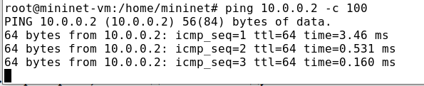{#fig:008 width=70%}

Для эмуляции глобальной сети с потерей пакетов в обоих направлениях
необходимо к соответствующему интерфейсу на хосте h2 также добавить 10%
потерь пакетов (рис. [-@fig:009]):

{#fig:009 width=70%}

Проверим, что соединение между хостом h1 и хостом h2 имеет больший про-
цент потерянных данных (10% от хоста h1 к хосту h2 и 10% от хоста h2 к хосту
h1), повторив команду ping с параметром -c 100 на терминале хоста h1 (рис. [-@fig:010]):

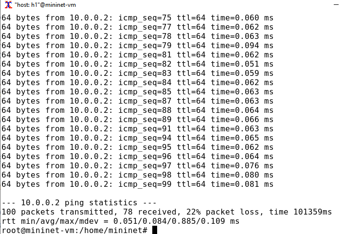{#fig:010 width=70%}

**22% потерь пакетов**

Восстановим конфигурацию по умолчанию, удалив все правила, приме-
нённые к сетевому планировщику соответствующего интерфейса. Для
отправителя h1 (рис. [-@fig:011]):

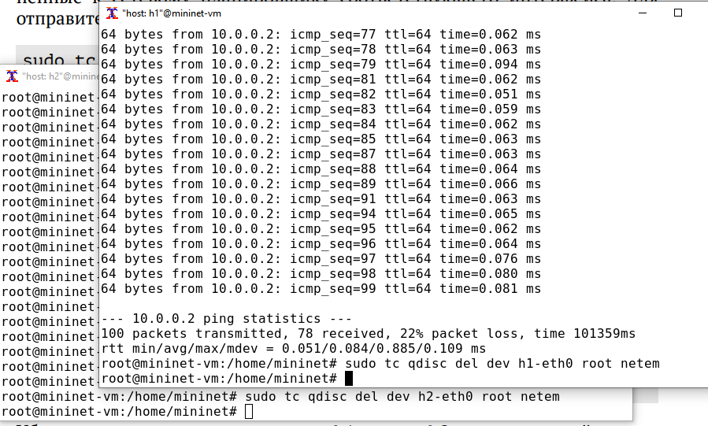{#fig:011 width=70%}

Убедимся, что соединение от хоста h1 к хосту h2 не имеет явной потери (рис. [-@fig:012]):

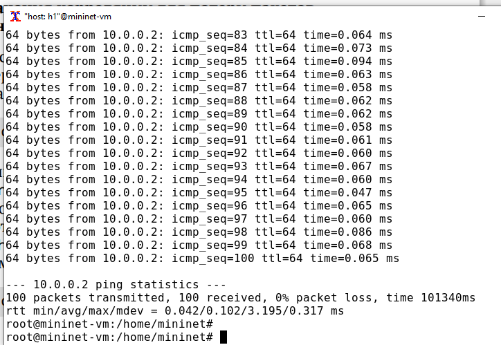{#fig:012 width=70%}

### Добавление значения корреляции для потери пакетов в эмулируемой глобальной сети

Добавим на интерфейсе узла h1 коэффициент потери пакетов 50% (такой
высокий уровень потери пакетов маловероятен), и каждая последующая
вероятность зависит на 50% от последней (рис. [-@fig:013]):

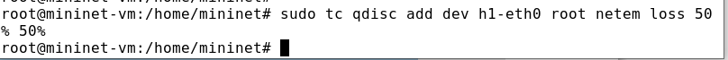{#fig:013 width=70%}

Проверим, что на соединении от хоста h1 к хосту h2 имеются потери пакетов,
используя команду ping с параметром -c 50 с хоста h1 (рис. [-@fig:014]): 

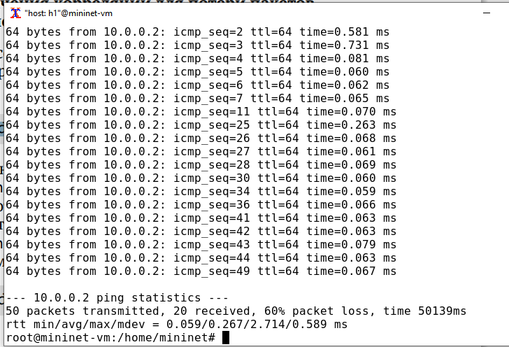{#fig:014 width=70%}

**60% потеря пакетов**

Восстановим для узла h1 конфигурацию по умолчанию, удалив все правила,
применённые к сетевому планировщику соответствующего интерфейса (рис. [-@fig:015]):

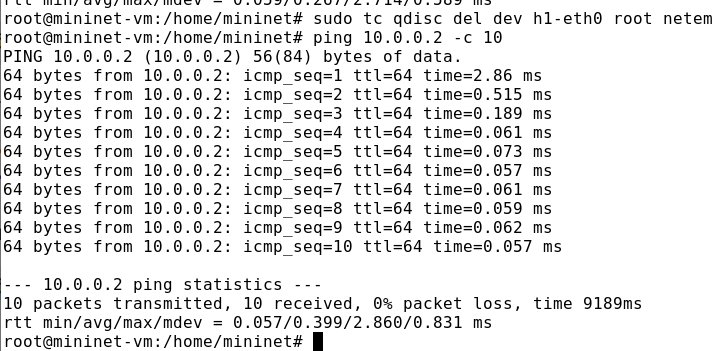{#fig:015 width=70%}

### Добавление повреждения пакетов в эмулируемой глобальной сети

Добавим на интерфейсе узла h1 0,01% повреждения пакетов (рис. [-@fig:016]):

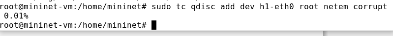{#fig:016 width=70%}

Проверим конфигурацию с помощью инструмента iPerf3 для проверки
повторных передач(рис. [-@fig:017]):

{#fig:017 width=70%}


Восстановим конфигурацию на h1(рис. [-@fig:018]):

{#fig:018 width=70%}

### Добавление переупорядочивания пакетов в интерфейс подключения к эмулируемой глобальной сети

Добавим на интерфейсе узла h1 следующее правило (рис. [-@fig:019]):

{#fig:019 width=70%}

Здесь 25% пакетов (со значением корреляции 50%) будут отправлены немед-
ленно, а остальные 75% будут задержаны на 10 мс.

Проверим, что на соединении от хоста h1 к хосту h2 имеются потери пакетов,
используя команду ping с параметром -c 20 с хоста h1. Убедимся, что часть
пакетов не будут иметь задержки (один из четырех, или 25%), а последующие несколько пакетов будут иметь задержку около 10 миллисекунд (три
из четырех, или 75%). При необходимости повторим тест (рис. [-@fig:020]):

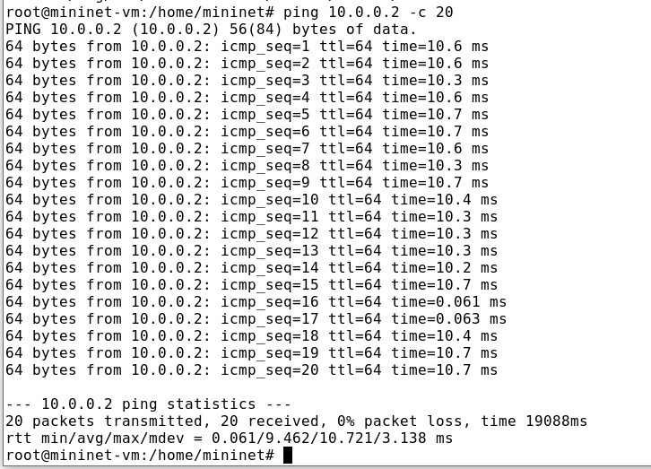{#fig:020 width=70%}

**0% потерь пакетов**

Восстановим конфигурацию.

### Добавление дублирования пакетов в интерфейс подключения к эмулируемой глобальной сети

Для интерфейса узла h1 зададим правило c дублированием 50% пакетов (т.е.
50% пакетов должны быть получены дважды) (рис. [-@fig:021]):

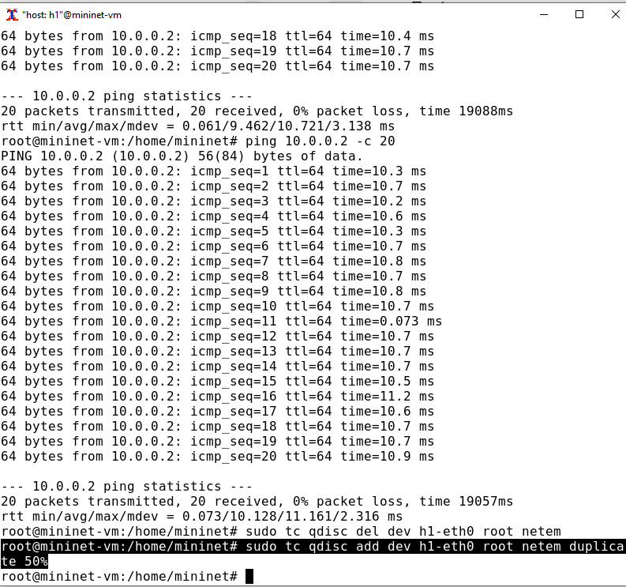{#fig:021 width=70%}

Проверим, что на соединении от хоста h1 к хосту h2 имеются дублированные
пакеты, используя команду ping с параметром -c 20 с хоста h1. Дубликаты
пакетов помечаются как DUP!. Измеренная скорость дублирования пакетов
будет приближаться к настроенной скорости по мере выполнения большего
количества попыток (рис. [-@fig:022]):

{#fig:022 width=70%}

Восстановим конфигурацию.

## Воспроизведение экспериментов
### Предварительная подготовка

Для каждого воспроизводимого эксперимента expname создадим свой каталог, в котором будут размещаться файлы эксперимента (рис. [-@fig:023]):

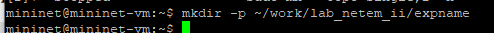{#fig:023 width=70%}

Здесь expname может принимать значения simple-drop, correlation-
drop и т.п.

### Добавление потери пакетов на интерфейс, подключённый к эмулируемой глобальной сети

С помощью API Mininet воспроизведем эксперимент по добавлению потери
пакетов для интерфейса хоста, подключающегося к эмулируемой глобальной
сети.
В виртуальной среде mininet в своём рабочем каталоге с проектами создадим
каталог simple-drop и перейдем в него (рис. [-@fig:024]):

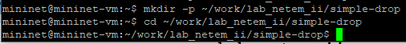{#fig:024 width=70%}

Создадим скрипт для эксперимента lab_netem_ii.py (рис. [-@fig:025]):

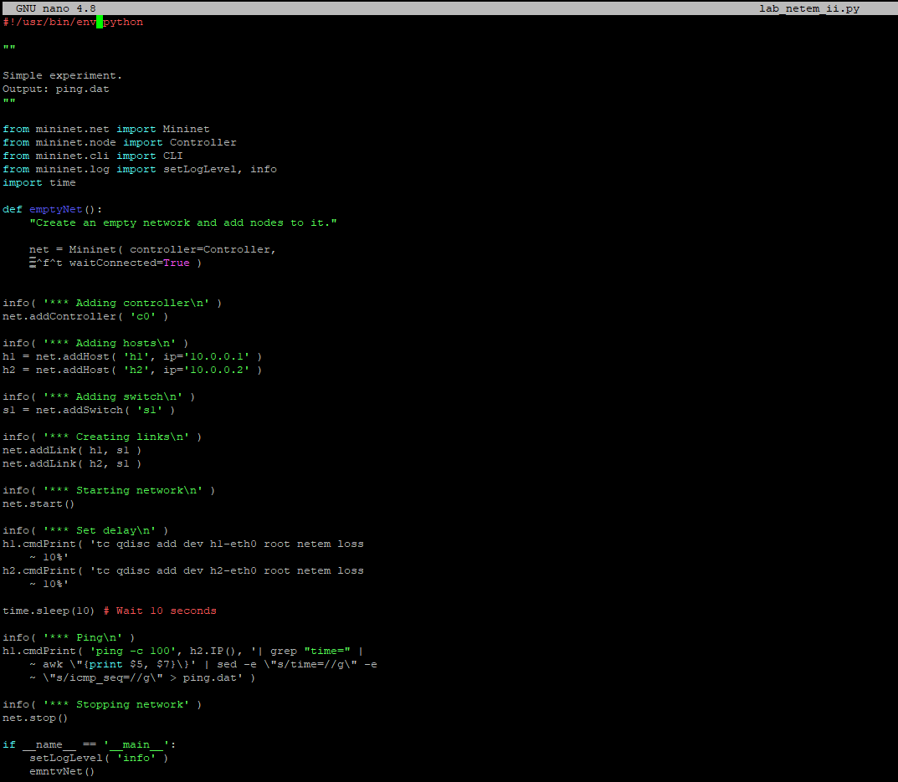{#fig:025 width=70%}

В этих строках задается значение потери пакетов для интерфейса хоста:

```python
h1.cmdPrint( 'tc qdisc add dev h1-eth0 root netem loss
    ~ 10%'
h2.cmdPrint( 'tc qdisc add dev h2-eth0 root netem loss
    ~ 10%'
```

Скорректируем скрипт так, чтобы на экран или в отдельный файл выводи-
лась информация о потерях пакетов (рис. [-@fig:026]):

{#fig:026 width=70%}

Создадим Makefile для управления процессом проведения эксперимента (рис. [-@fig:027]):

{#fig:027 width=70%}

Запустим скрипт (рис. [-@fig:028]):

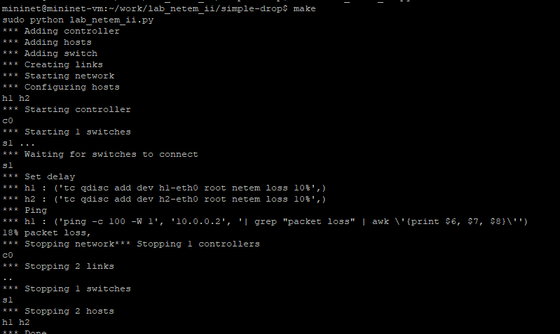{#fig:028 width=70%}

Также помимо вывода например потери пакетов на экран можно сделать вывод в файл. Рассмотрим и такой вариант. Вот как я скорректировала файл (рис. [-@fig:029]):

{#fig:029 width=70%}

Ping.dat (рис. [-@fig:030])теперье есть в каталоге и его можно посмотреть (рис. [-@fig:031]):


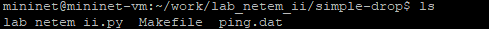{#fig:030 width=70%}

{#fig:031 width=70%}

## Задание для самостоятельной работы

Самостоятельно реализуйте воспроизводимые эксперименты по исследованию параметров сети, связанных с потерей, изменением порядка и повреждением пакетов при передаче данных (рис. [-@fig:032]):

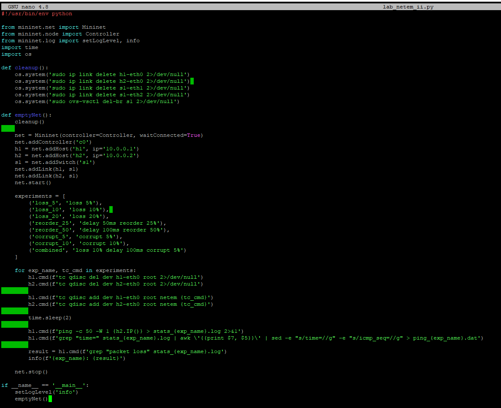{#fig:032 width=70%}

Запустим обновленный скрипт (рис. [-@fig:033]):


{#fig:033 width=70%}

Созданы файлы для всех воспроизводимых экспериментов в каталоге (рис. [-@fig:034]):

{#fig:034 width=70%}


# Выводы

В результате выполнения данной лабораторной работы я получила навыки работы проведения интерактивных экспериментов в среде Mininet по исследованию параметров сети,
связанных с потерей, дублированием, изменением порядка и повреждением
пакетов при передаче данных.
