---
## Front matter
lang: ru-RU
title: Лабораторная работа № 6. Эмуляция и измерение потерь пакетов в глобальных сетях
author:
  - Абакумова О. М.
institute:
  - Российский университет дружбы народов, Москва, Россия

## i18n babel
babel-lang: russian
babel-otherlangs: english

## Formatting pdf
toc: false
toc-title: Содержание
slide_level: 2
aspectratio: 169
section-titles: true
theme: metropolis
header-includes:
 - \metroset{progressbar=frametitle,sectionpage=progressbar,numbering=fraction}
mainfont: Open Sans Light
---

# Информация

## Докладчик

:::::::::::::: {.columns align=center}
::: {.column width="70%"}

  * Абакумова Олеся Максимовна
  * Студентка
  * Российский университет дружбы народов
  * 1132220832@pfur.ru
  * <https://github.com/omabakumova>

:::
::: {.column width="30%"}

:::
::::::::::::::

# Цель работы

Основной целью работы является знакомство с принципами работы дисциплины очереди Token Bucket Filter, которая формирует входящий/исходящий
трафик для ограничения пропускной способности, а также получение навыков
моделирования и исследования поведения трафика посредством проведения
интерактивного и воспроизводимого экспериментов в Mininet

# Предварительные сведения

Token Bucket Filter (TBF) представляет собой алгоритм, используемый в сетях
с коммутацией пакетов для ограничения пропускной способности и пиковой
нагрузки трафика. Передача поступающих в очередь системы (queque)
пакетов данных осуществляется при наличии в специальном буфере (bucket)
необходимого числа разрешений на передачу (или токенов). Токены могут быть
представлены в виде пакетов или числа байтов, поступающих в буфер (корзину)
фиксированного размера с фиксированной скоростью.

# Задание

1. Задайте топологию, состоящую из двух хостов и двух коммутаторов
с назначенной по умолчанию mininet сетью 10.0.0.0/8.

2. Проведите интерактивные эксперименты по ограничению пропускной способности сети с помощью TBF в эмулируемой глобальной сети.

3. Самостоятельно реализуйте воспроизводимые эксперимент по применению
TBF для ограничения пропускной способности. Постройте соответствующие
графики.

# Выполнение лабораторной работы
## Запуск лабораторной топологии

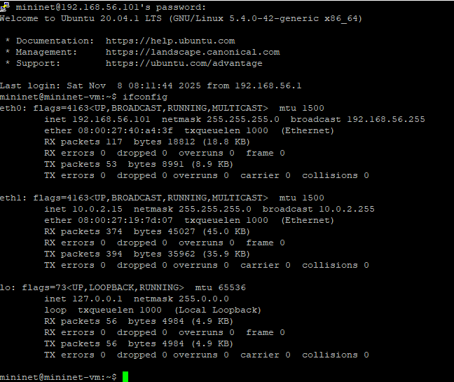{#fig:001 width=50%}

## Запуск лабораторной топологии

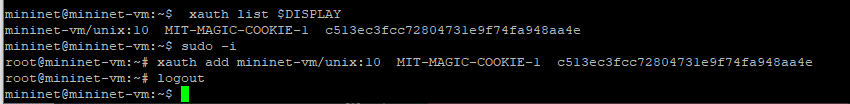{#fig:002 width=70%}

## Запуск лабораторной топологии

{#fig:003 width=70%}

## Запуск лабораторной топологии

{#fig:004 width=70%}

## Запуск лабораторной топологии

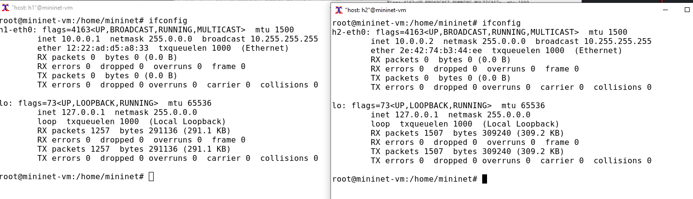{#fig:005 width=70%}

## Запуск лабораторной топологии

{#fig:006 width=70%}

## Запуск лабораторной топологии

{#fig:007 width=70%}

## Интерактивные эксперименты

Команду tc можно применить к сетевому интерфейсу устройства для формирования исходящего трафика. Требуется ограничить скорость отправки данных
с конечного хоста с помощью фильтра Token Bucket Filter (tbf)

## Интерактивные эксперименты

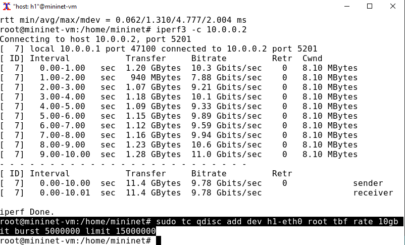{#fig:008 width=70%}

## Интерактивные эксперименты

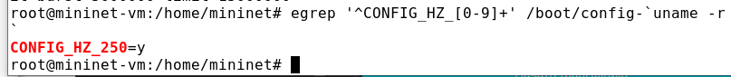{#fig:009 width=70%}

## Интерактивные эксперименты

Для расчёта значения всплеска (burst) необходимо скорость передачи (10
Гбит/с или 10 Gbps = 10,000,000,000 bps) разделить на полученное таким
образом значение HZ (на хосте h1 HZ = 250):
Burst = 10,000,000,000/250 = 40,000,000 bits = 40,000,000/8 bytes = 5,000,000
bytes.

## Интерактивные эксперименты

{#fig:010 width=70%}

## Интерактивные эксперименты

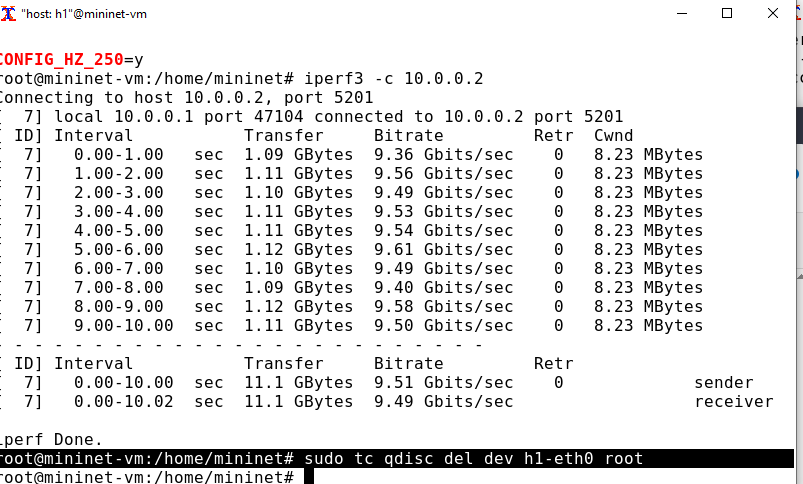{#fig:011 width=70%}

## Интерактивные эксперименты

При ограничении скорости на интерфейсе s1-eth2 коммутатора s1 все сеансы связи между коммутатором s1 и коммутатором s2 будут фильтроваться
в соответствии с применяемыми правилами.

## Интерактивные эксперименты
{#fig:012 width=70%}

## Интерактивные эксперименты

{#fig:013 width=70%}

## Интерактивные эксперименты

{#fig:014 width=70%}

## Интерактивные эксперименты

NETEM используется для изменения задержки, джиттера, повреждения пакетов и т.д. TBF может использоваться для ограничения скорости. Утилита tc
позволяет комбинировать несколько модулей. При этом первая дисциплина
очереди (qdisc1) присоединяется к корневой метке, последующие дисциплины
очереди можно прикрепить к своим родителям, указав правильную метку.

## Интерактивные эксперименты

{#fig:015 width=70%}

## Интерактивные эксперименты

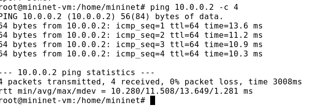{#fig:016 width=70%}

## Интерактивные эксперименты

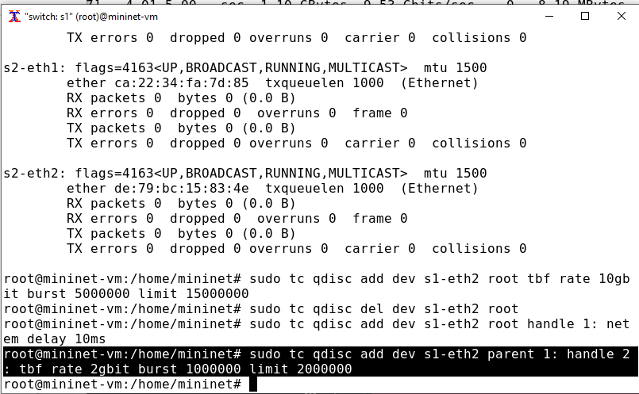{#fig:017 width=70%}

## Интерактивные эксперименты

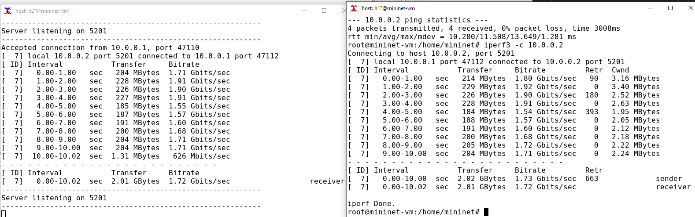{#fig:018 width=70%}

## Интерактивные эксперименты

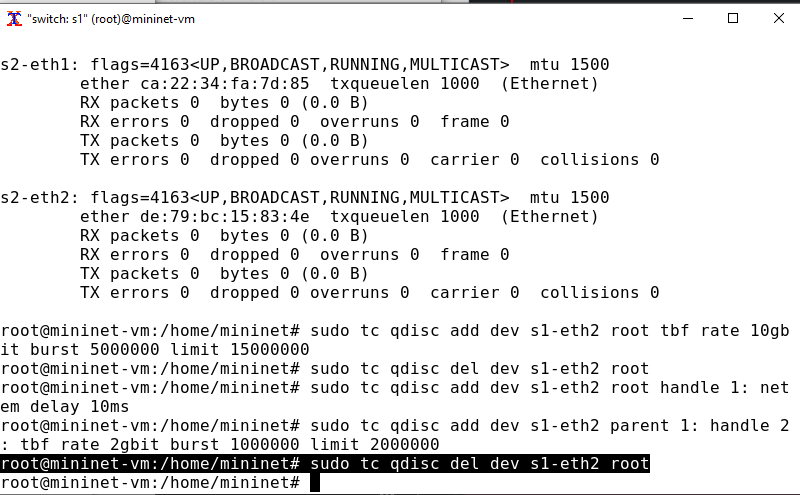{#fig:019 width=70%}

## Воспроизводимые эксперименты

Самостоятельно реализуйте воспроизводимые эксперименты по использованию TBF для ограничения пропускной способности. Постройте соответствующие
графики.

## Воспроизводимые эксперименты

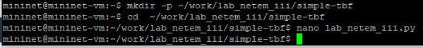{#fig:020 width=70%}

## Воспроизводимые эксперименты

{#fig:021 width=40%}

## Воспроизводимые эксперименты

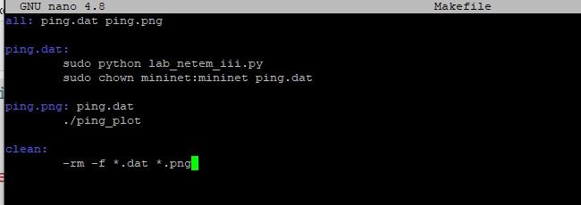{#fig:022 width=70%}

## Воспроизводимые эксперименты

{#fig:023 width=70%}

## Воспроизводимые эксперименты

{#fig:024 width=40%}

## Воспроизводимые эксперименты

{#fig:025 width=70%}

## Воспроизводимые эксперименты

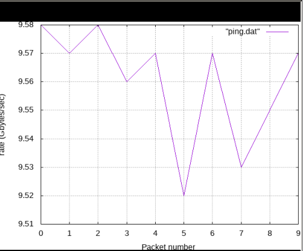{#fig:026 width=40%}

# Выводы

В результате выполнения данной лабораторной работы я познакомилась с принципами работы дисциплины очереди Token Bucket Filter, которая формирует входящий/исходящий трафик для ограничения пропускной способности, а также получила навыки
моделирования и исследования поведения трафика посредством проведения
интерактивного и воспроизводимого экспериментов в Mininet
