---
## Front matter
title: "Лабораторная работа № 6. Настройка пропускной способности глобальной сети с помощью Token Bucket Filter"
author: "Абакумова Олеся Максимовна, НФИбд-02-22"

## Generic otions
lang: ru-RU
toc-title: "Содержание"

## Bibliography
bibliography: bib/cite.bib
csl: pandoc/csl/gost-r-7-0-5-2008-numeric.csl

## Pdf output format
toc: true # Table of contents
toc-depth: 2
lof: true # List of figures
lot: true # List of tables
fontsize: 12pt
linestretch: 1.5
papersize: a4
documentclass: scrreprt
## I18n polyglossia
polyglossia-lang:
  name: russian
  options:
	- spelling=modern
	- babelshorthands=true
polyglossia-otherlangs:
  name: english
## I18n babel
babel-lang: russian
babel-otherlangs: english
## Fonts
mainfont: IBM Plex Serif
romanfont: IBM Plex Serif
sansfont: IBM Plex Sans
monofont: IBM Plex Mono
mathfont: STIX Two Math
mainfontoptions: Ligatures=Common,Ligatures=TeX,Scale=0.94
romanfontoptions: Ligatures=Common,Ligatures=TeX,Scale=0.94
sansfontoptions: Ligatures=Common,Ligatures=TeX,Scale=MatchLowercase,Scale=0.94
monofontoptions: Scale=MatchLowercase,Scale=0.94,FakeStretch=0.9
mathfontoptions:
## Biblatex
biblatex: true
biblio-style: "gost-numeric"
biblatexoptions:
  - parentracker=true
  - backend=biber
  - hyperref=auto
  - language=auto
  - autolang=other*
  - citestyle=gost-numeric
## Pandoc-crossref LaTeX customization
figureTitle: "Рис."
tableTitle: "Таблица"
listingTitle: "Листинг"
lofTitle: "Список иллюстраций"
lotTitle: "Список таблиц"
lolTitle: "Листинги"
## Misc options
indent: true
header-includes:
  - \usepackage{indentfirst}
  - \usepackage{float} # keep figures where there are in the text
  - \floatplacement{figure}{H} # keep figures where there are in the text
---

# Цель работы

Основной целью работы является знакомство с принципами работы дисциплины очереди Token Bucket Filter, которая формирует входящий/исходящий
трафик для ограничения пропускной способности, а также получение навыков
моделирования и исследования поведения трафика посредством проведения
интерактивного и воспроизводимого экспериментов в Mininet

# Предварительные сведения

Token Bucket Filter (TBF) представляет собой алгоритм, используемый в сетях
с коммутацией пакетов для ограничения пропускной способности и пиковой
нагрузки трафика. Передача поступающих в очередь системы (queque)
пакетов данных осуществляется при наличии в специальном буфере (bucket)
необходимого числа разрешений на передачу (или токенов). Токены могут быть
представлены в виде пакетов или числа байтов, поступающих в буфер (корзину)
фиксированного размера с фиксированной скоростью.

Максимальная средняя скорость отправки потока данных из очереди системы
зависит от скорости прибытия в специализированный буфер разрешений на
передачу N единиц данных. Очередной пакет может быть отправлен только
при получении числа разрешений, достаточного для передачи данных, объём
которых больше или равен размеру пакета. Если разрешений на передачу достаточно, то необходимое число токенов удаляется из специализированного буфера, а пакет данных отправляется. Если пакет поступит в очередь системы
и не будет располагать необходимым количеством разрешений, то токены не
удаляются из специализированного буфера, а сам пакет данных может быть отброшен, поставлен в очередь или передан, но помечен как несоответствующий
условиям передачи.

Дисциплина TBF реализована в виде буфера (queue), постоянно заполняющегося токенами с заданной скоростью. Наиболее важным параметром буфера
является его размер, определяющий количество хранимых токенов.

Если данные прибывают со скоростью, равной скорости входящих токенов, то
каждый пакет имеет соответствующий токен и проходит очередь без задержки.
Если данные прибывают со скоростью, меньшей скорости поступления токенов,
то лишь часть существующих токенов будет уничтожаться, поэтому они станут
накапливаться до размера специализированного буфера. Далее накопленные
токены могут использоваться при всплесках, для передачи данных со скоростью,
превышающей скорость пребывающих токенов.

Если данные прибывают быстрее, чем токены, то в буфере со временем не останется токенов, что заставит дисциплину приостановить передачу данных. Эта
ситуация называется «превышением». Если пакеты продолжают поступать, то
токены начинают уничтожаться. Данная ситуация позволяет административно
ограничивать доступную полосу пропускания.

Накопленные токены позволяют пропускать короткие всплески, но при про-
должительном превышении пакеты будут задерживаться, а в крайнем случае —
уничтожаться.

Алгоритм TBF обладает свойством взрывоопасности (burstiness), когда корзина полностью заполнена (т. е. никакие пакеты не потребляют токены) и новые
пакеты будут потреблять токены сразу, без ограничений. Всплеск определяется
как количество токенов, которые могут поместиться в корзину, или как размер
(ёмкость) корзины. Для обеспечения ограничения и контроля над всплесками
при поступлении пакетов формируется ещё одна корзина, с размером, равным

максимально передаваемому элементу данных (Maximum Transmission Unit,
MTU). Скорость обработки этого буфера намного превышает исходную (peak
rate — пиковая скорость).

Основной синтаксис tbf, используемый с tc в Linux:

```
tc qdisc [add | ...] dev [dev_id] root tbf limit [BYTES]
burst [BYTES] rate [BPS] [mtu BYTES] [ peakrate BPS ] [
latency TIME ]

```

Здесь:

- tc: инструмент управления трафиком Linux;

- qdisc: дисциплина очереди (qdisc), представляющая собой набор правил,
определяющих порядок, в котором обслуживаются пакеты, поступающие
с выходных данных IP-протокола;

- [add | del | replace | change | show]: операция над qdisc;

- dev [dev_id]: задаёт интерфейс;

- tbf: указывает, что используется алгоритм Token Bucket Filter;

- limit [BYTES]: размер очереди пакетов в байтах;

- burst [BYTES]: количество байтов, которое может поместиться в корзину;

- rate [BPS]: скорость передачи данных, определяемая частотой, с которой
токены добавляются в корзину;

- mtu [BYTES]: максимальная единица передачи в байтах;

- peakrate [BPS] (пиковая скорость [бит/с]): максимальная скорость переда-
чи пакета;

- latency [TIME]: максимальное время ожидания пакета в очереди

# Задание

1. Задайте топологию, состоящую из двух хостов и двух коммутаторов
с назначенной по умолчанию mininet сетью 10.0.0.0/8.

2. Проведите интерактивные эксперименты по ограничению пропускной способности сети с помощью TBF в эмулируемой глобальной сети.

3. Самостоятельно реализуйте воспроизводимые эксперимент по применению
TBF для ограничения пропускной способности. Постройте соответствующие
графики.

# Выполнение лабораторной работы
## Запуск лабораторной топологии

Запускаем виртуальную машину. Здесь ждет легкая неожиданность, но это не помешало выполнить лабораторную работу (рис. [-@fig:001]):

{#fig:001 width=70%}

В виртуальной машине mininet при необходимости исправим права запуска
X-соединения. Скопируем значение куки (MIT magic cookie) своего пользователя mininet в файл для пользователя root(рис. [-@fig:002]):

{#fig:002 width=70%}

После выполнения этих действий графические приложения должны запускаться под пользователем mininet.

Зададим птопологию сети, состоящую из двух хостов и двух коммутаторов
с назначенной по умолчанию mininet сетью 10.0.0.0/8 (рис. [-@fig:003]):

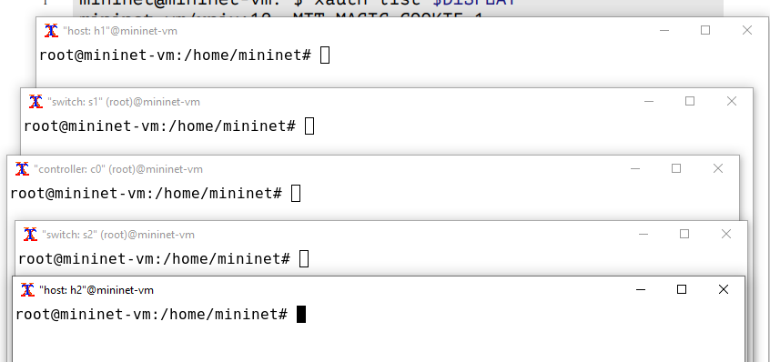{#fig:003 width=70%}

После введения этой команды запустятся терминалы двух хостов, двух ком-
мутаторов и контроллера.

На хостах h1, h2 и на коммутаторах s1, s2 введите команду ifconfig, чтобы
отобразить информацию, относящуюся к их сетевым интерфейсам и назначенным им IP-адресам. 
В дальнейшем при работе с NETEM и командой tc
будут использоваться интерфейсы h1-eth0, h2-eth0, s1-eth2 (рис. [-@fig:004]):

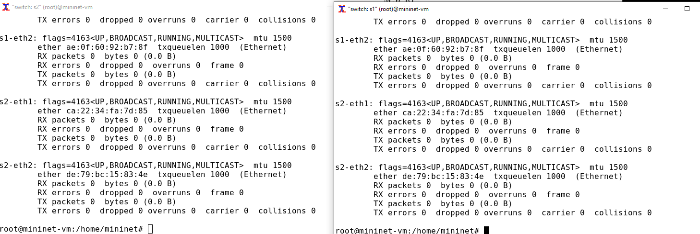{#fig:004 width=70%}

{#fig:005 width=70%}

Проверим подключение между хостами h1 и h2 с помощью команды ping
с параметром -c 4 (рис. [-@fig:006]):

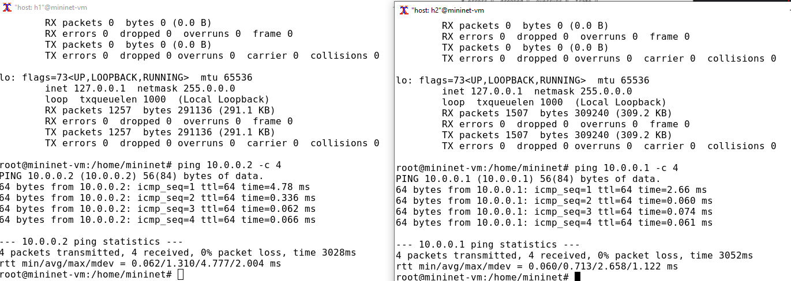{#fig:006 width=70%}

 В терминале хоста h2 запустим iPerf3 в режиме сервера и в терминале хоста h1 запустим iPerf3 в режиме клиента (рис. [-@fig:007]):

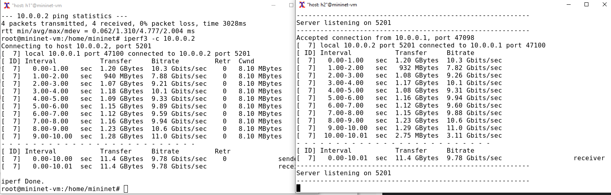{#fig:007 width=70%}

После завершения работы iPerf3 на хосте h1 остановим iPerf3 на хосте h2,
нажав Ctrl + c.

## Интерактивные эксперименты
### Ограничение скорости на конечных хостах

Команду tc можно применить к сетевому интерфейсу устройства для формирования исходящего трафика. Требуется ограничить скорость отправки данных
с конечного хоста с помощью фильтра Token Bucket Filter (tbf)

Изменим пропускную способность хоста h1, установив пропускную способность на 10 Гбит/с на интерфейсе h1-eth0 и параметры TBF-фильтра(рис. [-@fig:008]):

{#fig:008 width=70%}

Здесь:

- sudo: включить выполнение команды с более высокими привилегиями
безопасности;

- tc: вызвать управление трафиком Linux;

- qdisc: изменить дисциплину очередей сетевого планировщика;

- add (добавить): создать новое правило;

- dev h1-eth0 root: интерфейс, на котором будет применяться правило;

- tbf: использовать алгоритм Token Bucket Filter;

- rate: указать скорость передачи (10 Гбит/с);

- burst: количество байтов, которое может поместиться в корзину (5 000
000);

– limit: размер очереди в байтах (15 000 000).

Фильтр tbf требует установки значения всплеска при ограничении скорости.
Это значение должно быть достаточно высоким, чтобы обеспечить установленную скорость. Она должна быть не ниже указанной частоты, делённой на
HZ, где HZ — тактовая частота, настроенная как параметр ядра, и может быть
извлечена с помощью следующей команды (рис. [-@fig:009]):

{#fig:009 width=70%}

Для расчёта значения всплеска (burst) необходимо скорость передачи (10
Гбит/с или 10 Gbps = 10,000,000,000 bps) разделить на полученное таким
образом значение HZ (на хосте h1 HZ = 250):
Burst = 10,000,000,000/250 = 40,000,000 bits = 40,000,000/8 bytes = 5,000,000
bytes.

С помощью iPerf3 проверим, что значение пропускной способности изменилось.В терминале хоста h2 запустим iPerf3 в режиме сервера и в терминале хоста h1 запустим iPerf3 в режиме клиента (рис. [-@fig:010]):

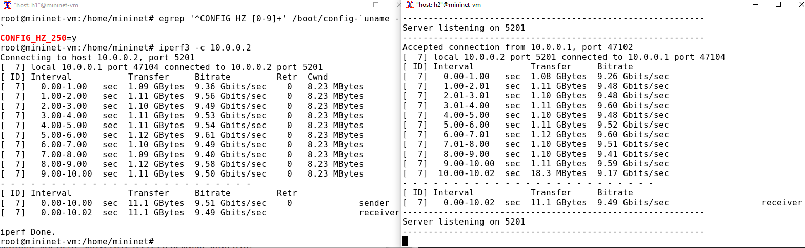{#fig:010 width=70%}

После завершения работы iPerf3 на хосте h1 остановим iPerf3 на хосте h2,
нажав Ctrl + c.

Удалим модифицированную конфигурацию на хосте h1 (рис. [-@fig:011]):

{#fig:011 width=70%}

### Ограничение скорости на коммутаторах

При ограничении скорости на интерфейсе s1-eth2 коммутатора s1 все сеансы связи между коммутатором s1 и коммутатором s2 будут фильтроваться
в соответствии с применяемыми правилами.

Применим правило ограничения скорости tbf с параметрами rate = 10gbit,
burst = 5,000,000, limit= 15,000,000 к интерфейсу s1-eth2 коммутатора s1,
который соединяет его с коммутатором s2 (рис. [-@fig:012]):

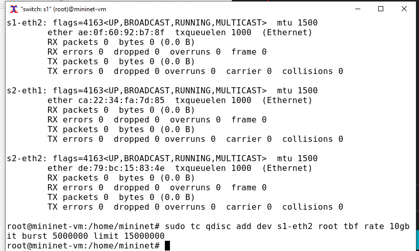{#fig:012 width=70%}

Проверим конфигурацию с помощью инструмента iperf3 для измерения
пропускной способности. В терминале хоста h2 запустим iPerf3 в режиме сервера и в терминале хоста h1 запустим iPerf3 в режиме клиента (рис. [-@fig:013]):

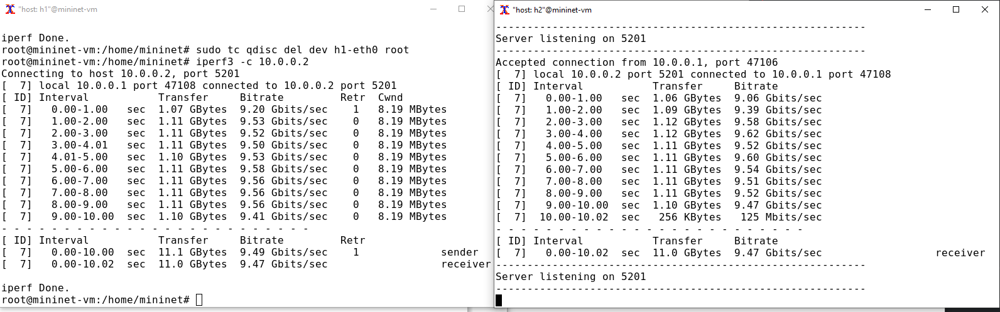{#fig:013 width=70%}

После завершения работы iPerf3 на хосте h1 остановим iPerf3 на хосте h2,
нажав Ctrl + c.

Удалим модифицированную конфигурацию на коммутаторе s1 (рис. [-@fig:014]): 

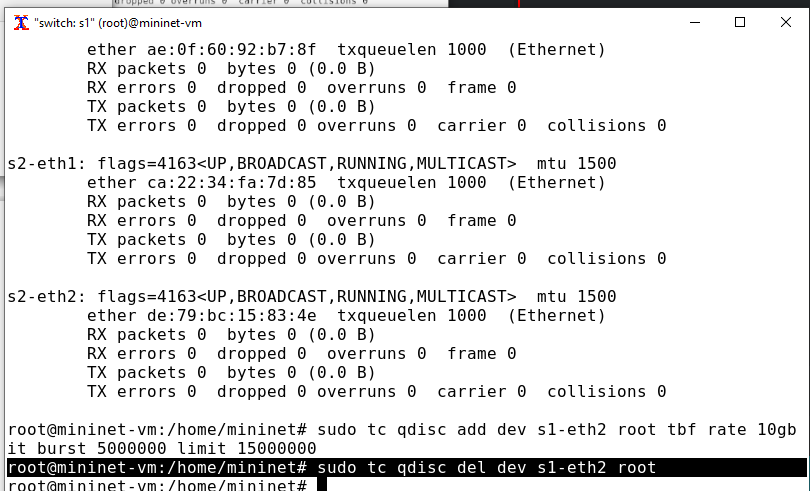{#fig:014 width=70%}

### Объединение NETEM и TBF

NETEM используется для изменения задержки, джиттера, повреждения пакетов и т.д. TBF может использоваться для ограничения скорости. Утилита tc
позволяет комбинировать несколько модулей. При этом первая дисциплина
очереди (qdisc1) присоединяется к корневой метке, последующие дисциплины
очереди можно прикрепить к своим родителям, указав правильную метку.

Объединим NETEM и TBF, введя на интерфейсе s1-eth2 коммутатора s1
задержку, джиттер, повреждение пакетов и указав скорость (рис. [-@fig:015]):

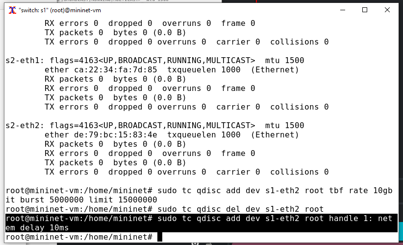{#fig:015 width=70%}

Здесь ключевое слово handle задаёт дескриптор подключения, имеющий
смысл очерёдности подключения разных дисциплин qdisc.

Убедимся, что соединение от хоста h1 к хосту h2 имеет заданную задержку.
Для этого запустим команду ping с параметром -c 4 с терминала хоста h1 (рис. [-@fig:016]):

{#fig:016 width=70%}

Добавим второе правило на коммутаторе s1, которое задаёт ограниче-
ние скорости с помощью tbf с параметрами rate=2gbit, burst=1,000,000,
limit=2,000,000 (рис. [-@fig:017]):

{#fig:017 width=70%}

Проверим конфигурацию с помощью инструмента iperf3 для измерения
пропускной способности. В терминале хоста h2 запустим iPerf3 в режиме сервера и в терминале хоста h1 запустим iPerf3 в режиме клиента (рис. [-@fig:018]):

{#fig:018 width=70%}

После завершения работы iPerf3 на хосте h1 остановим iPerf3 на хосте h2,
нажав Ctrl + c.

Удалим модифицированную конфигурацию на коммутаторе s1 (рис. [-@fig:019]):

{#fig:019 width=70%}

## Воспроизводимые эксперименты

Самостоятельно реализуйте воспроизводимые эксперименты по использованию TBF для ограничения пропускной способности. Постройте соответствующие
графики.

Создадим каталог, где будем проводить наш эксперимент и перейдем в него (рис. [-@fig:020]):

{#fig:020 width=70%}

Создадим скрипт, реализующий наш воспроизводимый эксперимент (рис. [-@fig:021]):

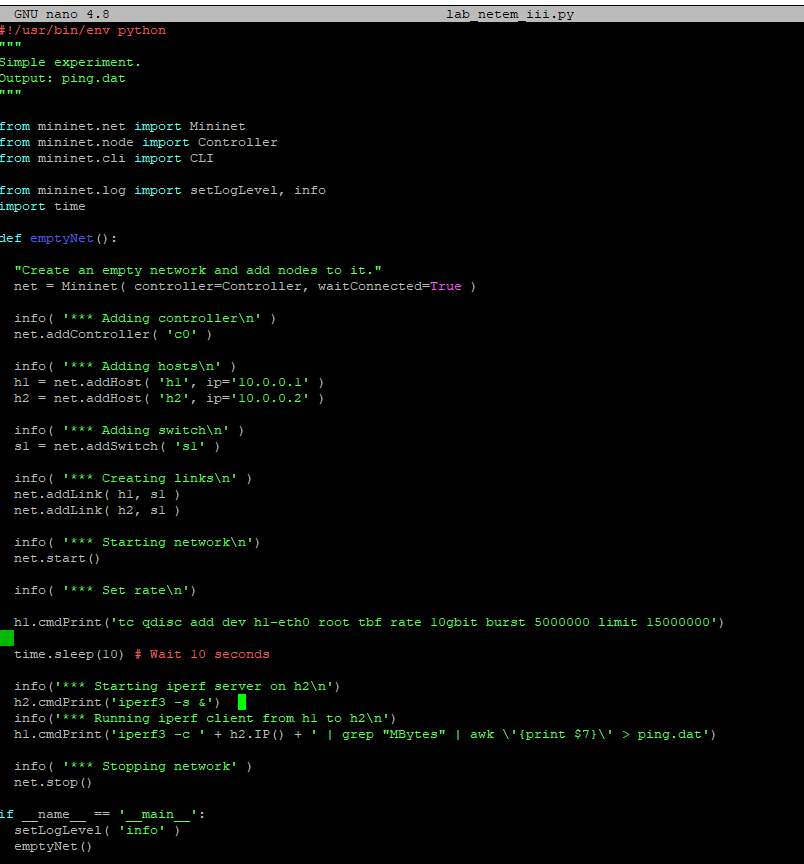{#fig:021 width=70%}

Создадим Makefile (рис. [-@fig:022]):

{#fig:022 width=70%}

Создадим ping_plot (рис. [-@fig:023]):

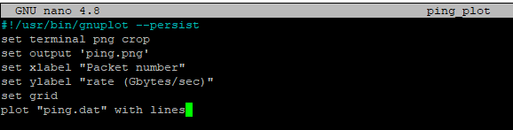{#fig:023 width=70%}

Теперь запустим эксперимент и дождемся его окончания. Просмотрим содержимо нашего каталого после запуска эксперимента (рис. [-@fig:024]):

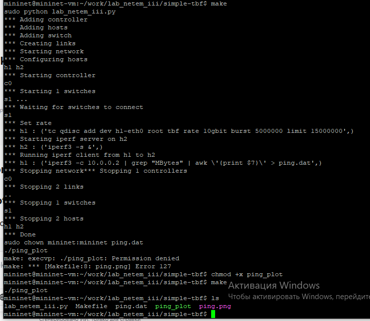{#fig:024 width=70%}

Для открытия, полученного графика воспользуемся geeqie (рис. [-@fig:025]):

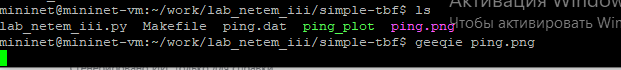{#fig:025 width=70%}

{#fig:026 width=70%}


# Выводы

В результате выполнения данной лабораторной работы я познакомилась с принципами работы дисциплины очереди Token Bucket Filter, которая формирует входящий/исходящий трафик для ограничения пропускной способности, а также получила навыки
моделирования и исследования поведения трафика посредством проведения
интерактивного и воспроизводимого экспериментов в Mininet
